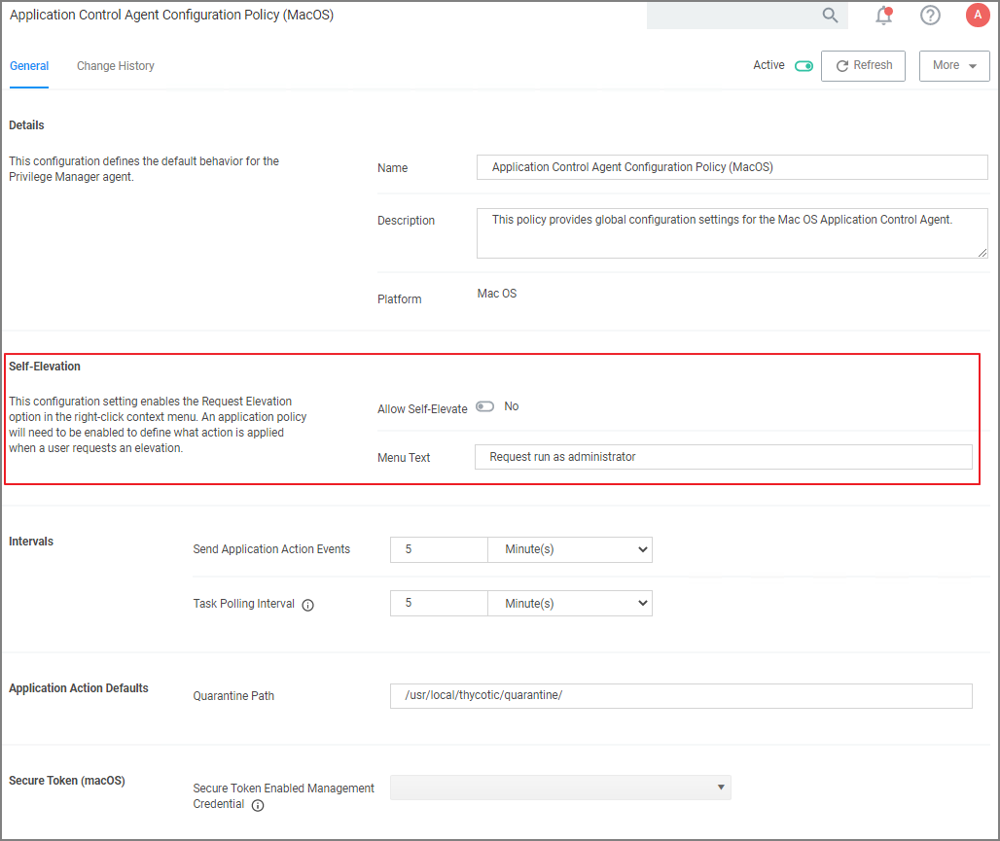
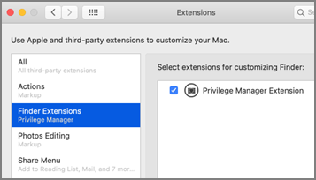
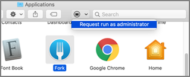
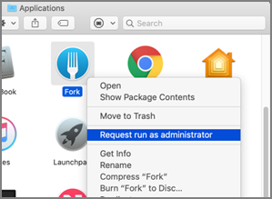

[title]: # (Self-elevation)
[tags]: # (macOS, standard user, policy)
[priority]: # (7)
# Application Self-elevation

Finder Sync Extensions allow application control on macOS endpoints. Just as on Windows endpoints, users can request application self-elevation via right-click mouse action. The application control is policy based and the macOS system with the endpoint agent must have been online at least once to request its policies from the Privilege Manager server.

>**Note**: This feature is only available with the KEXT based Privilege Manager Agent. Self-elevation in this form is not possible with the system extension.

## Configuring Application Self-elevation

Your Privilege Manager needs to be configured to allow self-elevation of applications on an endpoint. Follow these server configuration steps:

1. Navigate to your __MacOS Computers__ computer group and select __Agent Configuration__.
1. Under __Self-Elevation__ set the __Allow Self-Elevate__ switch to __Yes__.
1. In the Menu text entry field you may customize the default __Request run as administrator__ text.
   
1. Click __Save Changes__.

>**Note**:
>When Self-Elevation options are modified in the __MacOS Agent Configuration__, client items on a macOS system must be updated and on older versions of macOS the user must logout and login for the changes to take effect.

After enabling Self-Elevation of applications in the __MacOS Agent Configuration__, you can create policies to target the __User Requested Run As Administrator Filter (macOS)__ and specify which action you want taken. If you choose Approval Request, users will have to request and gain approval before having the application elevated.

## How to Request an Application Run as Administrator

>**Note**: This is the procedure for kernel extension. On endpoints using system extension, the [__Run as Root__ action](../../../admin/actions/index.md) needs to be used instead.

To request to run an application as Administrator, the user at the macOS endpoint navigates to and selects the applications in Finder and uses either right-click or Control+Click to invoke Finder's context menu:

Here the user selects the Request run as administrator menu option.

Depending on the policy in place, this will either be granted immediately or trigger an approval request.

## Troubleshooting: Verify the Finder Extension is Installed

The Finder Privilege Manager extension installs by default during an agent install or upgrade. The extension is enabled/disabled based on the __MacOS Agent Configuration__ policy on the Privilege Manager Server. If the extension is not enabled, check with your system administrator.

1. Open __System Preferences | Extensions__.
1. Select __Finder Extensions__.
1. Verify that Privilege Manager Extension is listed and enabled for customizing Finder.

Once the Privilege Manager Extension is enabled, the extension icon is visible in Finder.

The extension is also present as a menu item when you right-click or control+click an application in Finder.

### Finder Extension and Drive Type Extensions

On endpoints that are also using OneDrive, GoogleDrive, DropBox, or similar extensions, when enabling the Finder Extension the endpoint will take about 2 min to correctly initialize.

For systems prior to Privilege Manager 10.8, if a finder sync extension does not work correctly. Execute the following steps in sequence:

1. Disable the Privilege Manager Finder Extension.
1. Install/Enable other third-party Finder Extension.
1. Enable the Privilege Manager Finder Extension.

>**Note**: On endpoints using OneDrive, GoogleDrive, DropBox, or similar enabled extensions, the endpoint will take about 2 min to correctly initialize the Finder Extension functionality after enabling the extension or after upgrading from versions prior to 10.8.
