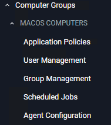

[title]: # (macOS Computers)
[tags]: # (admin,configuration)
[priority]: # (2)
# macOS Computers

Default macOS Computer Group. 

This is the navigation entry point into the macOS Computer Group. The sub nodes are in feature parity with other OS computer groups. Every policy or resource underneath MACOS COMPUTERS pertain to that specific default computer group.