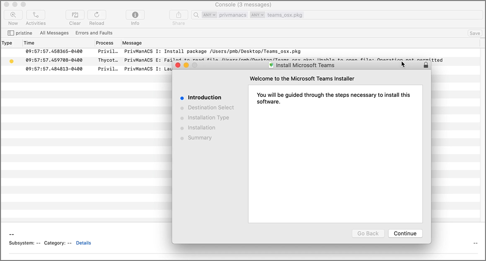
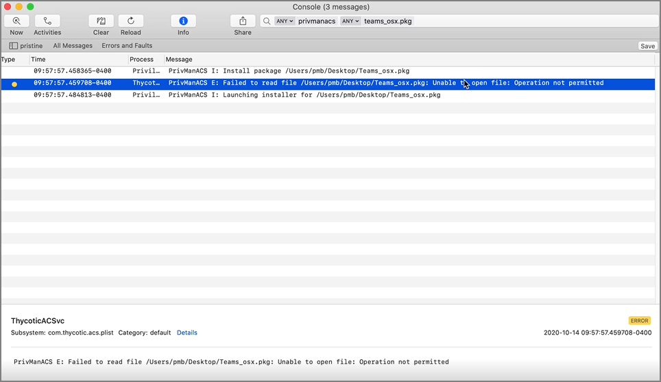

[title]: # (File/Folder Access)
[tags]: # (macOS)
[priority]: # (13)
# macOS File/Folder Access

Permissions determine who or what can access (view or alter) files on a computer. With the release of macOS Mojave (10.14), Apple introduced Transparency Consent and Control (TCC) to further limit the permissions and access granted to applications as they relate to user data and devices. With macOS Catalina (10.15), Apple extended this to prevent third-party daemons from accessing user data within certain folders. These include a user's Desktop, Documents, and Downloads folders. The user's Public folder is exempt from this restriction.

For example, on Catalina, when package (pkg) installers are downloaded to a user's Desktop and there is a Privilege Manager policy governing them, an error like the following will be written to the [Unified Log](https://developer.apple.com/documentation/os/logging/viewing_log_messages).

| Install Attempt | Error `Failed to read file /Users/pmb/Desktop/Teams_osx.pkg: Unable to open file: Operation not permitted` |
| ----- | ----- |
|  |  |

In order to read files in these protected locations, third-party daemons need to be given the Full Disk Access (FDA) entitlement. On macOS Catalina, the FDA entitlement can't be granted manually to the daemon by a user. It must be provisioned by a TCC profile via a Mobile Device Management (MDM) solution.

macOS versions prior to Catalina do not experience this restriction.

## Workaround via MDM Solution

If an MDM solution is in place, a TCC profile can be used to alleviate the problem. The below example can be used as a starting point. The example was specifically created for full disk access for a mobile configuration.

Either create a TCC profile based on this example for your environment or copy and paste the contents into a file and edit to meet your requirements.

```xml
<?xml version="1.0" encoding="UTF-8"?>
<!DOCTYPE plist PUBLIC "-//Apple//DTD PLIST 1.0//EN" "http://www.apple.com/DTDs/PropertyList-1.0.dtd">
<plist version="1.0">
<dict>
    <key>PayloadContent</key>
    <array>
        <dict>
            <key>PayloadDescription</key>
            <string>Allows Privilege Manager to access all files on Catalina and higher</string>
            <key>PayloadDisplayName</key>
            <string>Privilege Manager ThycoticACSvc Profile</string>
            <key>PayloadIdentifier</key>
            <string>com.thycotic.privilegemanager.thycoticacsvc.01BF42EA-574B-47A3-8B06-CBA3731973EE</string>
            <key>PayloadOrganization</key>
            <string>Thycotic Software, LLC</string>
            <key>PayloadType</key>
            <string>com.apple.TCC.configuration-profile-policy</string>
            <key>PayloadUUID</key>
            <string>01BF42EA-574B-47A3-8B06-CBA3731973EE</string>
            <key>PayloadVersion</key>
            <integer>1</integer>
            <key>Services</key>
            <dict>
                <key>SystemPolicyAllFiles</key>
                <array>
                    <dict>
                        <key>Allowed</key>
                        <true/>
                        <key>CodeRequirement</key>
                        <string>anchor apple generic and identifier "com.thycotic.ThycoticACS" and (certificate leaf[field.1.2.840.113635.100.6.1.9] /* exists */ or certificate 1[field.1.2.840.113635.100.6.2.6] /* exists */ and certificate leaf[field.1.2.840.113635.100.6.1.13] /* exists */ and certificate leaf[subject.OU] = UJDHBB2D6Q)</string>
                        <key>Comment</key>
                        <string>Allow SystemPolicyAllFiles control for Privilege Manager ThycoticACSvc</string>
                        <key>Identifier</key>
                        <string>com.thycotic.ThycoticACS</string>
                        <key>IdentifierType</key>
                        <string>bundleID</string>
                    </dict>
                </array>
            </dict>
        </dict>
    </array>
    <key>PayloadDescription</key>
    <string>Allows Privilege Manager to access all files on Catalina and higher</string>
    <key>PayloadDisplayName</key>
    <string>Privilege Manager ThycoticACSvc Profile</string>
    <key>PayloadIdentifier</key>
    <string>com.thycotic.privilegemanager.thycoticacsvc</string>
    <key>PayloadOrganization</key>
    <string>Thycotic Software, LLC</string>
    <key>PayloadRemovalDisallowed</key>
    <true/>
    <key>PayloadScope</key>
    <string>system</string>
    <key>PayloadType</key>
    <string>Configuration</string>
    <key>PayloadUUID</key>
    <string>01BF42EA-574B-47A3-8B06-CBA3731973EE</string>
    <key>PayloadVersion</key>
    <integer>1</integer>
</dict>
</plist>

```