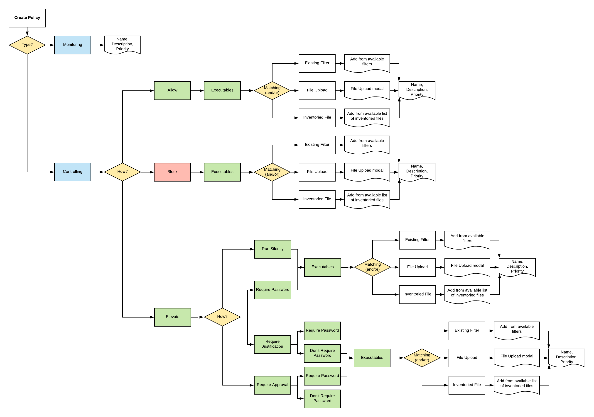

[title]: # (Unix/Linux Specific Policies)
[tags]: # (policy examples)
[priority]: # (1)
# Unix/Linux Specific Policies

Once your Unix/Linux agent is registered, creating policies for your Unix/Linux machines follows a very similar process to creating policies for Windows machines in Privilege Manager. The main approach should be via the use of the [Policy Wizard](../../app-control/policies/index.md) aided by the following:

1. __Collect File Data__: This enables Privilege Manager to recognize specific files and file types in your environment. The file data that you want to target with policies are called Events. All imported files can be viewed via __File Inventory__.
1. __Create Filters__: This step sorts important file data (Events) according to different criteria.
1. __Create Policies__: This step defines what
   1. Actions to perform on applications and
   1. Targets (Locations) for those actions.

   Refer to the [Policy Page](../../app-control/policies/policy-page.md) topic.
1. __Assign Filters to Policies__: This step directs a Policy's actions to the appropriate Events happening on your network. This step also allows a Policy to be set to active.
1. __Order your Policies__ based on priority level—Once your policies are created, the order they execute across your network matters. See the [Policy Priority](../../app-control/policies/priority.md) topic for more details.

>**Note**: In Unix/Linux, roles are bifurcated into two groups: Admins, and Users rather than by Group Policy Objects (GPO) found in Windows environments.

## Example Policies

* [Allow ID](allow-id.md)
* [Block Diskspace Command](block-df-com.md)
* [Elevate LS](elevate-ls.md)

## Wizard Flow Diagram

The following diagram shows the typical decision flow when using the policy wizard for creating Unix/Linux policies.

