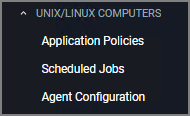

[title]: # (Unix/Linux Computers)
[tags]: # (admin,configuration)
[priority]: # (3)
# Unix/Linux Computers

The default Unix/Linux Computer Group.

This is the navigation entry point into the Unix/Linux Computer Group. The sub nodes are in feature parity with other OS computer groups. All policies or resources underneath __UNIX/LINUX COMPUTERS__ pertain to that specific default computer group.

For Unix/Linux Agent Configuration information refer to [Agent Configuration](../../agents/nix/cfg/index.md).

>**Note**:  Linux/Unix user and group management is not enabled. The Unix/Linux agent allows administrators to get lists and details of local users, groups, and membership.
