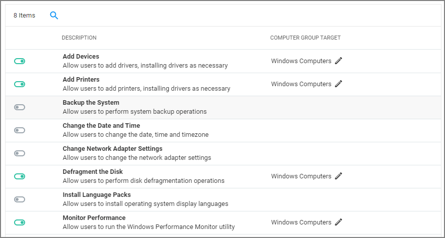

[title]: # (Client System Settings)
[tags]: # (admin,configuration)
[priority]: # (10)
# Client System Settings

The Client System Settings are common settings for standard Windows endpoint systems ranging from allowing installation of drivers to printers. These settings are deployed to Agents the same as any Policy.

By default each setting targets the default "Windows Computers" Computer Group.

Changes to client system settings do not take effect until Policies have been cached and deployed to the agent. Review the agent status reports to see which agents have which Policies.

## Add Devices

If active, users on Windows endpoints are allowed to add and install device drivers.

## Add Printers

If active, users on Windows endpoints are allowed to add and install printer drivers.

## Backup the Systems

If active, users on Windows endpoints are allowed to perform system backup operations.

## Change the Date and Time

If active, users on Windows endpoints are allowed to change date, time, and timezone settings.

## Change Network Adapter Settings

If active, users on Windows endpoints are allowed to change network adapter settings.

On Windows 7 endpoints with __Change Network Adapter Settings__ active, do NOT enable high integrity when using the Administrative Rights action in policies.

## Defragment the Disk

If active, users on Windows endpoints are allowed to perform disk defragmentation operations.

## Install Language Packs

If active, users on Windows endpoints are allowed to install operating system display language packs.

## Monitor Performance

If active, users on Windows endpoints are allowed to run the Windows Performance Monitor Utility.
