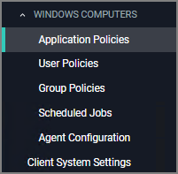

[title]: # (Windows Computers)
[tags]: # (admin,configuration)
[priority]: # (3)
# Windows Computers

The default Windows Computer Group.

This is the navigation entry point into the Windows Computer Group. The sub nodes are in feature parity with other OS computer groups. All policies or resources underneath __WINDOWS COMPUTERS__ pertain to that specific default computer group.

Refer to the [Policy Wizard](../app-control/policies/policy-wizard/index.md) section for details on decision points for:

* [Creating a Monitoring Policy](../app-control/policies/policy-wizard/monitoring.md)
* [Creating a Controlling Elevation Policy for macOS](../app-control/policies/policy-wizard/controlling-elevate-win.md)
* [Creating a Controlling Allow Policy for macOS](../app-control/policies/policy-wizard/controlling-allow-win.md)
* [Creating a Controlling Block Policy for macOS](../app-control/policies/policy-wizard/controlling-block-win.md)
* [Creating a Controlling Restrict Policy for Windows](../app-control/policies/policy-wizard/controlling-restrict-win.md)

For Windows Agent Configuration information refer to [Agent Configuration](../../agents/win/cfg/index.md).
