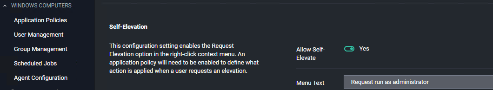
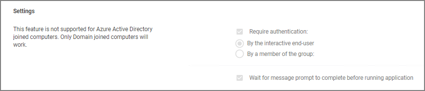
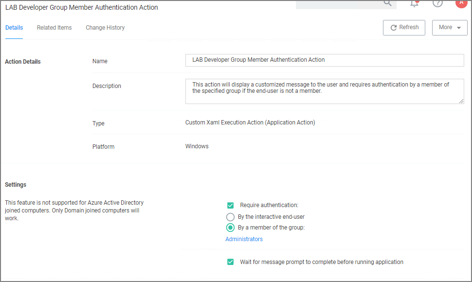
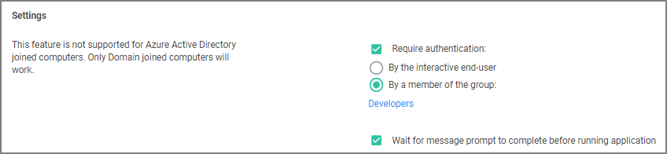
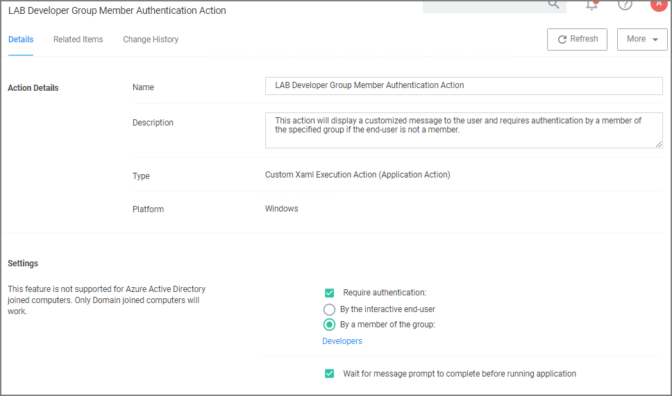
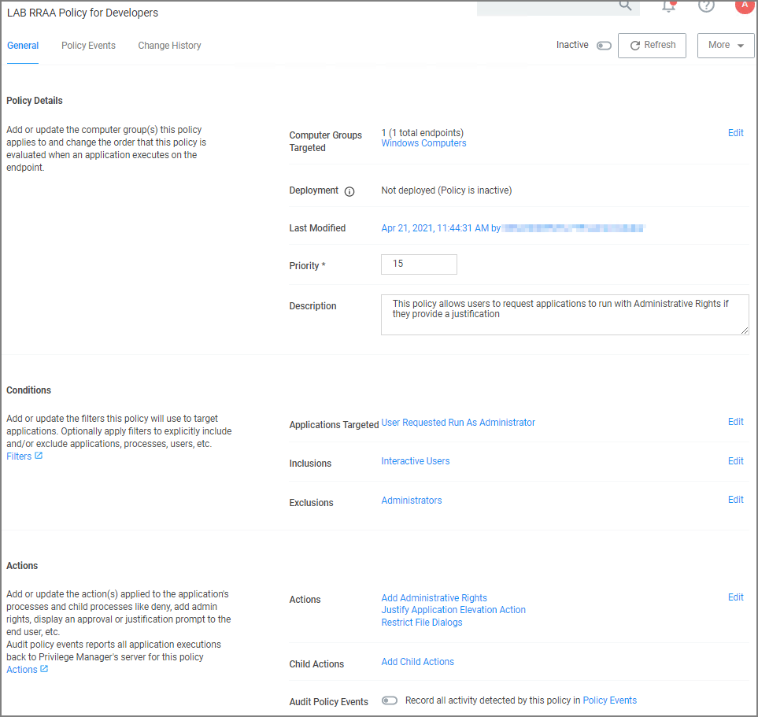
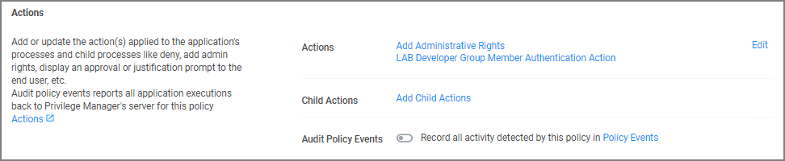
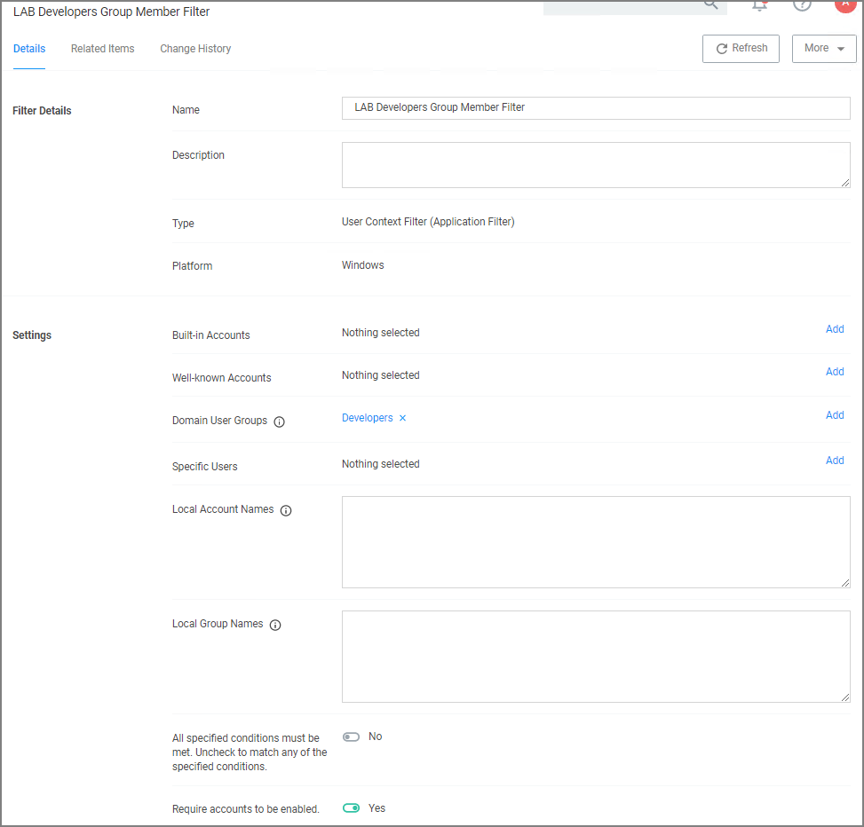
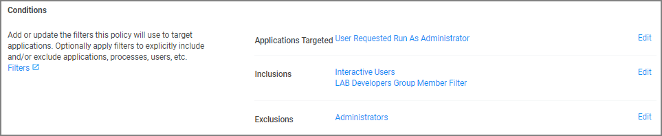

[title]: # (Run As Admin)
[tags]: # (admin,configuration)
[priority]: # (4)

# Run as an Adminstrator

This topic describes the Privilege Manager __Right-Click Run As Thycotic Administrator__, or __Request Run As Administrator__ (RRAA), functionality and cover use cases.

>**Note**: Also refer to the [Adjust Process Rights Action](../../admin/actions/windows/unrestricted-token.md) topic for further details and best practices.

## RRAA Use Cases

Removing all accounts from the local Administrators Group creates several “Gotcha” situations:

* The UAC prompt to Elevate becomes an un-answerable request when there are no account credentials to satisfy UAC with
* Trying to use the built-in Right Click "Run as Administrator" we also have no credentials that can be entered.

RRAA becomes a very useful support tool and can provide those “special” users unfettered access to admin functionality they demand.

RRAA is a tool that satisfies Admin removal issues when: you are under the gun of a deadline to remove Admin, in a very fast paced environment and understaffed to keep-up with policy creation, it can also provide the support staff with the super powers they need.

## Background of RRAA

This function is built into the Privilege Manager Agent. There are different versions of the Agent and new versions sometimes have additional RRAA functionality, like the recent addition of .MSI file types to the right click option. This feature is for Windows Operating Systems only.
It is toggled on or off via any of your __Windows Computer Groups | Agent Configuration__ and under __Self-Elevation__ set the switch to on.

## Testing RRAA Policies

This section explains how to create a RRAA Elevation Policy for Developers. As described here, this feature will be added to all endpoints with the Application Control Agent. It will require authentication from a Developer to proceed, so other users won’t be able to *use* the feature, but it will be present.

There are two steps to configuring the __Right-Click Run As Thycotic Administrator__ feature.

One is the global configuration setting to enable the feature. Enabling this adds the “Request run as Thycotic Administrator” option to all endpoints with the Application Control Agent installed.

After enabling the global feature, Policies are created that assign Actions to this feature, typically based on specific use cases (such as the Developer use case detailed below).

If testing this feature in an environment with Agents deployed to production machines, consider first creating a Policy that targets all endpoints and all users that includes a custom Application Denied Message Action or Application Warning Message Action explaining that this feature isn’t currently enabled, but may be used in the future by Helpdesk or other users. Then create a separate policy that has Resource Targets only for your test machines and a Policy Priority to occur earlier in processing. That way, your tests will be separate from the global actions of this feature.

## Create a RRAA Elevation Policy for Developers

After the Right-Click Run As Thycotic Administrator feature is enabled, an Elevation Policy that handles the Elevation workflow will need to be created.
The policy in this topic uses the default Resource Targets for All Windows computers with the Privilege Manager Agent installed. Using computer groups, smaller Resource Targets can be used and many custom options can be created to address many use cases in the environment, each having a customized Menu Text and resource specific targeting.

In the following example, a RRAA Elevation Policy will be created for the Developers group. First, a custom Message Action will be created to use on the Policy.

### Advanced Message Actions

There are several Advanced Message Actions that can be displayed to end users. Advanced Message Actions can either require feedback in a justification and/or group member authentication, require approval from within Privilege Manager when
the process runs, or require no input.

The most common Message Actions used with RRAA Policies are the Advanced Feedback Message Actions, including:

* [Group Member Authenticated Message Action](../../admin/actions/windows/group-member-approvals.md): This action will display a customized message to the user and requires authentication by a member of the specified group if the end-user is not a member.

* [Authenticated Justification Message Action](../../admin/actions/windows/all/index.md#justify_application_message_action): This action will display an authentication prompt to the user before continuing to the process controlled by a policy.

* [Justify Application Elevation Action](../../admin/actions/windows/all/index.md#justify_application_elevation_action): This action will display a justification prompt to the user before continuing to the process controlled by a policy.

Each of these Actions provide fields that can adjust the communication presented to the User.

As the following steps demonstrate, the Message Actions have several radio buttons in the Settings area to shape what they do and how they interact with the user.

These Actions are really just different radio button selections of two basic Actions. One Action with a Justification and the other Action without Justification.

### Custom Group Member Authentication Action for Developers

For this example, we will be using the “Group Member Authenticated Message Action” with the default radio button configuration. The Action will require credentials from a user who is a member of a specific AD group. This Action will not require justification.

To begin, find an existing Message Action to duplicate. 

1. Navigate to __Admin | Actions__.
1. Search for __Group Member Authenticated Message Action__.
1. Click __Duplicate__.
1. In the __Duplicate__ modal, enter the name _LAB Developer Group Member Authentication Action_.
1. Click __Create__.

   
1. Under Settings and __By a member of group__, click __Administrators__.
   1. As a resource select the AD group for your developers, in this example _Developers_.

      
1. Click __Save Changes__.

      

### Custom RRAA Elevation Policy for Developers

To build the custom RRAA Elevation Policy for Developers, copy an existing RRAA Elevation Policy. A default policy is included with Privilege Manager.

1. Navigate to your Windows Computer group. 
1. Search for __User Requested Elevation Justification Policy (Sample)__, to locate the default policy.

   ")
1. Click __Duplicate__.
1. In the __Duplicate__ modal, enter the name _LAB RRAA Policy for Developers_.
1. Click __Create__.

   

   Under __Conditions__ the policy includes the Application Target of __User Requested Run As Administrator__. This corresponds to the __Right-Click Run As Thycotic Administrator__ option on the endpoint.

   Under __Actions__ the policy includes by default:
   * Add Administrative Rights
   * Justify Application Elevation Action
   * Restrict File Dialogs
1. Next to these actions, click __Edit__.
1. Remove the __Justify Application Elevation Action__ and __Restrict File Dialogs__ default actions.
1. Search for and add the __LAB Developer Group Member Authentication Action__. 
1. Click __Update__.

   
1. Click __Save Changes__.

With the __LAB RRAA Policy for Developers__, logged-on members of the Developers group can seamlessly get Admin rights when using the Right-Click Request Run As Thycotic Administrator.

Activate this policy, when you are ready to begin using it on endpoints.

## Multiple RRAA Policies in the Same Policy Stack

Another common use case for the Right-Click Run As Thycotic Administrator feature is a RRAA Elevation Policy for Helpdesk. To do this, follow the same steps for the RRAA Elevation Policy for Developers, outlined above, using Helpdesk AD groups and naming conventions for the Action and Policy during creation.

It’s possible to have multiple RRAA policies that work for different groups in the same Policy stack. To get this working, User Context Filters will be built in Privilege Manager that match the targeted AD groups.

Once the basic policies needed are made, and the User Context Filters are created, use the “Add Inclusion Filter” and “Add Exclusion Filter” sections under the Policy’s “Conditions” to logically get all Policies working in your policy stack.

In the Developers & Helpdesk example:

* If the Current User on an endpoint is in the Developers AD group and initiates the Right-Click Run As Thycotic Administrator feature, the LAB Developer Group Member Authentication Action will execute, requiring the credentials of a member of the Developer AD group.

* A separate Policy is created that excludes the Developers User Context Filter (therefore, applies to all other users) and includes a custom Helpdesk Action that requires credentials from a member of a Helpdesk AD group and a justification/reason.

* If the Current User on an endpoint is not a member of the Developers AD group and initiates the Right-Click Run As Thycotic Administrator feature, the custom Helpdesk Action executes.

* The Helpdesk’s RRAA Policy would not work when the computer User is in the Developers group, but the Helpdesk policy would work on all other computers regardless of who the User is.

This example gives Helpdesk users a workflow to enter their credentials on any computer to request elevation for supporting all computers not having a separate RRAA Policy of their own (in the above example, only the Developers have a separate RRAA Policy).

Other examples can be added for other use cases. By utilizing user AD groups, this can be managed in AD with corresponding User Context Filters created in Privilege Manager and assigned to Policies.

If more than two RRAA policies are required like adding with and without Justifications, sorting the Inclusion/Exclusion logic would be required. The Global RRAA has all other RRAA group filters in the Exclusions, the user specific RRAA get only their Group filter put in the Inclusions.

If the Inclusion/Exclusion logic is managed correctly, the RRAA Policies could use the same Policy Priority, but Policy Priorities can also help with the logic. Assume the RRAA Elevation Policy for Developers has a Policy Priority of 14, and the RRAA Elevation Policy for Helpdesk has a Policy Priority of 15. In this example, the RRAA Elevation Policy for Developers has priority over the
RRAA Elevation Policy for Helpdesk.

Also, the Policy Priority of the RRAA Elevation Policies matters in relation to the other Policies in the Policy stack. Other Policies with Policy Priorities to occur before the RRAA Elevation Policies – such as Deny Policies – would happen before the RRAA Elevation. This is why the single, default User Requested Elevation Justification Policy has a Policy Priority of 15, to occur early in
the Policy stack.

>**Note**: Enabling the Right-Click Run As Thycotic Administrator feature via Computer Groups | Agent Configuration will add the Right-Click Run As Thycotic Administrator feature to all machines with the Application Control Agent installed.

If not using the RRAA Elevation Policy for Helpdesk example for all other RRAA use cases not defined, consider a Global RRAA Policy that adds a Notification Message Action to inform these users that they do not have permissions to run the Right-Click Run As Thycotic Administrator feature.

## User Context Filter for Developers

A User Context Filter can be created for the Developers AD group. That filter can then be used as an Inclusion Filter on the RRAA Elevation Policy for Developers.

In the use case of a separate RRAA Elevation Policy for Helpdesk, the User Context Filter for the 
Developers AD group will also be used as an Exclusion Filter on the RRAA Elevation Policy for Helpdesk.

### Create a Custom User Context Filter for Developers

1. Navigate to Admin | Filters.
1. Click __Create Filter__.
1. From the __Platform__ drop-down, select __Windows__.
1. From the __Type__ drop-down, select __User Context Filter__.
1. Enter the name _LAB Developers Group Member Filter_.
1. Click __Create__.
1. Under __Settings__ next to __Domain User Groups__, click __Add__.
1. In the __Search__ modal, click __Search__ and add the __Developers__ AD group.
1. Click __Select__.
1. Set the __Require accounts to be enabled__ switch to __Yes__.
1. Click __Save Changes__.

   

### Include User Context Filter for Developers to RRAA Elevation Policies for Developers 

Adding LAB Developers Group Member Filter to the RRAA Elevation Policy for Developers will result in the Actions on this Policy only executing if a member of the Developers AD group initiates the Right-Click Run As Thycotic Administrator.

1. Navigate to your __LAB RRAA Policy for Developers__ policy.
1. Under __Conditions__ next to __Inclusions__, click __Edit__.
1. Search for and add the __LAB Developers Group Member Filter__, you might have to refresh the available filter list.
1. Click __Update__.
1. Click __Save Changes__.

   

### Exclude User Context Filter for Developers to RRAA Elevation Policies for Helpdesk 

If a RRAA Elevation Policy for Helpdesk was created, as described in the “Multiple RRAA Policies in the Same Policy Stack” section of this document, the LAB Developers Group Member Filter can be added to the RRAA Elevation Policy for Helpdesk as an Exclusion Filter to ensure that there is not a conflict between which action to run when Developers initiate the Right-Click Run As Thycotic
Administrator feature.

To create a RRAA Elevation Policy for Helpdesk, follow the same steps for the RRAA Elevation Policy for Developers, as described in this document, but use the Helpdesk AD group(s) and naming conventions for the Action and Policy.

A RRAA Elevation Policy for Helpdesk may require or desire different types of Message Actions than used on the RRAA Elevation Policy for Developers. Consider using the Authenticated Justification Message Action for the RRAA Elevation Policy for Helpdesk.

To add the LAB Developers Group Member Filter as an Exclusion Filter:

1. Navigate to your __LAB RRAA Policy for Helpdesk__ policy.
1. Under __Conditions__ next to __Exclusions__, click __Edit__.
1. Search for and add the __LAB Developers Group Member Filter__, you might have to refresh the available filter list.
1. Click __Update__.
1. Click __Save Changes__.

The Helpdesk Policy is now finished. When ready to use, Enable on the General tab and Save.
