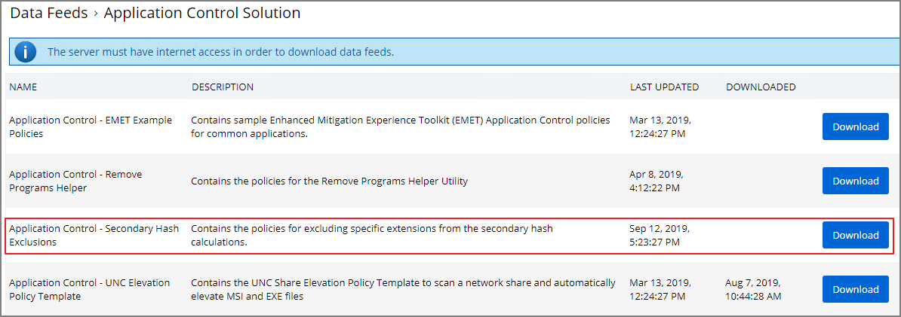

[title]: # (File Hash Exclusions)
[tags]: # (secondary file filters)
[priority]: # (8001)
# Exclude File Extensions during File Hashing

The Thycotic Application Control Agent collects the file hash of a new process and also the hashes of the child processes it runs. Sometimes non-executable file types cause execution issues during the hashing process. Via the downloadable Configuration Feeds, Thycotic offers a policy template that provides the ability to exclude certain file extensions from the hash process.

If non-executable files like xlsx, xls, mdb, and accdb for example cause execution issues, download the __Secondary  Hash Exclusions__ policy template. By default .mdb and .accdb are excluded from the file hashing procedure in Privilege Manager. To not overwrite default behavior, make them a part of your exclude list at all times.

Always manually test a new policy deployment on a single endpoint, and only push the solution to all desired endpoints after a successful verification on the test environment.

>**Note**:
>This feature requires a Thycotic Control Agent version of 10.5 or greater.

## Create File Exclusion through Config Feed

1. Navigate to __Admin | More__ and then click the __Config Feeds__ link.
1. Next to __Privilege Manager Configuration Feeds__ click __Select Items__.
1. Next to __Application Control Solution__ click __Select Items__.
1. Locate the __Application Control - Secondary Hash Exclusions__ and click __Download__.

   

   The policy template is being downloaded and installed.
1. Navigate to __Admin | Policies__ and select the __General__ tab.
1. Search and select the new policy __Deploy File Hash Exclusion Setting (Windows)__.

   
1. Click __Create a Copy__.
1. Click __Edit__, change the Name on the __General__ tab and also click the __Enable__ checkbox.
1. Go to the __Parameters__ tab and add the list of extensions to exclude, for example xlsx, xls, mdb, accdb.

   
1. Go to __Triggers__ and verify the set schedule works for your environment and edit if changes are required.

   
1. Go to the __Targets__ tab and specify the targets for the deployment of that list.

   
1. On the Conditions tab, you may specify any conditions specific to your environment.
1. Click __Save__.

## Manually Test on Endpoint

To create manual secondary extension exceptions to file hash collection, add a registry key to the endpoint.

1. Open Registry Editor (regedit.exe) and navigate to

   ```
   HKLM:\Software\Policies\Arellia\AMS.
   ```
1. Create __New | String Value__

   1. Name: __SecondaryExtensionExclusions__
   1. Value: enter a comma-separated list of extensions to include, i.e. `xlsx,xls,mdb,accdb`.
1. Restart the Thycotic services on this machine.

Open a file matching an extension from your inclusion list and test if it works on this endpoint. If it works, create a Policy to push this registry key creation to all desired endpoints.
<!-- TODO: The following sub topic will only be available in the dev publication environment, it will be commented out for QA and Production.-->
## Create Policy to Push Registry Change to Endpoints (internal)

First create a PowerShell Script task that can create the registry key, then create a Policy to push that task to the desired endpoints.

To create a PowerShell Script task to create the registry key:

1. Navigate to __ADMIN | Tasks | Automation tab | PowerShell Commands |  Client Commands | Agent | Windows__.
1. Select __Add New | Remote Powershell Script__.

   1. Give this task a custom name, ex.: [Company Name] - Deploy Registration Key
   1. Edit | Script tab
   1. Paste this script

      ```ps1
      $AppInfoPath = "HKLM:\Software\Policies\Arellia\AMS"
      $ExclusionList = "xls,xlsx,xlsm,mdb,accdb"
      if((Test-Path $AppInfoPath))

        {
         New-ItemProperty -Path $AppInfoPath -Name "SecondaryExtensionExclusions" -Value $ExclusionList -PropertyType "String" -Force
        }
      ```

Additional extensions can be added to __$ExclusionList__, if needed.

To create a Policy to push this script task to desired endpoints:

1. Navigate to __ADMIN | Policies__ and select the __General__ tab.
1. Search and select the __Ensure UAC Override Setting (Windows)__.
1. Click __Create Copy__ to copy the Policy and give the new Policy a custom name, for example _[Company Name] - Registry - Ensure UAC Override Setting (Windows)_.
1. Click Edit on your new policy.

   1. On the __General__ tab:

      1. check the __Enabled__ box and
      1. for __Command__ select the __Deploy Registration Key__ task created above.
   1. On the Targets tab verify the correct Resource Target(s) is(are) used.
1. Click __Save__.
1. Go to the __Deployment__ tab and deploy the policy via __Run Policy Targeting Update__ button.
-->
