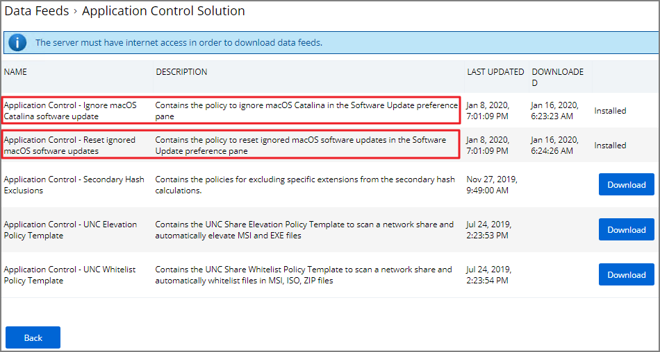
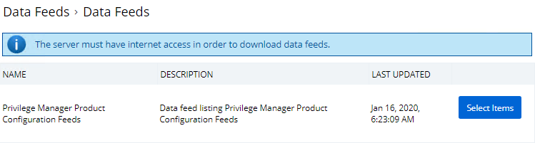
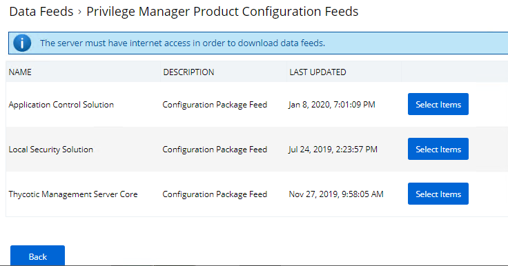
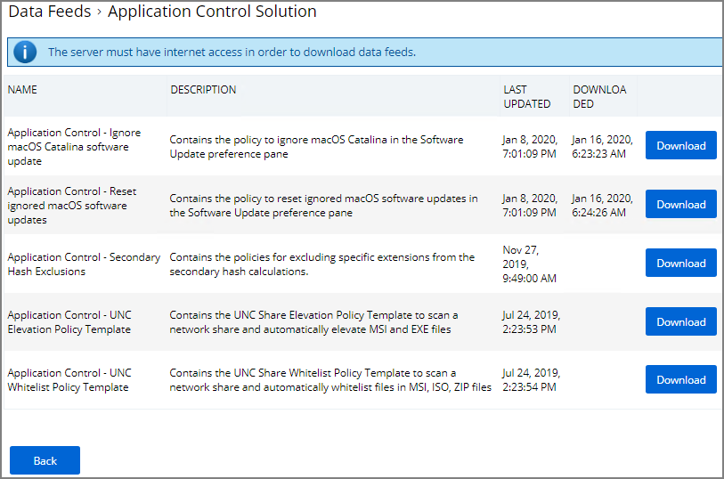
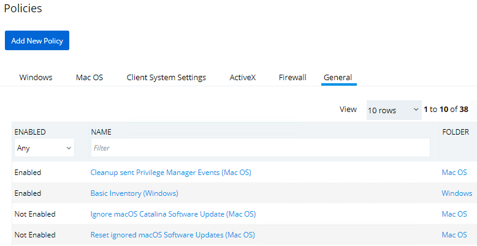
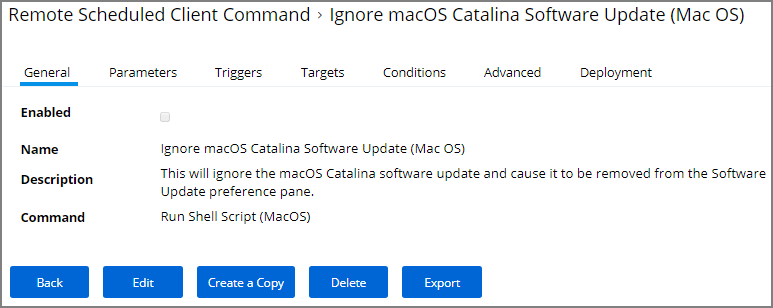
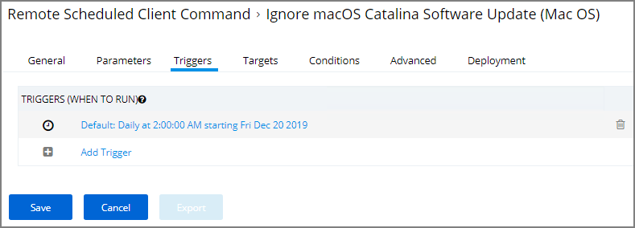

[title]: # (Ignoring macOS Updates)
[tags]: # (overview)
[priority]: # (8002)
# Ignoring macOS Updates

MacOS has a command-line utility that can be used to ignore specific software updates in the Software Update preference pane. To provide a way in Privilege Manager to ignore or reset ignored OS updates, the following policieswith commands are available via configuration feeds.

 

* The Ignore macOS Catalina Software Update (Mac OS) - The Ignore macOS Catalina Software Update (Mac OS) policy uses the Run Shell Script (Mac OS) command. By default, it is triggered to run Daily at 5:00:00 AM starting Fri Dec 20 2019, with default Targets specified as MacOS Computers.

* The Reset ignored macOS Softwares Update (Mac OS) - The Reset ignored macOS Softwares Update (Mac OS). uses the Run Shell Script (Mac OS) command. By default, it is triggered to run Daily at 5:30:00 AM starting Fri Dec 20 2019, with default Targets specified as MacOS Computers.

## Configuration Feeds

1. Navigate to __ADMIN | More__.
1. Click on __Config Feeds__.
1. Click on __Select Items__ for __Privilege Manager Product Configurations__.

   
1. Click on __Select Items__ for Application Control Solution.

   
1. Click on download for both __Application Control - Ignore macOS Catalina software update and Application Control - Reset ignored macOS software updates__.

   

## Enabling the Policies

1. Navigate to __ADMIN | Policies__.
1. Click on the __General Tab__.
1. Click on __Ignore macOS Catalina Software Update (Mac OS)__.

   
1. Under the General tab, click __Edit__.

   
1. Check the __Enabled__ box.
1. Click __Save__.

   

1. Repeat steps 1 through 6 for __Reset ignored macOS Software Updates (Mac OS)__ policy.

## Scheduling

You can edit when the policy runs by navigating to the __Triggers__ tab under the policy and clicking on __Edit__.

   

   >**Note:** Once the policies are enabled they do not run immediately. If you would like the policies to run right way you will need to adjust the schedule which you can find under the __Triggers__ tab in the policy.
