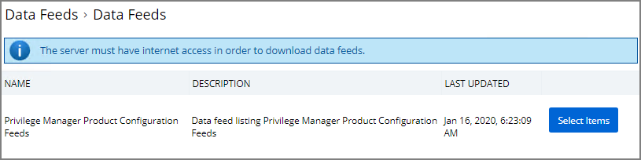

[title]: # (Ignoring macOS Updates)
[tags]: # (overview)
[priority]: # (8002)
# Ignoring macOS Updates

MacOS has a command-line utility that can be used to ignore specific software updates in the Software Update preference pane.

* Create a remote scheduled command and policy to ignore the macOS Catalina software update.
* Create a remote scheduled command and policy to reset ignore macOS software updates.

The following policies and remote scheduled commands should be created and not enabled by default:

Policies:
* Ignore macOS Catalina Software Update (Mac OS)
* Reset ignored macOS Software Updates (Mac OS)

The Ignore macOS Catalina Software Update (Mac OS) policy should have Ignore macOS Catalina Software Update (MacOS) as it's command. By default, it should be triggered to run at Daily at 5:00:00 AM starting Fri Dec 20 2019. It's default Targets should be MacOS Computers.

The Reset ignored macOS Softwares Update (Mac OS) policy should have Reset ignored macOS Software Updates (MacOS) as it's command. By default, it should be triggered to run at Daily at 5:30:00 AM starting Fri Dec 20 2019. It's default Targets should be MacOS Computers.

## Configuration Feeds

1. Navigate to __ADMIN | More__.
1. CLick on __Config Feeds__.
1. Click on __Select Items__ for __Privilege Manager Product Configurations__.

   
1. Click on __Select Items__ for Application Control Solution.
1. Click on download for both __Application Control - Ignore macOS Catalina software update and Application Control - Reset ignored macOS software updates__.

   

## Creating the Policies

1. Navigate to __ADMIN | Policies__.
1. Click on the __General Tab__.
1. Click on __Ignore macOS Catalina Software Update (Mac OS)__.

   
1. Under the General tab, click __Edit__.

   
1. Check the __Enabled__ box.
1. Click __Save__.

   

1. Repeat steps 1 through 6 for __Reset ignored macOS Software Updates (Mac OS)__ policy.

## Scheduling

You can edit when the policy runs by navigating to the __Triggers__ tab under the policy and clicking on __Edit__.

   >**Note:** Once the policies are enabled they do not run immediately. If you would like the policies to run right way you will need to adjust the schedule which you can find under the __Triggers__ tab in the policy.