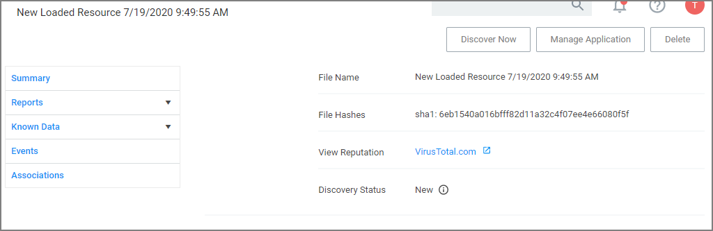

[title]: # (File Inventory)
[tags]: # (admin,configuration)
[priority]: # (4000)
# File Inventory

The file inventory page lists all files discovered based on the Basic Inventory policies. 

The table grid contains the following columns:

* File Name
* Original File Name
* Product Name
* Product Version
* First Discovered

At the beginning of your policy creation process you will see many new events labeled as __New Loaded Resource__. This is because importing files in Privilege Manager is not the same thing as discovering information about the files. Discovery of file details is done [by scheduled tasks by default](../admin/tasks/client/dfip.md), but if you want to discover file details immediately, do the following:

1. Navigate to __File Inventory__.
1. Select __New Loaded Resource__.

   
1. Click on a __New Loaded Resource__ entry.

   
   1. Check the Discover Status. The following states are available:
      * __New__, the resource was just reported). 
      * __Pending Assignment__, the resource will soon be assigned to an agent for discovery).
      * __Assigned to agent__, an agent was chosen to discover this resource.

      Once an agent is assigned, you can click __Discover Now__ to attempt to force the agent to immediately discover the resource. Many factors affect the agent's promptness in discovering the resource: agent up-time, current processing queue, etc. Please be patient.
1. Click __Discover Now__.
1. After the successful discovery, click __View File__ or __Create Filter__ as your next option to use the discovered or inventoried resource. You have the option to add it to a Policy.

>**Note**:
>Files may not be discovered if they have already been deleted from your system.
