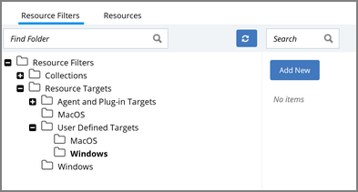
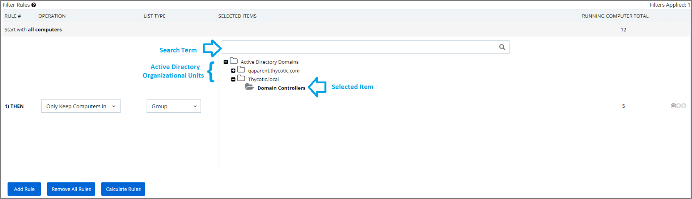
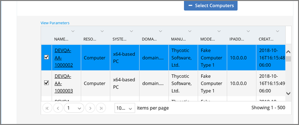
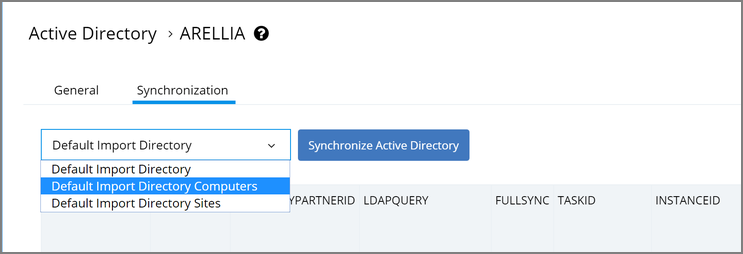
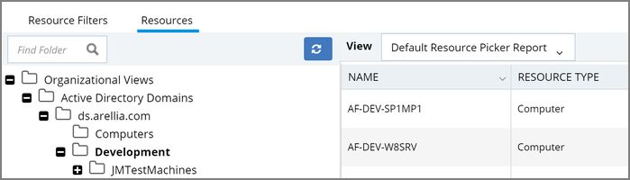
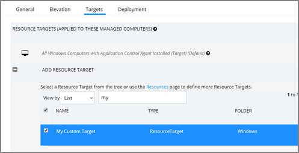

[title]: # (Resource Targets)
[tags]: # (filter)
[priority]: # (5001)
# Resource Targets/Filters

A Resource Target in Privilege Manager is a specified set of computers that meet certain criteria (e.g., type of operating system or location of the computers), meant to be used as targets for policies or scheduled tasks. To make a policy apply to a certain set of computers, you need a resource target comprising that set of computers and assign that resource target to the policy (or, to state it differently, assign the policy to the resource target).

There are several built-in resource targets (for example, "All 64-bit Windows Computers with Application Control Agent Installed") that can be used when defining policies so that users generally do not need to create custom resource targets. However, there are cases when the latter is needed and, toward that end, this article focuses on user defined resource targets.

The article also briefly touches upon collections, a concept related to resource targets.

Resource targets are not the only kind of targets that can be assigned to policies; one could also assign an application filter to a policy to make the policy apply to the application file included in the filter.

## User Defined Resource Targets

Targets are defined by starting with all known computers and then adding filters to narrow down the set (and after an initial narrowing down, if needed, expand it in some way).

You could create unique targets for all your policies, but if you want to create a target to be reused across multiple policies, it will be more practical to follow the guidance in this article.

### Interface to View or Create/Modify User Defined Targets

In the Privilege Manager console, select the Admin menu and click __More...__.  On the Administration page select Resources.  On the Resources page select the Resource Filters tab, then in the tree go to __Resource Filters | Resource Targets | User Defined Targets__, and select either MacOS or Windows.

If you already have user defined targets (having created them previously), you will see them listed here and can modify any of them by clicking the name and then editing the definition.

To create a new target, click the Add New button on the right, enter a name and description and then click the Create button.

>**Note**:
>A Computer Group, like a Resource Target, is also a specified set of computers; you can think of it as another way to refer to Resource Targets. A computer group can be viewed, created, and modified from the Local Security home page. If you create a computer group in Local Security, you will see it listed in the User Defined Targets node of the Resource Filters tree. However, in this article we are not referring to the Local Security interface for defining Resource Targets since the focus here is to define targets for policies, which is a feature related to Application Control.

## Target Definition
After you have clicked the Create button, you will be on the target page (a page that provides an interface for defining the target). On the target page, click Edit and make sure you are on the Filter Rules tab.

Here you will be able to add rules to define the target, using the drop-down fields in the Operation and List Type columns.

### Operation

The idea here is that you are starting with all computers and applying filters to get the desired set.  There are several operations that can be applied:

* __Only Keep Computers in__:  This is an intersect operation. Only computers in both the current working set and the given list/collection will be kept.
* __Include Computers in__:  This is an add operation. The computers in the given list/collection will be added to the current working set.
* __Exclude Computers in__:  This is a subtract operation. Any computers in the excluded list/collection will be removed from the current working set.

### List Type

* __Collection__: A collection (in the context being discussed here) is a predefined list of computers.  (A collection is often meant to act as a filter and hence is also sometimes referred to as a filter.) See the Collections section for more information.
* __Computer List__:  This is a fixed list specified for the target being defined. (See the screenshot at the end of this section.)
* __Group__:  This is most often used to select a group of computers like an Active Directory Organizational Unit.

You can select "View Parameters" to enter search text to help find a computer.

## Performance Considerations

Resource Targets are reevaluated when the scheduled task "Collection and Resource Targeting Update" runs.  This operation is expensive for large numbers of computers.  To keep performance high we suggest that you keep the overall number of targets to a minimum.  Also note that targets with simpler definitions are generally less expensive.

## Active Directory as Related to Resource Targets

After you have created an Active Directory (AD) instance in Privilege Manager, you need to import computers (computer records, to be more precise).  Go to your Active Directory Instance (by using Admin | Configuration | Foreign Systems, selecting your domain, then clicking your AD name) and select the Synchronization tab.  Run the task "Default Import Directory Computers":

>**Note**:
>Default Import Directory Computers will import computers and also import the Organizational Units (OU) to which they belong. Default Import Directory will import only organization structure and security-related information like users.

After the task completes, go to Admin | More, then select Resources, then Resource tab, then in the tree Organizational Views | Active Directory Domains | (your AD name).  You should be able to see your OUs and computers.

These OUs are what you can select using the "Group" option, for "List Type", when building a target.

>**Note**:
>Changes made in AD are not immediately reflected in Privilege Manager.  Run the Default Import Directory Computers task again to import changes.  You can search for "Default Import Directory Computers", edit the task and add a schedule to automatically import updates.  The operation can be long-running for large domains, so be careful about the frequency with which you schedule the import.

## Assigning Policies to Targets

To assign a policy to your target (or, stated another way, to add your target to a policy), find the  policy on the Policies page and click Edit.  If you are using the Simple Policy View, find the Targets tab; if using the Advanced Policy View, find the Conditions tab.  You can remove existing targets by clicking the trash icon.  Select Add Resource Target, find your target, select it, and click the Add button and Save.

## Collections

A collection is a predefined list of computers. A collection is often meant to act as a filter and hence is also sometimes referred to as a filter.

Collections are typically defined by an SQL query that returns a list of computer IDs or other resource IDs.

Built-in collections are available in Privilege Manager, for example, "All x64 Windows Computers" and "Domain Controllers."

User defined collections are possible but typically expected to be created by Privilege Manager professional services, on behalf of a user, rather than directly by a user.  Users are encouraged to define custom targets using existing (built-in) collections, groups, and fixed lists rather than creating new collections.
