[title]: # (Using Secondary File Filters)
[tags]: # (policy, deny, allow, best practice)
[priority]: # (4013)
# Using Secondary File Filters

This topic explains how to create policies for applications that trigger file executions. Implementing a policy to filter on a file type, which is used by another executable, is done by setting a **Secondary File Filter**.

This article shows the steps used to create filters and policies that enforce actions on  endpoints when batch files, PowerShell scripts, or Microsoft Installer files execute. Any type of executer can be specified and policed this way.

In general, the steps are similar for the different file types to be policed.

* You first create an application or file filter that identifies the executing application, for example \*.ps1,
* then you create the secondary file filter identifying the file type by adding the file or application filter (\*.ps1) under Settings,
* then you create a policy, specifying Application Targets, and
* use an Inclusion and/or Exclusion filter specified as and using the Secondary File Filter.

The following three examples show how to setup file filters to deny running single files, such as a .bat, .ps1, and .msi.

## Batch File Example

### Creating the File Filter for .bat Files

In this example we are creating a filter for the target executing .bat files.

1. In the Privilege Manager Console navigate to **Admin | More | Filters**.
2. On the Filter page, click **Add New Filter**.
3. On the New Filter page, select the platform. This can be either **Both Windows / Mac OS**, **Windows**, or **Mac OS**. For this example, select **Windows**.
4. From the Filter Type drop*down select **File Specification Filter**. This also allows you to link in hashes or signatures.

   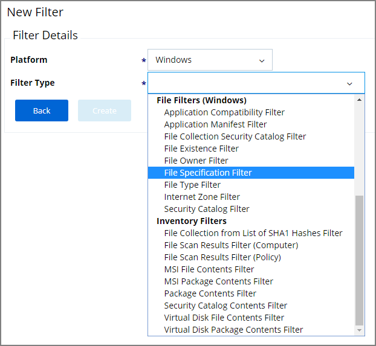

5. Enter the name and a description for the filter, for example “test.bat” and “filter for batch files”.
6. Click **Create**.
7. The page for the new filter opens, click **Edit**.
8. Under File Specifications in the File Name field enter either a single file name, file specification, or RegEx.

   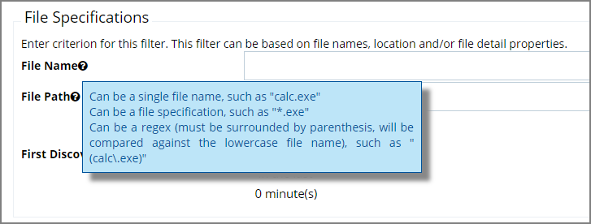

   For this example, we use **test.bat** to police a single file name.

9. Verify that First Discovered is set to **Anytime**.
10. Click **Save**.

### Creating the Secondary Filter

In this example we are creating the secondary file filter.

1. In the Privilege Manager Console navigate to **Admin | More | Filters**.
2. On the Filter page, click **Add New Filter**.
3. On the New Filter page, select the platform. This can be either **Both Windows / Mac OS**, **Windows**, or **Mac OS**. For this example, select **Windows**.
4. From the Filter Type drop*down select **Secondary File Filter**. 

   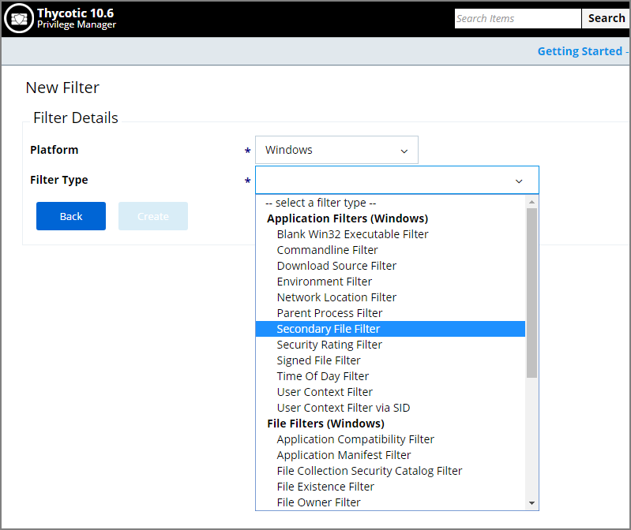

5. Enter the name and a description for the filter, for example “secondary file filter for batch files”.
6. Click **Create**.
7. The page for the new filter opens, click **Edit**.
8. Under Settings click **+Add** to add the test.bat filter created in “Creating the File Filter for .bat” procedure.

   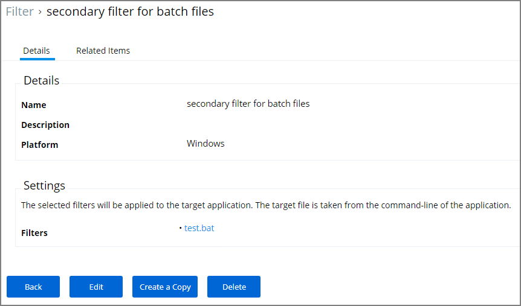

9. Click **Save**.

### Creating the Policy

1. Navigate to **Admin | Policies**.
2. Click **Add New Policy**.
3. From the Platform drop*down select **Windows**.
4. From the Policy Type drop*down select **Show All Templates**.
5. From the Template Type drop*down select **Other: Empty Policy**.
6. Enter a Name and Description, click **Create**.
7. Click **Edit**.
8. On the **General** tab in the Status area set the policy to **Enabled**.
9. Select the **Conditions** tab.
10. Under Application Targets click **+ Add Application Target**.
11. In Search, enter command and select **Command Processor (cmd.exe)** from the list, click **Add**.
12. Under Inclusion Filters click **+ Add Inclusion Filter**.
13. In Search, enter secondary and select **secondary filter for batch files** from the list, click **Add**. This is the filter you created in the “Creating the Secondary Filter” procedure above.

    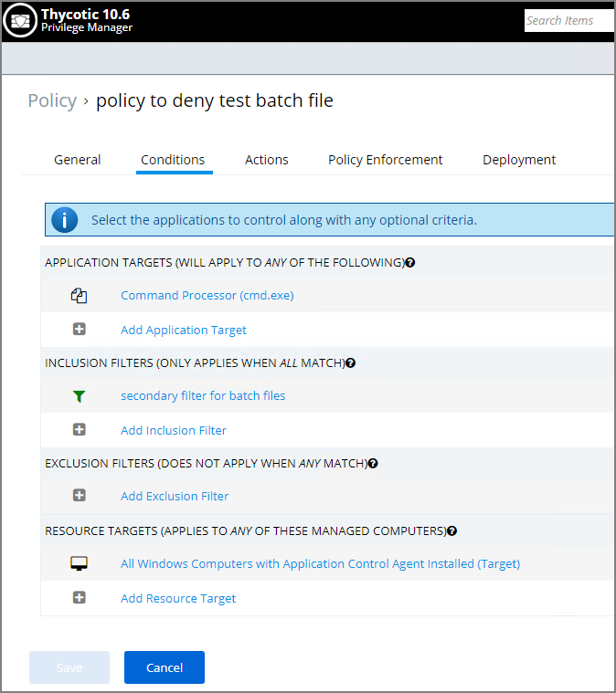

    Resource Targets are automatically added based on the policy template selected.

14. Select the **Actions** tab.
15. Enable Send policy feedback.
16. Under Actions to apply to the application click **+ Add Action**.
17. Select **Application Denied Message Action** from the list, click **Add**.

    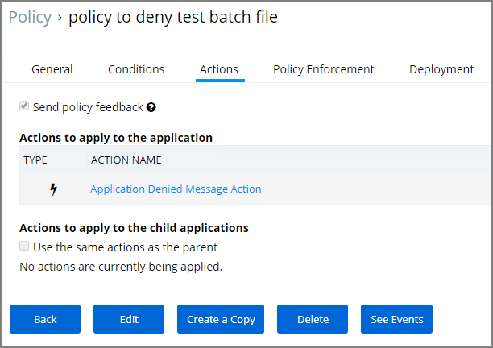

18. Click **Save**.

## PowerShell Script Example

In this example we are creating a policy to deny running a test.ps1 file.

### Creating the File Filter for .ps1 Files

In this example we are creating a filter for the target executing .ps1 files.

1. In the Privilege Manager Console navigate to **Admin | More | Filters**.
2. On the Filter page, click **Add New Filter**.
3. On the New Filter page, select the platform. This can be either **Both Windows / Mac OS**, **Windows**, or **Mac OS**. For this example, select **Windows**.
4. From the Filter Type drop*down select **File Specification Filter**. This also allows you to link in hashes or signatures.

   

5. Enter the name and a description for the filter, for example “test.ps1” and “filter for powerscript files”.
6. Click **Create**.
7. The page for the new filter opens, click **Edit**.
8. Under File Specifications in the File Name field enter either a single file name, file specification, or RegEx. 

   

 For this example, we use **test.ps1** to police a single file name.

9. Verify that First Discovered is set to **Anytime**.
10. Click **Save**.

### Creating the Secondary Filter

In this example we are creating the secondary file filter.

1. In the Privilege Manager Console navigate to **Admin | More | Filters**.
2. On the Filter page, click **Add New Filter**.
3. On the New Filter page, select the platform. This can be either **Both Windows / Mac OS**, **Windows**, or **Mac OS**. For this example, select **Windows**.
4. From the Filter Type drop*down select **Secondary File Filter**.

   

5. Enter the name and a description for the filter, for example “secondary file filter for PowerShell files”.
6. Click **Create**.
7. The page for the new filter opens, click **Edit**.
8. Under Settings click **+Add** to add the test.ps1 application filter created in “Creating the File Filter for .ps1 Files” procedure. 

   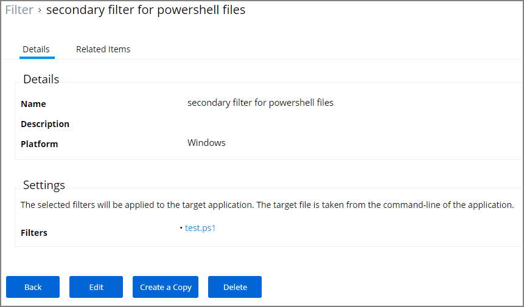

9. Click **Save**.

### Creating the Policy

1. Navigate to **Admin | Policies**.
2. Click **Add New Policy**.
3. From the Platform drop*down select **Windows**.
4. From the Policy Type drop*down select **Show All Templates**.
5. From the Template Type drop*down select **Other: Empty Policy**.
6. Enter a Name, for example “policy to deny test PowerShell script” and Description, click **Create**.
7. Click **Edit**.
8. On the **General** tab in the Status area set the policy to **Enabled**.
9. Select the **Conditions** tab.
10. Under Application Targets click **+ Add Application Target**.
11. In Search, enter command and select **Powershell (PowerShell.exe)** from the list, click **Add**.
12. Under Inclusion Filters click **+ Add Inclusion Filter**.
13. In Search, enter secondary and select **secondary filter for PowerShell files** from the list, click **Add**. This is the filter you created in the “Creating the Secondary Filter” procedure above.

    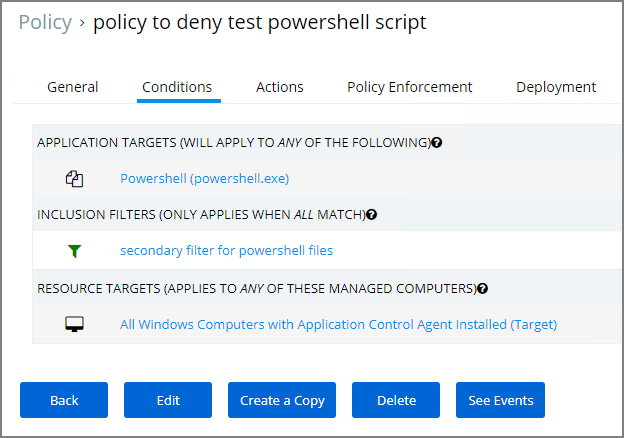

    Resource Targets are automatically added based on the policy template selected.

14. Select the **Actions** tab.
15. Enable Send policy feedback.
16. Under Actions to apply to the application click **+ Add Action**.
17. Select **Application Denied Message Action** from the list, click **Add**.

    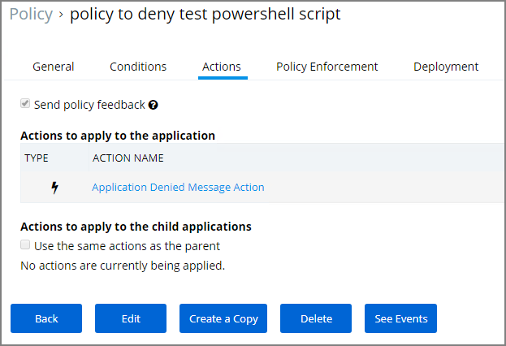

18. Click **Save**.

## MSI File Example

In this example we are creating a policy to deny running a test.msi file.

### Creating the File Filter for .msi Files

In this example we are creating a filter for the target executing .msi files.

1. In the Privilege Manager Console navigate to **Admin | More | Filters**.
2. On the Filter page, click **Add New Filter**.
3. On the New Filter page, select the platform. This can be either **Both Windows / Mac OS**, **Windows**, or **Mac OS**. For this example, select **Windows**.
4. From the Filter Type drop*down select **File Specification Filter**. This also allows you to link in hashes or signatures. 

   

5. Enter the name and a description for the filter, for example “test.msi” and “filter for msi files”.
6. Click **Create**.
7. The page for the new filter opens, click **Edit**.
8. Under File Specifications in the File Name field enter either a single file name, file specification, or RegEx.

   

   For this example, we use **test.msi** to police a single file name.

9. Verify that First Discovered is set to **Anytime**.
10. Click **Save**.

### Creating the Secondary Filter

In this example we are creating the secondary file filter.

1. In the Privilege Manager Console navigate to **Admin | More | Filters**.
2. On the Filter page, click **Add New Filter**.
3. On the New Filter page, select the platform. This can be either **Both Windows / Mac OS**, **Windows**, or **Mac OS**. For this example, select **Windows**.
4. From the Filter Type drop*down select **Secondary File Filter**.

   

5. Enter the name and a description for the filter, for example “secondary file filter for msi files”.
6. Click **Create**.
7. The page for the new filter opens, click **Edit**.
8. Under Settings click **+Add** to add the test.msi application filter created in “Creating the File Filter for .msi Files” procedure. 

   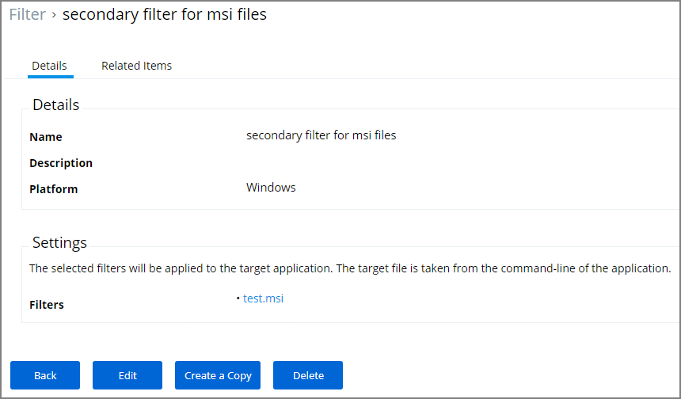

9. Click **Save**.

### Creating the Policy

1. Navigate to **Admin | Policies**.
2. Click **Add New Policy**.
3. From the Platform drop*down select **Windows**.
4. From the Policy Type drop*down select **Show All Templates**.
5. From the Template Type drop*down select **Other: Empty Policy**.
6. Enter a Name and Description, click **Create**.
7. Click **Edit**.
8. On the **General** tab in the Status area set the policy to **Enabled**.
9. Select the **Conditions** tab.
10. Under Application Targets click **+ Add Application Target**.
11. In Search, enter command and select **Microsoft Installer File Filter** from the list, click **Add**.
12. Under Inclusion Filters click **+ Add Inclusion Filter**.
13. In Search, enter secondary and select **secondary filter for msi files** from the list, click **Add**. This is the filter you created in the “Creating the Secondary Filter” procedure above.

    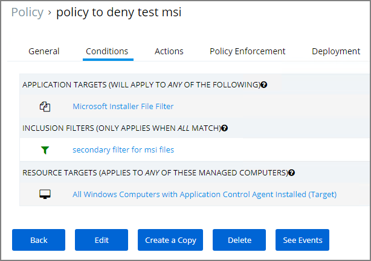

    Resource Targets are automatically added based on the policy template  selected.

14. Select the **Actions** tab.
15. Enable Send policy feedback.
16. Under Actions to apply to the application click **+ Add Action**.
17. Select **Application Denied Message Action** from the list, click **Add**. 

    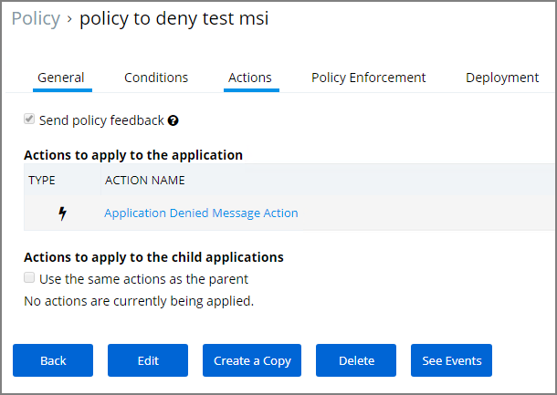

18. Click **Save**.

## Best Practices

As a best practice you create an elevate policy with a priority of X (for example 20) to elevate or allow specific scripts or files to run. Then you add a policy with a priority of X+1 (for this example 21) to deny any other execution of the command processor, PowerShell, or Microsoft installer files. For this example .msi is used.

### Creating the Allow notepad++\*.msi Filter

1. In the Privilege Manager Console navigate to **Admin | More | Filters**.
2. On the Filter page, click **Add New Filter**.
3. On the New Filter page, select the platform. This can be either **Both Windows / Mac OS**, **Windows**, or **Mac OS**. For this example, select **Windows**.
4. From the Filter Type drop*down select **File Specification Filter**.

   

5. Enter the name and a description for the filter, for example “notepad++\*.msi”
6. Click **Create**.
7. The page for the new filter opens, click **Edit**.
8. Under File Specifications in the File Name field enter either a single file name, file specification, or RegEx. 

   

   For this example, we use RegEx **(notepad\\+\\+[ a*z0*9\\.]+)** to elevate any Notepad++ version.

9. Verify that First Discovered is set to **Anytime**.
10. Click **Save**.

### Creating the Secondary Filter

1. In the Privilege Manager Console navigate to **Admin | More | Filters**.
2. On the Filter page, click **Add New Filter**.
3. On the New Filter page, select the platform. This can be either **Both Windows / Mac OS**, **Windows**, or **Mac OS**. For this example, select **Windows**.

4. From the Filter Type drop*down select **Secondary File Filter**. 

   

5. Enter the name and a description for the filter, for example “secondary file filter for notepad++ msi files”.
6. Click **Create**.
7. The page for the new filter opens, click **Edit**.
8. Under Settings click **+Add** to add the **notepad++\*.msi** application filter created in “Creating the Allow notepad++\*.msi Filter” procedure. 

   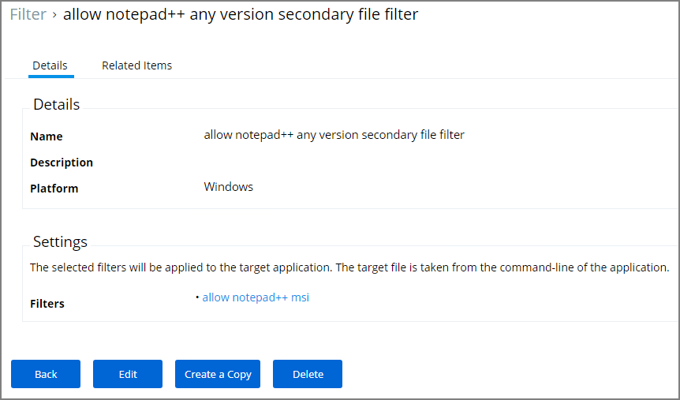

9. Click **Save**.

### Creating the Allow a Specific .msi File to Run Policy

1. Navigate to **Admin | Policies**.
2. Click **Add New Policy**.
3. From the Platform drop*down select **Windows**.
4. From the Policy Type drop*down select **Show All Templates**.
5. From the Template Type drop*down select **Other: Empty Policy**.
6. Enter a Name and Description, click **Create**.
7. Click **Edit**.
8. On the **General** tab in the Status area set the policy to **Enabled**.
9. Select the **Conditions** tab.
10. Under Application Targets click **+ Add Application Target**.
11. In Search, enter command and select **Microsoft Installer File Filter** from the list, click **Add**.
12. Under Inclusion Filters click **+ Add Inclusion Filter**.
13. In Search, enter secondary and select the **allow notepad++\*any version secondary file filter** created in “Creating the Secondary Filter” procedure steps, click **Add**.

    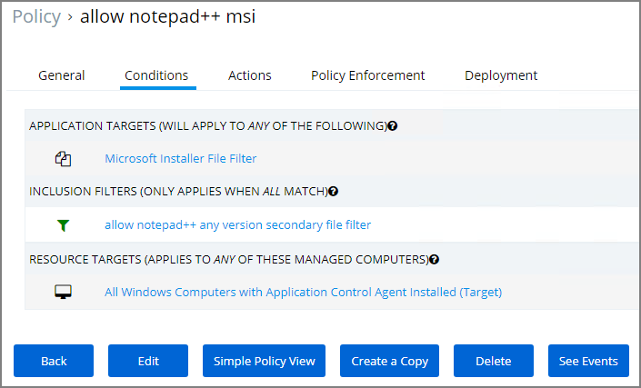

    Targets are automatically added based on the policy template selected.

14. Click **Save**.

### Creating the .msi Deny Policy

1. Navigate to **Admin | Policies**.
2. Click **Add New Policy**.
3. From the Platform drop*down select **Windows**.
4. From the Policy Type drop*down select **Blacklist / Deny Application Execution**.
5. From the Template Type drop*down select the **Blacklist: Deny Specific Applications**.
6. Enter a Name, for example “deny .msi execution” and Description. 

   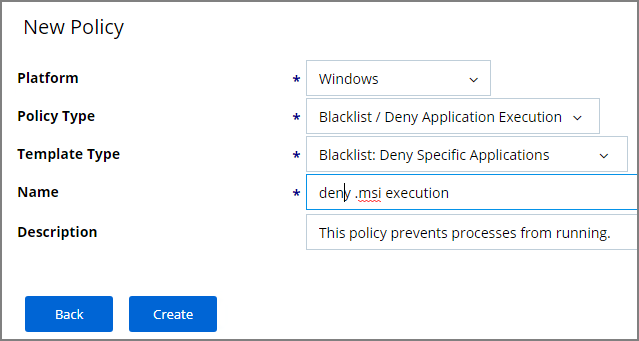

7. Click **Create**.
8. Click **Edit**.
9. On the **General** tab in the Status area set the policy to **Enabled**.
10. Set the **Policy Priority** to **21**.
11. Select the **Blacklist** tab.
12. Select **Modal Deny Message** and keep the selection for **Send Event Feedback to Server**.
13. Click **Add Existing File Filter**.
14. Search for Microsoft and select **Microsoft Installer File Filter**, click **Add**. 

    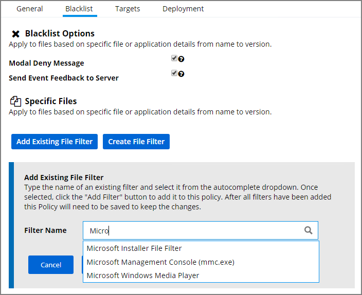

    Once added this filter is listed as msiexec.exe in the list. 
    Targets are automatically added based on the policy template selected.

15. Click **Save**.

## Updating the Endpoints with the Policies

After adding new filters and policies, the endpoints need to be updated to
enforce the new rules.

This can be done directly:

1. On the Policy Details page select the **Deployment** tab.
2. Click **Run Policy Targeting Update**.

From any other location in the Privilege Manager console follow these steps:

1. Navigate to **Admin | Config**.
2. Select the **General** tab.
3. Click **Policy Targeting Update**.

## RegEx Examples

When using RegEx instead of a single file name or tile specification, make sure to verify the syntax and test your filter before using it in production.

Program name with version in file name:

```RegEx
(flashutil[ a*zA*Z0*9\\.]+exe)
```

Winamp58_3660_beta_full_en*us

```RegEx
(winamp[ a*zA*Z0*9\\.]+exe)
```

Wireshark*win64*2.6.6.exe

```RegEx
(wireshark*win64*[ a*zA*Z0*9\\.]+exe)
```
