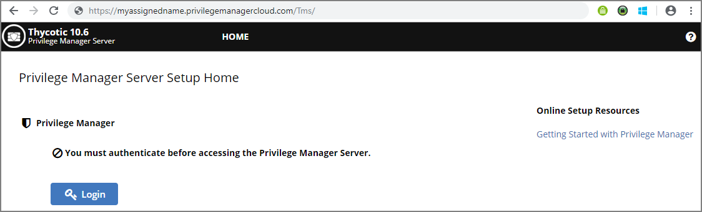

[title]: # (Privilege Manager Cloud)
[tags]: # (cloud instance)
[priority]: # (201)
# Privilege Manager Cloud

## Privilege Manager Cloud Login

To login to a Privilege Manager Cloud instance, use the URL and credentials provided to you. The URL is in the format of:

```url
https://myassignedname.privilegemanagercloud.com/TMS
```

1. Navigate to your assigned login URL.

   

1. Click the Login button. This opens the Sign In dialog:

   

   a. Enter your Email address and click Next.
   b. Enter your password and click Sign in.

1. Select Privilege Manager on the Server Setup Home page:

   

The Privilege Manager cloud console home page opens:

   

> **Note**: To import and synchronize Azure Active Directory Groups and Users, refer to the following KB article [here](../integration/set-up-privilege-manager-azure-ad-integration.md).