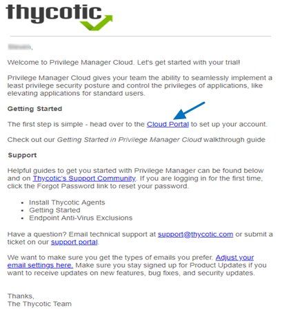
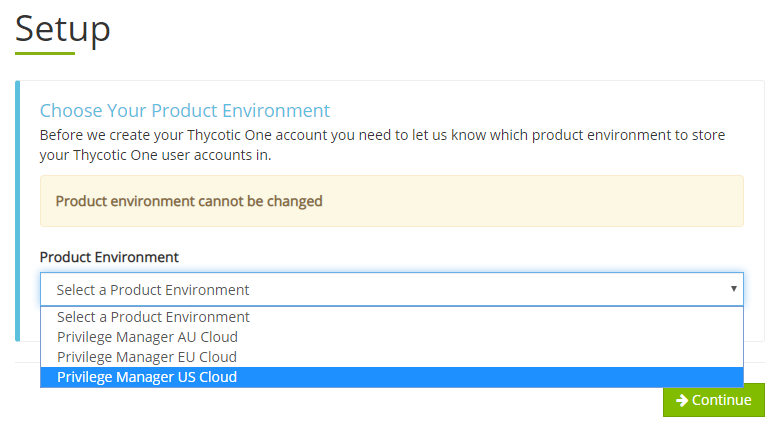
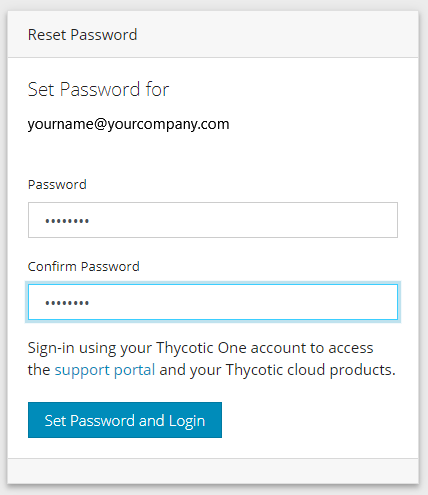
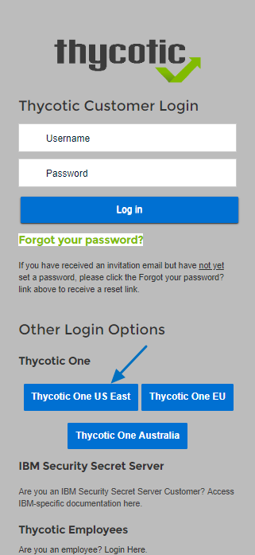
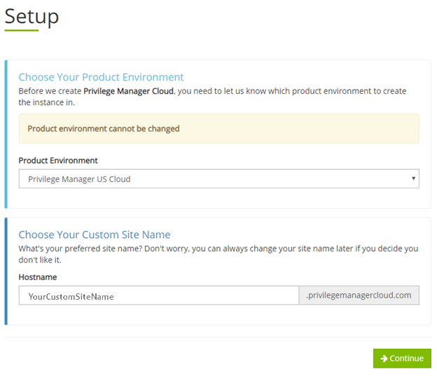
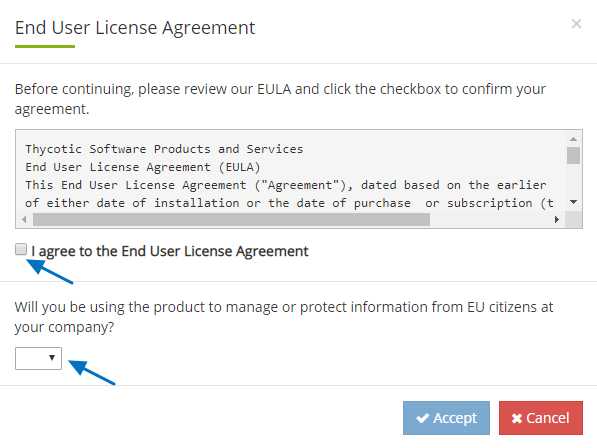
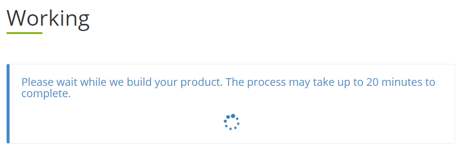
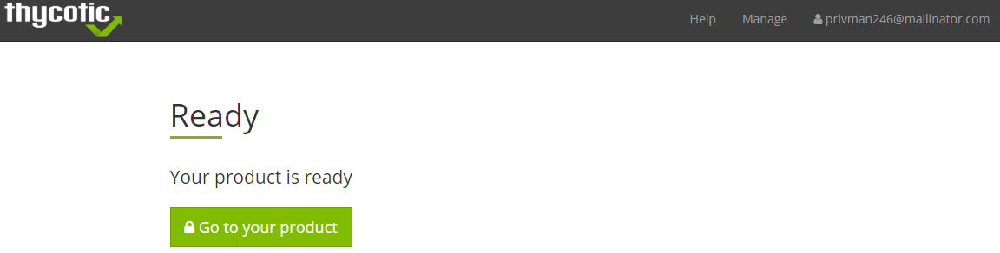
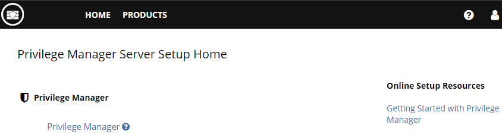
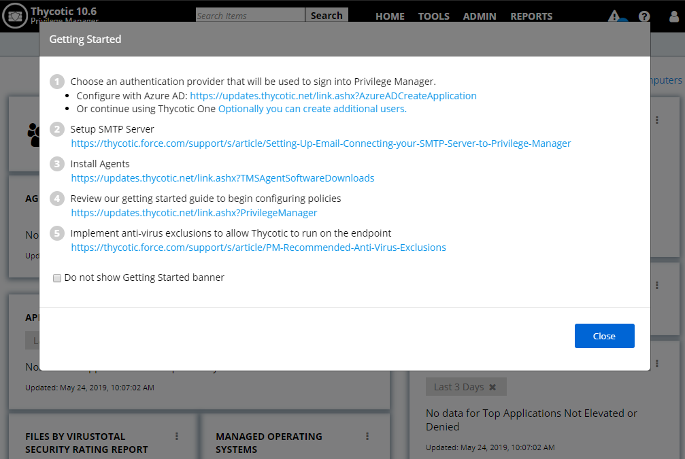

[title]: # (Quickstart)
[tags]: # (cloud instance)
[priority]: # (501)
# Cloud Quickstart Guide

Privilege Manager Cloud is a scalable cloud platform, where all backend services, databases, and redundancy are securely managed by Thycotic and hosted on the Microsoft Azure platform. Customers do not have direct access to the databases or application file system.

This guide will walk you through an initial configuration of your cloud instance.

## Initial Setup

After you’ve signed up for a Privilege Manager Cloud trial, you will receive 2 emails. The first one is from Customer Support and will ask you to create a password to log into the customer support portal.

The second email you will receive is from Thycotic Sales titled Privilege Manager Cloud Trial. This email directs you to the __Cloud Portal__ to begin your instance setup.

Select the Cloud Portal link. On the Setup page, choose your Cloud Environment location from the dropdown menu. Then click __Continue__.

You will be directed to the __Thycotic One__ portal to create the password for your first user account with Administrator credentials. This account will be assigned to the email address you entered to request the trial. After confirming
the password, click __Set Password and Login__.

**Important:** Thycotic recommends that you store the password in a secured physical location such as a safe or locked file cabinet. You can reset the password using an email reset, but __if this password is forgotten or you no longer have access to the email account, Thycotic will not be able to reset this password.__

On the Thycotic Login page, click the blue button that corresponds to your new Cloud’s Thycotic One location (chosen above).

Next, on the Setup page choose the location of your cloud environment and enter the __Name__ for your subdomain. Do not use special characters or spaces.

Read the End User License Agreement and click the box to signify agreement. From the dropdown, select Yes or No to signify your organization’s oversight of EU information. Click __Accept__.

It will take approximately __20 minutes__ for your new Privilege Manager Cloud to spin up.

When complete, click __Go to your Privilege Manager Cloud__ instance and __Login with Thycotic One__.

You will be automatically redirected to your new Privilege Manager Cloud Dashboard. 

Select the *Privilege Manager* link

## Getting Started Screen

Follow the steps on the Getting Started screen. Start with step 1 to allow other users to access Privilege Manager and make sure all 5 steps are completed or reviewed before continuing.

