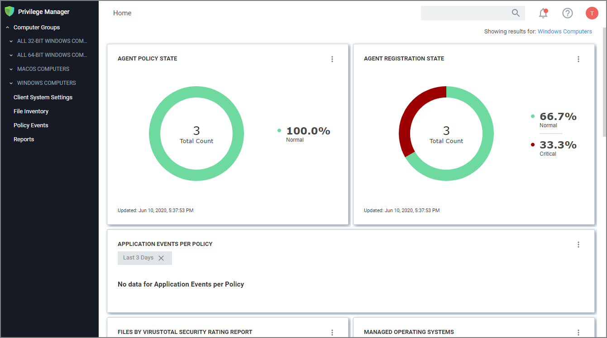

[title]: # (Cloud Login)
[tags]: # (cloud instance)
[priority]: # (3)
# Privilege Manager Cloud Login

To login to a Privilege Manager Cloud instance, use the URL and credentials provided to you. The URL is in the format of:

`https://myassignedname.privilegemanagercloud.com/TMS`

1. Navigate to your assigned login URL.

   

   Depending on the authentication provider setup, users are presented with different login choices.
1. Click the Login button. This usually opens the Sign In dialog:
   1. Enter your username or Email address and click __Next__.
   1. Enter your password and click __Login__.

   The Privilege Manager cloud console home page opens:

   

>**Note**: To import and synchronize Azure Active Directory Groups and Users, refer to the following topic: [Setting Up Azure Active Directory Integration in Privilege Manager](../../integration/active-directory/set-up-privilege-manager-azure-ad-integration.md).

To add Thycotic One Users manually refer to the following topic: [How to Add Thycotic One Users Manually](../../admin/users/index.md). That topic does also cover how to create Standard and API Client users.
