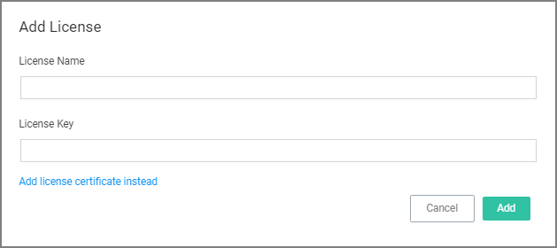

[title]: # (Licensing)
[tags]: # (Licensing,On-premises,Cloud)
[priority]: # (503)
# Licensing

## Cloud Licenses

Licensing for Privilege Manager Cloud customers is managed via Thycotic.

## Installing New Licenses - On-premises Only

To install new Privilege Manager licenses, it will depend on whether you chose to

a. perform a standalone install, or

b. install Secret Server in tandem with Privilege Manager.

>**Note**:
>Online activation is not required for Privilege Manager licenses.

### Steps for Standalone Privilege Manager Installation

To install licenses without Secret Server:

1. Navigate to __Admin | Licenses__ or __click__ the Product Licenses Installed link in the top banner.

   

1. On the Privilege Manager Licenses page, click __Add License__, then 
   1. enter your License Name(s) and 
   1. Key(s) one at a time, 
   1. select Add License to finish.

   

### Steps for Combined Secret Server + Privilege Manager Installation

To install licenses with Secret Server on the same server as Privilege Manager, you will need to install licenses through the Secret Server UI and then import the new licenses into Privilege Manager.

1. To access Secret Server’s licensing page, either click the Secret Server link listed in the banner at the top of the Privilege Manager Licenses page or navigate to __Admin | Setup – Licenses__.
1. From Secret Server’s License page, select Install New License.
1. Enter your License Names and Keys individually or through the Bulk Entry Mode. 
1. Click Save or Add Multiple Licenses to save the License Keys. Installing these licenses in Secret Server will automatically import the licenses into Privilege Manager.  
1. Navigate back to the Privilege Manager License page to verify under:
   __Tools | Privilege Manager | Admin | Privilege Manager–Licenses__.

>**Note**:
>If your license keys do not appear or you have too many keys listed, click the import task link and then Run Task to reset.

## Converting from Trial Licenses

If you previously had evaluation licenses and recently purchased, you will need to install your new license keys for production via the same steps as above. Normal trial licenses offer 50 endpoint agents and expire 30 days after issue.

## Expired Licenses

When your Privilege Manager licenses expire or have exceeded the licensed count, Privilege Manager will revert to a “Limited Mode,” meaning that the server will stop accepting data sent from agents. Additionally, new endpoints will register but will not be recorded. This means the endpoint won’t be added to Computer Groups (Resource Targets), can’t collect application or user inventories, no password changes will be able to occur, etc.

Configured policies will continue to run on endpoint machines but will not be able to be updated or edited. Moreover, the server will completely discard the data that agents send to Privilege Manager, and it won’t be stored.

## Client vs. Server Licenses

* __Client License__: This license provides coverage for endpoints that are workstations, such as Windows 10, windows 7, etc.
* __Server License__: This license provides coverage for endpoints that are server machines, Windows Server 2019, Windows 2016, etc.
* __Support License__: Without having a support license you will not be able to complete upgrades and will not be able to receive support or maintenance.

### When a license has expired or have exceeded the license count

The Server will stop accepting data sent from agents that are in violation of the licensing. New endpoints will register, but will not be recorded, which means the endpoint:

* Will not get added to the resource targets and will not collect application or user inventories
* No password changes will occur, etc.
* Policies will run on the endpoint, but the server will completely discard the data, and it won’t be stored.
* Tasks will not run – all automation will stop and event Discovery will not inventory users or applications, new endpoints won’t be discoverable.

## 10.7 and up Reset Licensing

If you need to reset licenses for your Privilege Manager instance refer to the [Reset Licensing](../tasks/reset-license.md) topic.
