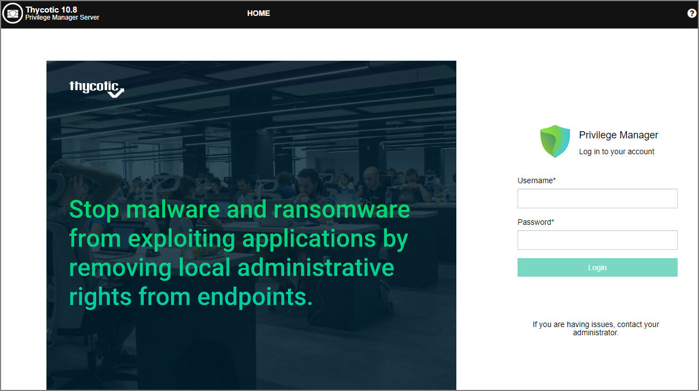
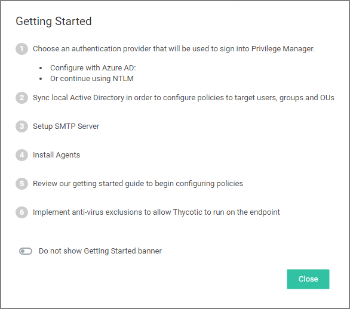
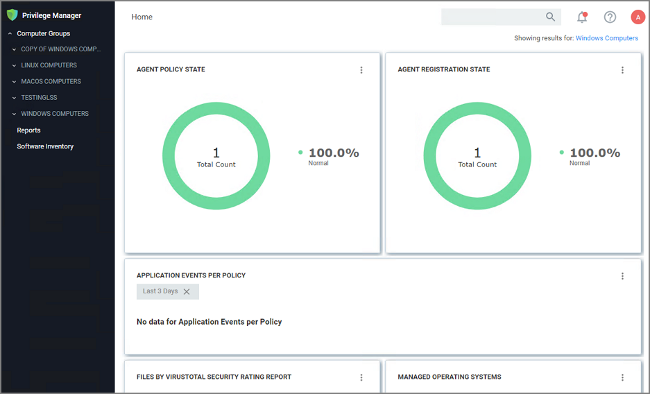

[title]: # (Initial Login)
[tags]: # (on-prem)
[priority]: # (502)
# Initial Login

Using the credentials configured in the Create User section of the on-premises installation, validate that you can login to Privilege Manager and view the home screen.

The login URL for an on-premises Privilege Manager instance has this form:

`https://[server-domain]/TMS/PrivilegeManager`

>**Note**:
>On combined Secret Server/Privilege Manager installations you are initially logged in through Secret Server. If this is the case, you can find Privilege Manager by navigating to __Tools | Privilege Manager__.

The initial login for on-prem happens via NTLM:

After logging in the Privilege Manager Server Setup Home page opens.

Use the Privilege Manager link to login to the product. If you need to add or update product features, such as connectors for foreign systems, use the __Add / Update Product Features__ link.

The __Setup a Secret Server Foreign System__ link can be used to set-up an integration with Secret Server. This will also allow you to use Secret Server as an authentication provider. Also refer to [Setting up Integration between Privilege Manager and Secret Server](../admin/config/foreign-systems/thycotic/set-up-pm-ss-integration.md)

## Getting Started Banner

At initial login the Getting Started Banner displays with help tips and next steps:

* Choose an authentication provider that will be used going forward to sign in to Privilege Manager.
* Setup the SMTP Server.
* Install Agents.
* Review the documentation to begin configuring policies.
* Implement anti-virus exclusions to allow Thycotic to run on the endpoint.

You may choose to not show the Getting Started Banner on subsequent logins.

## Home

The Home screen of Privilege Manager can be found by clicking Home in the top banner of any page inside of Privilege Manager. From this dashboard you can jump into either Application Control or Local Security, depending on what you want to do. You also will be given different snapshots of various important information about your environment. Once you have agents installed and policies setup, you'll have a lot going on from the Home Dashboard:

