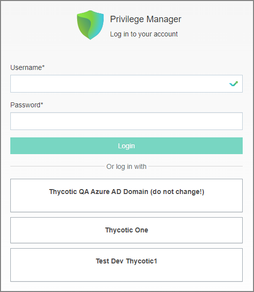
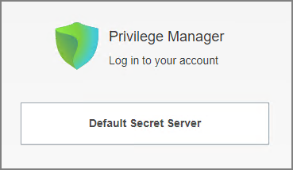
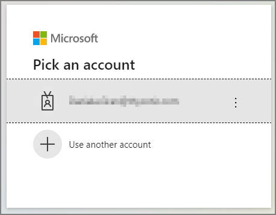
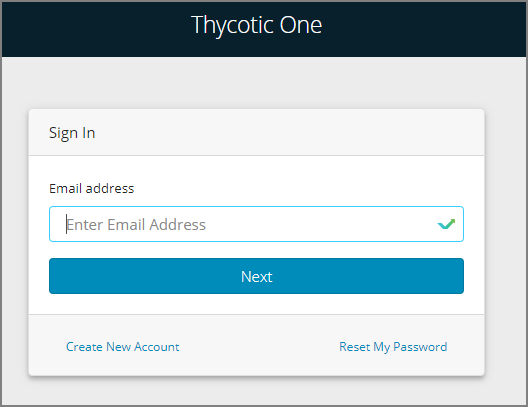

[title]: # (Login and Logout Scenarios)
[tags]: # (on-prem)
[priority]: # (503)

# Login and Logout Scenarios

Based on authentication provider configured and used, the login and logout prompts and scenarios differ.

## Login Options

Sample images with various login options set up.

### Basic login (Standard Out-Of-Box)

### Basic login (Secret Server)

### Azure AD

## Logout Scenarios

### Basic with NTLM 

After the logout completes and the tokens are cleared, the user is presented with a prompt to close the browser.

### Azure AD

After the logout completes and the user tokens are cleared, the user is redirected to the Thycotic One login modal.

