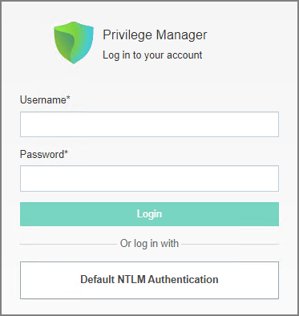
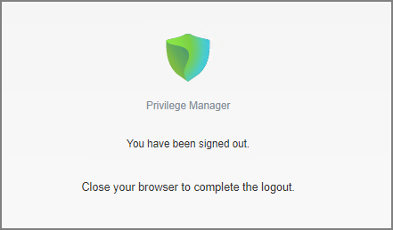

[title]: # (Login and Logout Scenarios)
[tags]: # (on-prem)
[priority]: # (503)

# Login and Logout Scenarios

Based on authentication provider configured and used, the login and logout prompts and scenarios differ.

## Login Options

### Basic login (Standard Out-Of-Box)

### Basic login (Secret Server)

### Azure AD

## Logout Scenarios

### Basic with NTLM 

### Azure AD
User logs out
Redirects to landing page with spinner only. This is a transition page while we clear out cookies
NOTE: Clears out all Privman and third-part provider login tokens/cookies
After this is complete, redirect to standard Logout page that has:
Image on left and options on right 
"You have been signed out"
Have a "Login" button below that message
Clicking "Login" button redirect you back to original Login" page

Local AD
User logs out
Redirects to landing page with spinner only. This is a transition page while we clear out cookies
NOTE: Clears out all Privman and third-part provider login tokens/cookies
After this is complete, redirect to standard Logout page that has:
Image on left and options on right 
"You have been signed out"
Have a "Login" button below that message
Clicking "Login" button redirect you back to original Login" page

Third party Auth
User logs out
Redirects to landing page with spinner only. This is a transition page while we clear out cookies
NOTE: Clears out all Privman and third-part provider login tokens/cookies
After this is complete, redirect to standard Logout page that has:
Image on left and options on right 
"You have been signed out"
Have a "Login" button below that message
Clicking "Login" button redirect you back to original Login" page

SAML/SSO
User logs out
Redirects to landing page with spinner only. This is a transition page while we clear out cookies
NOTE: Clears out all Privman and third-part provider login tokens/cookies
After this is complete, redirect to standard Logout page that has:
Image on left and options on right 
"You have been signed out"
Have a "Login" button below that message
Clicking "Login" button redirect you back to original Login" page

Third party SAML/SSO
User logs out
Redirects to landing page with spinner only. This is a transition page while we clear out cookies
NOTE: Clears out all Privman and third-part provider login tokens/cookies
After this is complete, redirect to standard Logout page that has:
Image on left and options on right 
"You have been signed out"
Have a "Login" button below that message
Clicking "Login" button redirect you back to original Login" page
