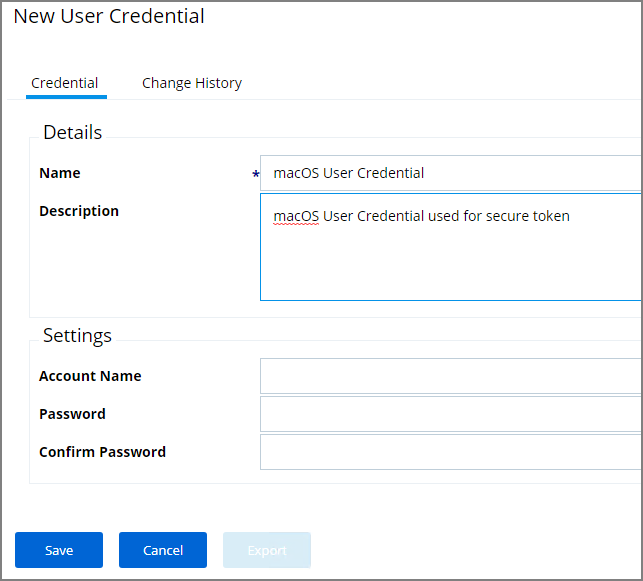
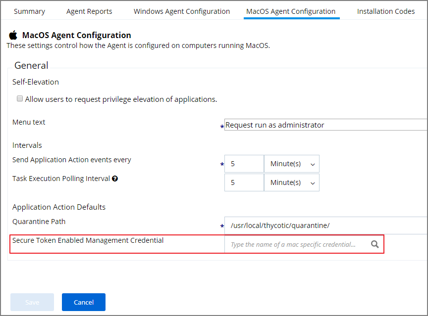

[title]: # (macOS Secure Token)
[tags]: # (local service accounts)
[priority]: # (1601)
# macOS Secure Token

Secure Token is a macOS High Sierra or later account attribute, that is required to be added to a user account before that account can be enabled for FileVault on an encrypted Apple File System (APFS) volume. To help make sure that at least one account has a Secure Token attribute associated with it, a Secure Token attribute is automatically added to the first account to log into the OS login window on a particular Mac. Once an account has a Secure Token associated with it, it can create other accounts which will in turn automatically be granted their own Secure Token.

In order for Privilege Manager to support Secure Token during account creation and for password management, a local account with Secure Token enabled must created on each macOS endpoint. The credentials for this account must be set as the Secure Token Management Credential.

When the Secure Token Management Credential is configured in the MacOS Agent Configuration, Privilege Manager will use this credential to create a local account on each macOS endpoint. The resulting managed local account will be used during account provisioning and password management to ensure that managed accounts are Secure Token enabled.

If the Secure Token Management Credential is removed in the MacOS Agent Configuration, the local account created will be removed and the agent will no longer be able to provision and manage accounts as Secure Token enabled.

## Agent Configuration

To use the secure token with macOS Agents, the user credential needs to be established and linked to the macOS Agent configuration. 

1. Navigate to __ADMIN | Configuration__, select the __Credentials__ tab.
1. Click __Add New__.

   
1. Under Details enter a Name and Description.
1. Under Settings enter the __Account Name__ and __Password__ for the macOS user account with Secure Token access.
1. Click __Save__.
1. Navigate to __Admin | Agents__.
1. Select the __MacOS Agents Configuration__ tab.
1. Click __Edit__.

   
1. In the __Secure Token Enabled Management Credential__ field enter the macOS user credential you created in __step 4__.
1. Click __Save__.
