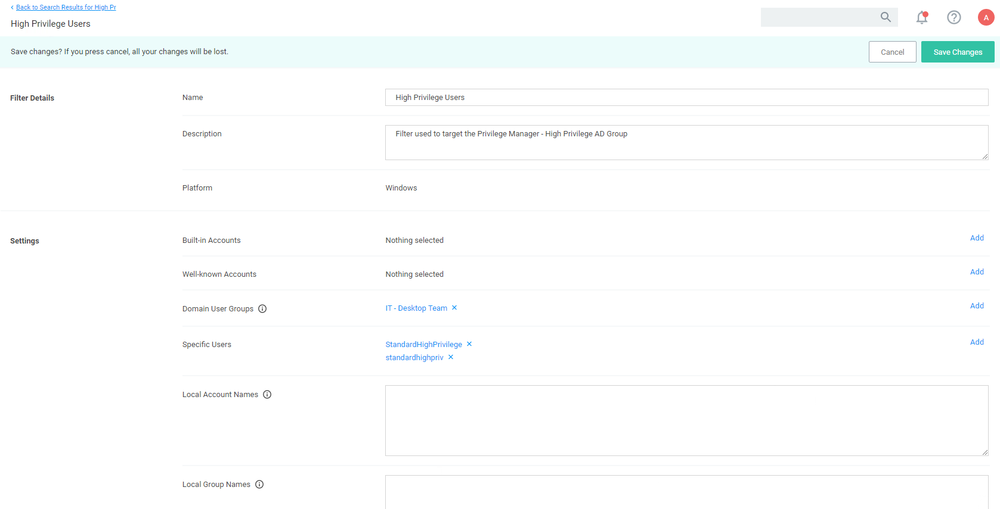
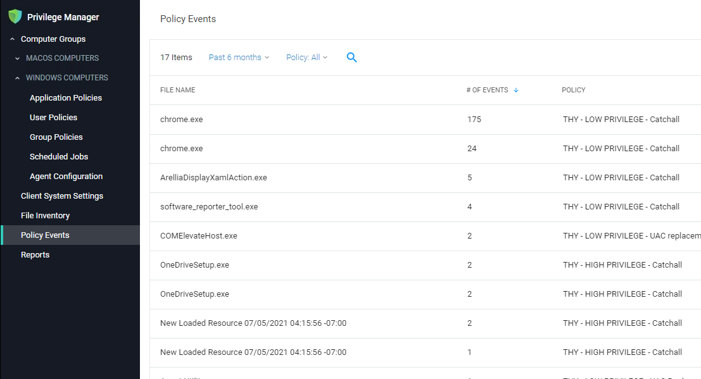

[title]: # (Policy Framework)
[tags]: # (policy set,deployment)
[priority]: # (510)

# Thycotic Policy Framework (TPF) Deployment

This topic outlines a refined policy set and deployment methodology for Thycotic Privilege Manager. The approach has several key aims, which are highlighted below:

* Take the best practices learned from thousands of successful implementations and make them available to all customers.
* Provide reduced time to value, with a policy set that can be enabled in seconds.
* Simplify and reduce the overhead of day-to-day management of endpoint privilege and application management.

## Approach

When you implement Endpoint Privilege Management (EPM), you risk impact to user productivity. For example, if you implement a policy that removed local admin rights during an overnight maintenance, your users' access to applications as part of their core job function might be impacted without those admin privileged. Our framework provides elevation policies that allows users with flexible 'on demand' privileges where required.

This means that admin rights can be removed without the need for lengthy discovery phases meaning customers get more value from the solution from the point of implementation.

### One Size Does Not Fit All

Different users and communities of users require very different application sets and privilege levels in their endpoint environment, the Thycotic policy approach allows customers to define users or groups of users into a high, medium, or low
privilege filter based on Active Directory group membership or by targeting individual users. A high-level summary of the out of the box user experience is provided below.

* __High Privilege__: Provides users with a 'Pseudo Admin' experience, any application can be elevated on demand by right-clicking and selecting run as administrator. This policy set is typically aimed at the most technical users such as Developers and IT administrators.

* __Medium Privilege__: Provides users with a highly flexible experience where most applications can be elevated on-demand. High risk applications such as scripting engines require approval for elevated execution. This policy set is typically aimed at technical users.

* __Low Privilege__: Provides a highly secure application environment where users are unable to run any application with elevation without approval. This policy set is typically aimed at non-technical users who do not regularly need to install new applications.

The out of the box user experience can be changed in a few clicks by replacing messaging. Customizable messages can be used to change the effective privilege levels at any point from a warning message to a justification or approval workflow.

### Application Control

The approach also utilizes an intelligent approach to application allow-listing that leverages the core security concept of trusted file ownership.

Applications with trusted ownership (owned by Local System, Trusted Installer, Administrators by default) that are commonly found in the enterprise environment, will be allowed to execute out of the box. Applications that don't match against the allow list will hit a catch-all policy. The catch-all policy starts with a 'soft' audit approach, which allows customers to monitor unknown applications and refine allow listing before hardening the catch-all to an appropriate level for different user communities.

## Policy Set Overview

The following section provides a high-level overview of the policies included in the TPF policy set.

| Priority | Policy Name  | Behavior Description |
| ----- | ----- | ----- |
| 5 | THY - Malware Protection Policy | Catches any unsigned and untrusted application that runs as a child process of high-risk applications such as Microsoft Office applications, email clients and browsers. |
| 10 | THY: Fileless Attack Protection | Protects vulnerable applications from being exploited using 'Living off the Land Binaries and Scripts' attack vectors. |
| 15 | THY - GLOBAL - Blocked Applications | Targets explicitly defined applications and denies execution with a visible message. All applications matching this policy are audited. |
| 20 | THY - GLOBAL: silently Elevated Applications | Applications that are elevated for all users with no messaging displayed. |
| 25 | THY - GLOBAL: Silently Elevated Installers  | This policy elevates targeted installers for all users with no messaging displayed. |
| 30 | THY - GLOBAL - Allow List (Explicit) | This policy will allow applications that are explicitly defined to run with standard user rights. |
| 35 | THY - HIGH PRIVILEGE - Silently Elevated Applications | This policy elevates targeted applications for users defined within the High Privilege Filter. |
| 40 | THY - HIGH PRIVILEGE - Silently Elevated Installers | This policy elevates targeted installers for users defined within thee High Privilege filter with no messaging displayed. |
| 45 | THY: HIGH PRIVILEGE: High Risk Applications | This policy targets high risk applications and presents a justification message which must be completed before execution. |
| 50 | THY - HIGH PRIVILEGE - High Risk Windows Settings | This policy targets high risk windows settings areas and presents a justification message which needs to be completed before execution is possible. All applications matching this policy are audited  |
| 55 | THY - HIGH PRIVILEGE - UAC Replacement (Signed Applications) | Targets any signed application that generates a User Account Control (UAC) dialogue. A warning message is displayed prior to elevated execution. All applications matching this policy are audited |
| 60 | THY - HIGH PRIVILEGE - UAC replacement (Unsigned Applications) | Targets any unsigned application that generates a User Account Control (UAC) dialogue. A warning message is displayed prior to elevated execution. All applications matching this policy are audited |
| 65 | THY - HIGH PRIVILEGE - Allow List (Trusted Owners) | This policy will allow applications with a trusted owner or that are explicitly defined to run with standard user rights, no messaging is displayed. |
| 70 | THY: HIGH PRIVILEGE - Catchall | This policy targets any application that has not matched against a previous policy for users defined within the High Privilege filter. This policy should not be enabled without High Privilege - Allow List also being enabled, doing so will generate large amounts of feedback data.  |
| 75 | THY - MEDIUM PRIVILEGE - Silently Elevated Applications | This policy elevates targeted applications for users defined within the Medium Privilege Filter. |
| 80 | THY - MEDIUM PRIVILEGE - Silently Elevated Installers | This policy elevates targeted installers for users defined within thee Medium Privilege filter with no messaging displayed. |
| 85 | THY - MEDIUM PRIVILEGE - High Risk Applications | This policy targets high risk applications and presents an approval workflow prior to elevated execution. |
| 90 | THY - MEDIUM PRIVILEGE - High Risk Windows Settings | This policy targets high risk windows settings areas and presents an approval workflow prior to elevated execution. All applications matching this policy are audited. |
| 95 | THY - MEDIUM PRIVILEGE - UAC Replacement (Signed Applications) | Targets any signed application that generates a User Account Control (UAC) dialogue. A warning message is displayed prior to elevated execution. All applications matching this policy are audited. |
| 100 | THY - MEDIUM PRIVILEGE - UAC replacement (Unsigned Applications) | Targets any unsigned application that generates a User Account Control (UAC) dialogue. A warning message is displayed prior to elevated execution. |
| 105 | THY - MEDIUM PRIVILEGE - Allow List (Trusted Owners) | This policy will allow applications with a trusted owner or that are explicitly defined to run with standard user rights, no messaging is displayed. |
| 110 | THY - MEDIUM PRIVILEGE - Catchall | This policy targets any application that has not matched against a previous policy for users defined within the High Privilege filter. This policy should not be enabled without High Privilege - Allow List also being enabled, doing so will generate large amounts of feedback data. |
| 115 | THY - LOW PRIVILEGE - High Risk Applications | This policy targets high risk applications and presents an approval workflow prior to elevated execution. |
| 120 | THY - LOW PRIVILEGE - High Risk Windows Settings | This policy targets high risk windows settings areas and presents an approval workflow prior to elevated execution. All applications matching this policy are audited. |
| 125 | THY - LOW PRIVILEGE - UAC Replacement (Signed Applications) | Targets any signed application that generates a User Account Control (UAC) dialogue. An approval workflow is displayed prior to elevated execution. |
| 130 | THY - LOW PRIVILEGE - UAC replacement (Unsigned Applications) | Targets any signed application that generates a User Account Control (UAC) dialogue. An approval workflow is displayed prior to elevated execution.  |
| 135 | THY - LOW PRIVILEGE - Allow list (Trusted Owners) | This policy will allow applications with a trusted owner or that are explicitly defined to run with standard user rights, no messaging is displayed. |
| 140 | THY - LOW PRIVILEGE - Catchall | This policy targets any application that has not matched against a previous policy for users defined within the High Privilege filter. This policy should not be enabled without High Privilege - Allow List also being enabled, doing so will generate large amounts of feedback data. |

## Deployment Steps

Download the latest version of the Thycotic Policy Framework (TPF) from the [Config Feeds](../admin/config-feeds/index.md).
Once installed, the policy set is available in the Thycotic Policy Framework folder, usually at `https://[yourprivilgegemangerinstance/TMS/PrivilegeManager/#/folders/all/dfa7db45-f75c-4e31-be53-6281b1d4ce39`.

## Initial Configuration Steps

In addition to installing the config feed with the policy set and following the general initial [setup
guidelines](index.md), the following configuration should be performed.:

### Set up Active Directory / Azure AD integration for administrative console access and policy targeting.

To allow users to authenticate with the Privilege Manager administrative console using their AD or Azure AD identity you should [configure the AD or Azure AD integration](../admin/config/foreign-systems/active-directory/index.md). This can also be used to target TPF policies to specific users or security groups.

### Build User Context Filters and or Resource Targets for Policy Targeting

Privilege Manager policies can be targeted at the user and or computer level. To target policies to specific users or security groups User Context filters can be created. The TPF set comes with three out of the box user context filters for High, Medium and Low Privilege Users.

#### Adding Users to High, Medium, or Low Privilege User Context Filters

1. In the Privilege Manager console search for __High Privilege Users__ or select the __High Privilege Users filter__ from any of the high privilege policies.
1. Search for and add local or domain users or Active Directory Security Groups to the filter:

   
1.  Click __Save Changes__.

Privilege Manager also provides the ability to build [resource targets](../admin/filters/resource-filters.md), which are groups of computers that policies can target.

## Policy Management and Refinement

Before deploying any policies, you should add any known applications to relevant policies. For example, if you are aware of corporately approved applications that are used by all users which require admin rights, you can add application filters to the THY: PLOBAL: Pllow List (Explicit) policy)

There are a number of ways application targets can be created:

* Manually by creating a blank win32 filter and targeting specific application metadata fields.
* By uploading an application file.
* Waiting for the TPF policies to generate application audit events and creating filters directly from the event.

### Policy Refinement after Deployment

1. On a regular basis (as frequently as possible during the initial stages of the deployment) open the __Policy Events Report__:

   
1. From the left-hand menu, select __Policy Events__.
1. The report should default to sorting by the __# of events field__.
1. For each application in the list, review and decide how you want to handle the application. There are a number of options to consider:
   * Add to Global: Silently Elevated Applications or Installers to allow silent, elevated execution for __all users__.
   * Add to High/medium: Silently Elevated Applications or Installers to allow silent, elevated execution for users within the scope of the chosen policy.
   * Add to restricted applications to allow execution with approval workflow.
   * Do Nothing (User will continue to receive UAC replacement messaging, which will likely be hardened).
   * Add to Global: Block List.

     >**Note**: The key consideration in making this decision, is the number of users executing the application and the number of times they are executing it. The higher these numbers the more impactful gating the application with an approval
workflow would be.
1. Once number of new applications hitting UAC replacement plateaus, add more users to scope OR harden UAC replacement.
1. If application Control is required, review applications hitting catch-all, review and perform one of the following actions:
   1. Add to High/Medium/Low Allow List.
   1. Add to Global - Block List.
   1. Do nothing (Application will be gated with approval workflow when catch-all is hardened).
   1. Once number of unknown applications hitting the catch-all plateaus, add more users to scope AND/OR harden catch-all.

## Frequently Asked Questions

Q1. Why is there no user context filter for Low Privileged Users?

    A: This is by design, as the Low Flexibility policy set does not have any user context inclusion filters it will apply to any user that is not in the scope of the High or Medium flexibility policies. Effectively the Low Privilege policy set functions as a catch-all policy set and avoids the risk that user is not included in a filter and has no policies applied.

Q2. Why are there no silent elevation policies for low privilege users?

    A: It is highly unlikely that applications need to be elevated for low privilege users without being elevated for all users. Typically, any application requiring elevation for low privilege users can be targeted in the global elevation policies.

Q3. Why is the catch-all policy configured to allow unknown applications to run?__

    A: Any policy set that attempted to block or gate unknown applications at the point of deployment would be highly disruptive to users and/or generate high volumes of approval requests to support teams. Catch-all policies are intended to quickly collect audit data that can be used to refine allow listing before being hardened.
