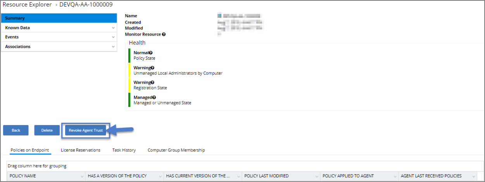

[title]: # (Agent Trust Revocation)
[tags]: # (operations)
[priority]: # (2)
# Agent Trust Revocation

With Privilege Manager 10.5, you can revoke an agent trust relationship.

The agent has a certificate that it uses to prove its identity to the server. If the server revokes the agent trust, it deletes the agent certificate thumbprint and the agent can no longer communicate in any way with the server. The only way to re-establish the communication with the server would be to use an Installation Code.

1. Look up a computer in Resource explorer. Example navigate to  Admin | More | Resources | expand Organizational Views | Default | All Resources | Asset | Network  Resource | Computer.
1. Click one listed; OR search by resource name.
1. Click __Revoke Agent Trust__.

>**Note**: You must confirm by clicking the button again on the next screen. The message below reads:

Revoking this agent's trust will disallow this computer from registering and receiving policies. This process cannot be undone. To later re-establish trust between this computer, you will need to re-install the agent with the proper install code.

This does not uninstall the agent from the computer, it simply denies it from contacting this server. This process also does not delete this agent nor its data from this server. Use the 'Delete' button from the Resource Explorer view to remove the computer and it's data from this server.

