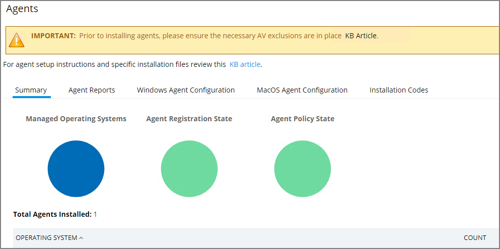
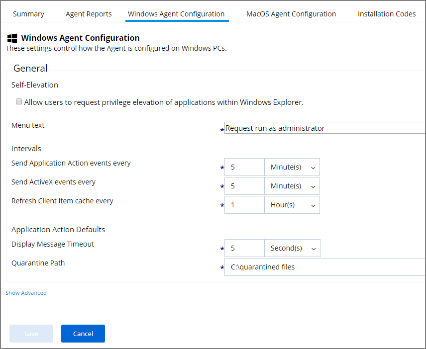
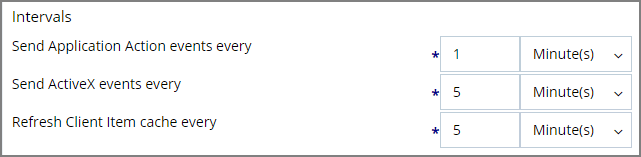
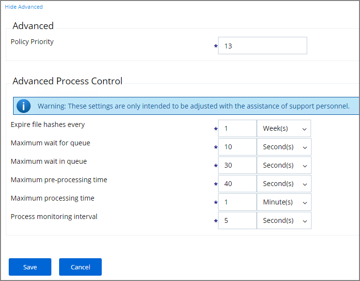

[title]: # (Test Environments)
[tags]: # (agents)
[priority]: # (9600)
# Configuring for a Test Environment

You need to set Privilege Manager Agent configuration options to readily test configuration changes in a test environment. The agent configurations outlined in this page allow for accelerated feedback when testing use cases.

1. Navigate to __ADMIN | Agents__.

   
1. Go to either the __Windows Agent Configuration__ or __MacOS Configuration__ tab.
1. Click __Edit__.

   
1. Under Intervals, adjust the values to receive quicker turnarounds on any tests run on a test instance.

   1. Set Sent Application Action events every to 1 Minutes.
   1. Set Send ActiveX events every 5 Minutes.
   1. Set Refresh Client Items cache every 5 Minutes. 

      
1. Keep the advanced settings as is (Thycotic recommends to only change the advanced settings after consulting via Professional Service engagement.)

      
1. Click __Save__.
