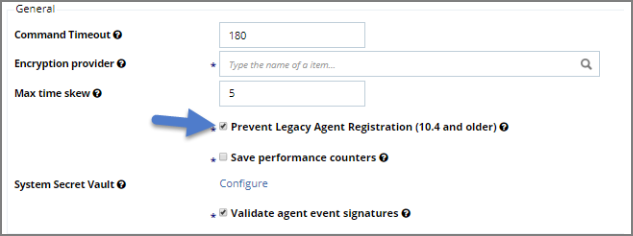

[title]: # (How to prevent Backwards Compatibility for Agents v10.4 and earlier)
[tags]: # (agent)
[priority]: # (2)
# How to prevent Backwards Compatibility for Agents v10.4 and earlier

Starting in Privilege Manager version 10.5 and up, due to security updates you can now prevent services from using agents versions 10.4 and earlier from communicating with the Privilege Manager server.

## Resolve

1. Launch Privilege Manager.
1. Navigate to __ADMIN__ | __Configuration__.
1. Click the __Advanced__ tab.
1. To enable this setting, click the __Edit__ button at the bottom of this page.
1. Check the box next to __Prevent Legacy Agent Registration (10.4 and older)__ under the General section.

   
1. Click __Save__.
