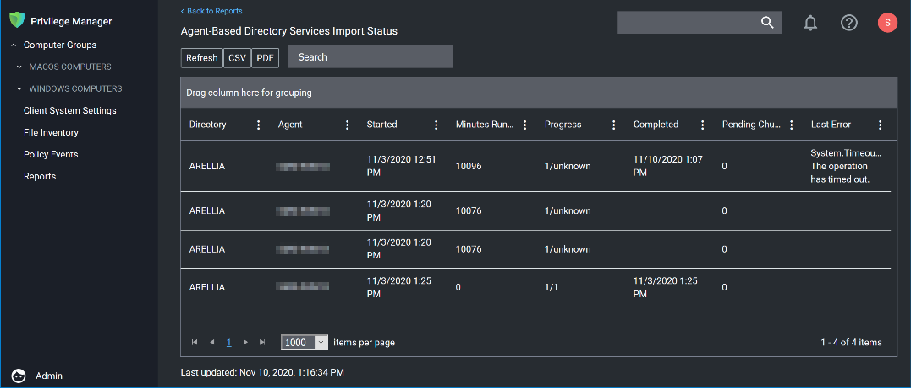

[title]: # (AD Import)
[tags]: # (azure ad,cloud,on-prem)
[priority]: # (2)
# Active Directory Import - On-prem vs Cloud

## On-premises

The support for on-prem AD import is better than the support for Azure AD. On-prem AD import has more usable data. For customers that want to target computers based on OU or Security Groups, this is the best option. Our customers can setup an AD foreign system with credentials and import directly using LDAP.

## Cloud

In a cloud environment the Privilege Manager server(s) typically don’t have direct access to
Active Directory. Instead the customer can select a local machine on which to install the
Directory Services Agent. The agent retrieves information, and sends data to the server on a schedule.

## Full vs Differential Synchronization

Unless otherwise specified, both the server and agent imports attempt a differential synchronization of AD data. AD keeps an Update Sequence Number (USN) that goes up as changes are made and resources are added. The following 3 conditions must be met for a differential sync:

1. Privilege Manager has a record of a prior sync with a session ID and USN.
   * On the server these are recorded in the database as data for the foreign system in the [Ams.Data].[DirectorySync] table.
   * For the agent they’re recorded in the registry under `HKLM\\Software\\Arellia\\Agent\\DirectoryServices\\Imports`. Users can force a full sync by deleting this data.
1. The directory partner (Domain Controller Server) must be the same. Starting with Privilege Manager version 10.8 and later, a server will be automatically picked if none is specified. But on older versions of the product, no differential sync is available unless the server is specified.
1. The LDAP query must be the same query as the hash is stored.

Assuming the conditions are met, Privilege Manager takes the given LDAP query, and appends a condition that the USN is greater than the recorded last USN.

>**NOTE**: In test environments it’s common to have a sync “fail” because the agent has done a sync prior on a different PM server. For a new environment setup with a Directory Services Agent, remember to clear out the registry record of syncs.

## Expected Performance

If connectivity is good (low latency is just as important as high throughput), the main bottleneck is writing item data to the Privilege Manager database. Small ADs with a few hundred resources complete in a couple minutes. Large ADs with hundreds of thousands may take 10 hours or more.

### Status

For imports run via the Directory Services Agent, Privilege Manager contains a report to give basic status named __Agent-Based Directory Services Import Status__.

When Privilege Manager runs an LDAP query, the number of results returned or how long the process will take is an unknown. The agent reports the data as it gets it in chunks to the server. The Progress field shows the number of chunks the server has successfully processed vs the total number. Typically what happens is that the agent finishes importing from AD before the server imports all the chunks. This shows at a minimum that there is progress.

## Azure AD Imports

The primary reason for imports from Azure AD is to configure authentication in Privilege Manager.

### Users/Groups

Importing users and groups from Azure AD works well for authentication, and usually plays well with data from other sources.

#### Import Azure AD Resources

This is the primary task users should run to import from Azure AD.

#### Import Specific Azure AD Users and Groups

This task allows users to import selected users and groups, instead of importing all.

>**NOTE**: For groups the search filter is by display name. For users either display name or UPN can be entered (or a partial with \*). This is a common point of trouble - users often use account names or other names that don’t match the Azure AD data. When in doubt, open the Azure AD portal and make sure the display names match.

#### Device Import

At this time, importing devices (computers) from Azure AD is discouraged. The usable data for Privilege Manager is very limited, and there is basically only one way to link an Azure AD device to an existing computer resource in Privilege Manager and that by Device ID. Refer to [Azure AD - Device ID](ts-ad-sync.md) in the troubleshooting topic. Unless the agent is reporting this data, there are guaranteed to be duplicates and/or resources that will not work to assign policies.

## On-Premises vs. Cloud 

Since Azure AD is itself a cloud service, there’s basically no difference between our support on-premises and in cloud.
