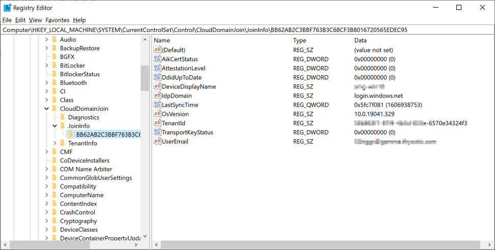
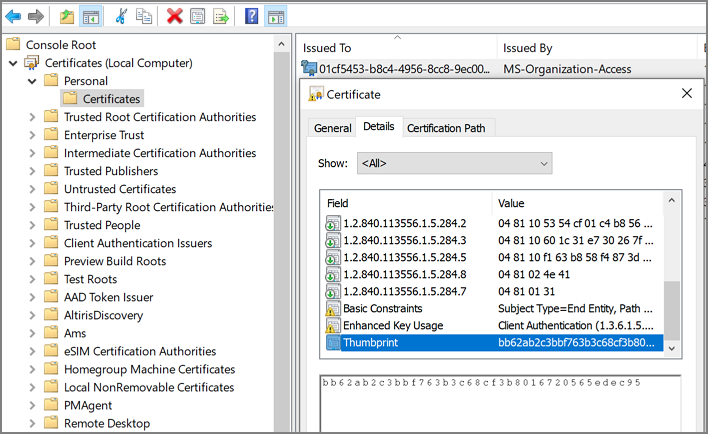

[title]: # (Troubleshooting)
[tags]: # (azure ad,cloud,on-prem)
[priority]: # (3)
# Troubleshooting AD Sync

## Authentication

>**NOTE**: Thycotic recommends that customers create a new user in Azure AD (one that is not sync-ed from AD) as a Privilege Manager _global administrator_. This user can be used as a backup access if other users fail to sync correctly.

When a user logs in to Privilege Manager with Azure AD, Privilege Manager gets back an object ID. A search of the database for that Object ID in Foreign System ID, provides what roles that user is a member of. The internal caching uses SID, so the user must also have a Global Account Details - SID. If there are any issues with the user authentication, it is recommended to check this data to make sure it exists, and make sure it matches the Azure portal data.

The object ID in the Azure portal:

should match Foreign System ID in Privilege Manager:

>**NOTE**: There may be multiple foreign systems entries here, when it doubt browse the Azure AD foreign system, not the GUID in the browser URL, and match that up in the list along with the object ID.

Users also need to have a Global Account Details - SID from the same Azure AD foreign system ID:

>**NOTE**: There may be multiple entries here. If Privilege Manager doesn't have one where the AccountDomain matches the foreign system ID, that could potentially point to a problem.

## Duplicates

The basic reason for duplicates is not having matching information when Privilege Manager imports resources, registers computers, or updates inventory.

### Agent Registration

Prior to Privilege Manager release version 11.1.0, if you imported devices from Azure AD and then registered agents, you were guaranteed to get duplicate computers. With version 11.1.0, when agents register, the server checks for existing computers with the same Device ID and merges them automatically.

For existing systems where duplicate computers have been recorded, the __Computers with Duplicate Azure Device IDs__ report is available.

Run the report and then use the __Merge Computers with Duplicate Azure Device IDs__ task to merge all computers with duplicate device Ids based on the report.

The report and task require a version 11.1.x based agent.

### Resource Type Keys

Privilege Manager identifies resources in several ways. The primary way is through “keys”, which is basically just uniquely identifying data about a resource. Not all keys are available from all sources, so below each key is a table that lists availability.

#### Global Account Details - SID

This key is used to match computers, users, and groups based on the SID from their primary domain.

##### Availability

|               | **Azure AD** | **AD** | **Local Inventory** | **Agent Reg** |
|---------------|--------------|--------|---------------------|---------------|
| **Users**     | Yes and No[^1] | Yes    | Yes[^2]               | N/A           |
| **Groups**    | Yes and No[^1] | Yes    | Yes[^3]               | N/A           |
| **Computers** | No           | Yes    | N/A                 | Yes[^4]         |

* [^1] Users and groups created natively in Azure AD will not have a SID.
* [^2] SID may not be available on all Azure AD systems. Users and Groups imported from AD will have a SID (by default, customers can change the settings in Azure AD Connect, so it's typical, but not a guarantee). Devices (computers) in Azure AD will typically not have this information. 
* [^3] Starting with the 10.8 agent, when reporting AD domain users and groups that are members of a local group, the agent will include Global Account Details SID. But with older agents it's not reported, and this can be a likely source of duplicates.
* [^4] Starting with the 10.8 agent, when registering the agent will report its SID from the domain to which it's currently connected. Agents that are offline will cache this information for a period of time, but agents long disconnected from the domain will not be able to report this.

#### Global Windows Users - User Id & Domain Name

This is the key that has the longest history of use in Privilege Manager.

##### Availability

|               | **Azure AD** | **AD** | **Local Inventory** | **Agent Reg** |
|---------------|--------------|--------|---------------------|---------------|
| **Users**     | No[^1]         | Yes    | Yes                 | N/A           |
| **Groups**    | No[^1]         | Yes    | Yes                 | N/A           |
| **Computers** | No           | Yes    | N/A                 | Yes           |

[^1] Azure AD can be configured (Azure AD Connect) to report this information for users and groups, but we don't read it when importing. This is planned as a future product update.

>**NOTE**: Until recently, the agent didn't report SID for domain users and groups. So the agent would report users with name/domain, import from Azure AD would report SID, since there wasn't common data, this was a common source of duplication.

There are a couple of solutions to duplicates here:

1. Also run an import from AD (typically on-premises AD agent), and then run the task “Merge Duplicate Account SID Resources”. Note that this will not work for computers - we can't get SID for computers from Azure AD.
1. Delete the duplicates. When you delete duplicates, delete the resource that is not an agent, and with the least information.

#### Azure AD - Device ID

This data was added in an attempt to support importing devices from Azure AD. The agent will report Azure AD domain join info which includes Device ID and Tenant ID, and when importing from Azure AD Privilege Manager will attempt to match existing computers before creating a new one.

##### Send Azure AD Domain Info

This is the agent-scheduled task that reports the Azure AD info, by default it runs at 2AM daily.

##### Limitations

Unfortunately this data is limited to a very specific domain join. Hybrid domain joins (both AD and Azure AD) don't seem to support this. When using hybrid join, all the data seems to be per-user, and currently the agent task to report info only works if the data is global.

##### Registry/Certificates

If you want to troubleshoot why an agent isn't reporting this domain join info, you can follow in the registry to check the data for yourself. Go to `HKLM\System\CurrentControlSet\Control\CloudDomainJoin\JoinInfo\`. The keys there are named by the hash of the relevant certificate (the image below is for a local user (the one that doesn't work), but the concept is the same):

In this case 6A901B…. is referencing a certificate. The certificate will be in the local machine, personal store (again, the image below is actually for a user's cert, but the concept is the same):

So we find the certificate with thumbprint 6A901B…. and it's subject, in this case “58b863f1-87f4-4b3d-833e-6570e34324f3” is what will be reported, and what we can match up to the Device ID in Azure.
