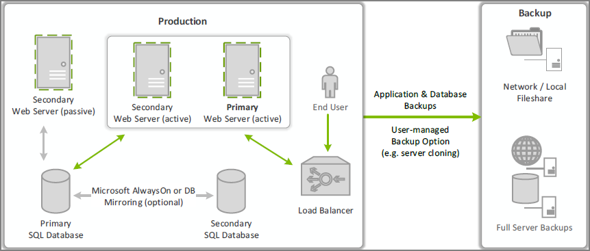

[title]: # (Disaster Recovery)
[tags]: # (ha,clustering,passive)
[priority]: # (2)
# Privilege Manager Disaster Recovery

With Privilege Manager environments three types of Disaster recovery strategies can be implemented. Those are:

* active fail-over via High Availability setup. Privilege Managers licensing allows for full clustering.
* passive failover (built and ready, but with a few manual switches)
* manual backups to restore (restoring/rebuilding from backup)

As a best practice for Privilege Manager DBs, we recommend asynchronous replication. There are a lot of transactions - too many transactions for synchronous replication in most enterprise environments. Synchronous replication allows for automatic failover. Asynchronous means there will be a manual failover.

## Maintaining Privilege Manager in a Disaster

The framework of a solid Privilege Manager Disaster Recovery Plan should follow these methods of maintaining operations.

### Simple Installation and Architecture

Privilege Manager operates on typical modern servers On-Premises, in the Cloud, and in virtual environments.

By design, Privilege Manager's installation is a quick and easy process. Keeping this process as quick and easy to install was a goal from the outset. This serves as a viable fallback option should redundancy plans fail. In a worst-case scenario where the host server fails, a cluster/mirror fails, and the other backup plans fail, Privilege Manager can be installed from scratch quickly and data imported from various methods. Users familiar with Microsoft SQL and IIS can typically install Privilege Manager in about 30 minutes on a prepared server.

Refer to the following installation topics:

* [Privilege Manager Product Installation - Basic](../../../install/installation/index.md)
* [Privilege Manager Manual Installation](../../../install/installation/installation-adv.md)

### Restoring from Backup

Restoring a backup of Privilege Manager's web application folder is as simple as copying the contents of the last available zipped backup file into place. Microsoft SQL database restores are simple as well, but require several steps, depending on the backup scenario.

Start by preparing servers for installation. When the servers are prepared, restore the Privilege Manager application on one and the database on the other. Some specific web configurations may be needed to match the previous IIS settings.

#### Restoring Privilege Manager from a Backup

When restoring from backup in the single-server configurations, be certain to make copies of the backup files on a different device or media.

Follow instructions as detailed under [Installing as a Virtual Directory](../../../install/installation/installation-adv.md#installing_as_a_virtual_directory).

### High Availability

A Privilege Manager implementation based on a high availability setup plays well with any disaster recovery plan.

With HA clustering, there are more than one front-end web servers, and more than one active node.
Allowing users to use Privilege Manager through more than one active node simultaneously requires enabling
clustering within the application. Only one server handles background processes, meaning that one of the active nodes will be designated as the Primary Node at any given time (this can be changed manually, if necessary, in the application). In the event that the Primary Node becomes unavailable, the "Primary" status will be transferred to one
of the other active nodes and users can continue using the application without interruption. There can
be more than one active and passive server nodes (no limit), depending on the needs of the organization.

A Disaster Recovery Plan for the above configuration would consist of failover for Web Server or Microsoft
SQL Server issues. If the failover members were to themselves fail, then Automated Web Application
Backups and Automated Application Database Backups can be used to restore functionality. If these
Servers are virtualized, leveraging strategies such as making scheduled Snapshots or having a hot/cold
Site may add additional layers of redundancy.

Refer to [Privilege Manager High Availability Setup](../../infrastructure/ha_clustering.md).

## Summary & Additional Support Resources

The integration of Privilege Manager into our customers' Business Continuity Planning should not present any unique challenges beyond normal server and database recovery. If your organization already has DR plans for servers and databases, Privilege Manager and its Microsoft SQL database should fit within your organization's current framework. Using server virtualization to assist with Business Continuity and Disaster Recovery in terms of snapshots, replication, and other 3rd party features are recommended where applicable.
