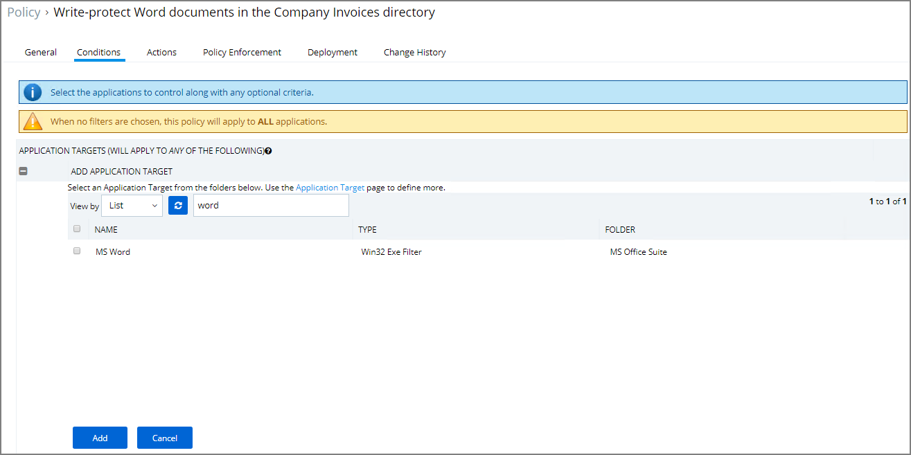

[title]: # (Prevent Read/Write Access)
[tags]: # (privilege reduction)
[priority]: # (2)
# Prevent Read and Write Access to File Types or Locations

You can restrict access to specific file types or locations using Privilege Manager. To prevent read / write access to file types or locations, do the following steps:
* Create a Deny File Access Action
* Create an Application Control Policy to which you will add the 
* Deny File Access Action
* Test the privilege reduction you've just created

In the following scenario you will create a Microsoft Word document and save it on your machine to:

`c:\company invoices\invoice 101.doc`

## Create a deny file access action

1. Navigate to __ADMIN | Actions__.
1. Under Filter Type enter __Deny File Access Action__.
1. Click on the Deny File Access Action.

   
1. Click on __Create a Copy__.
1. Name the new copy of the action.
1. Click __Edit__.
1. Select the __Read__ and __Write__ check boxes.
1. Enter in the path of the file (`e.g., c:\company invoices`).
1. Select __Add__ to the right of MIME types and enter in __Word document__ for the example.

   
1. Click __Save__.

## Create an application control policy

1. Navigate to __ADMIN | Policies__.
1. Click __New Policy__.
1. From the Platform drop down Select __Windows__.
1. From the Policy Type drop down Select __Show All Templates__.
1. From the Template Type drop down Select __Other: Empty Policy__.
1. Add Name and Description, click __Create__.

  

1. Click __Edit__.
1. Select the __Enabled__ Check box.
1. Navigate to the __Conditions__ tab.
1. Click on __Application Target__.
1. In the search box enter __word__ and select the __MS Word__ filter.
1. Click __Add__.

   
1. Navigate to the __Actions__ tab.
1. Click __Add Action__.
1. In the search box enter __Deny File Access Action__ and select the new deny file access filter you created.
1. Click __Add__.

   
1. Click __Save__.
1. After you run the Policy Targeting Update under the __Deployment__ tab, the appropriate endpoints will receive the new policy.

## Test Access

Verify that the restricted access you set up was successful by applying the following tests:

* In Microsoft Word, open `C:\company invoices\invoice 101.doc`. The file is read only and can't be modified.
* Create a new document and attempt to save it to `c:\company invoices\`. You will be unable to open it and will receive a File Permission error.
* Verify that you can create or modify a Word document in a different directory.
* In Microsoft Excel, save a spreadsheet to `c:\company invoices\invoice 101.doc`. The permissions are limited to Microsoft Word.
 