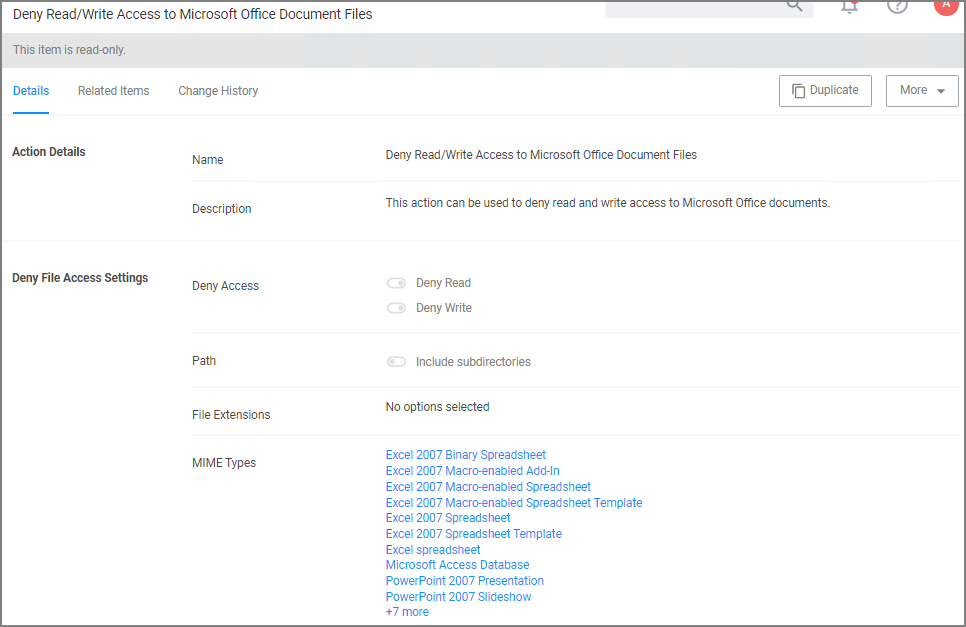

[title]: # (Prevent Read/Write Access)
[tags]: # (privilege reduction)
[priority]: # (2)
# Prevent Read and Write Access to File Types or Locations

You can restrict access to specific file types or locations using Privilege Manager. To prevent read / write access to file types or locations, do the following steps:
* Create a Deny File Access Action
* Create an Application Control Policy to which you will add the Deny File Access Action
* Test the privilege reduction you've just created

In the following scenario you will create a Microsoft Word document and save it on your machine to:

`c:\company invoices\invoice 101.doc`

## Create a Deny File Access Action

1. Navigate to __Admin | Actions__.
1. Search for __Deny File Access Action__.
1. Click on __Deny Read/Write Access to Microsoft Office Document Files__.

   
1. Click on __Duplicate__.
1. Name the new copy of the action and click __Create__.
1. Enter the path of the file location (`e.g., c:\company invoices`), for our example we also set the switch to include subdirectories.

   
1. Click __Save Changes__.

## Create an Application Control Policy

1. Under your Computer Group select __Application Policies__.
1. Click __Create Policy__.
1. Select __Skip the wizard, take me to a blank policy__.
1. Add Name and Description, click __Create Policy__.

   
1. Under __Conditions | Applications Targeted__, click __Add Application Targeted__.
1. Search for __word__ and add the __MS Word__ filter.
1. Click __Update__.
1. Under __Actions__, click __Add Actions__.
1. Search for and add your __Deny Read/Write Access to Microsoft Office Document Files__ Action.
1. Click __Update__.

   
1. Click __Save Changes__.
1. Set the Inactive switch to __Active__.
1. Next to Deployment, click the __i__ icon and run the __Resource and Collection Targeting Update__. After you run update, the appropriate endpoints will receive the new policy.

## Test Access

Verify that the restricted access you set up was successful by applying the following tests:

* In Microsoft Word, open `C:\company invoices\invoice 101.doc`. The file is read only and can't be modified.
* Create a new document and attempt to save it to `c:\company invoices\`. You will be unable to open it and will receive a File Permission error.
* Verify that you can create or modify a Word document in a different directory.
* In Microsoft Excel, save a spreadsheet to `c:\company invoices\invoice 101.doc`. The permissions are limited to Microsoft Word.