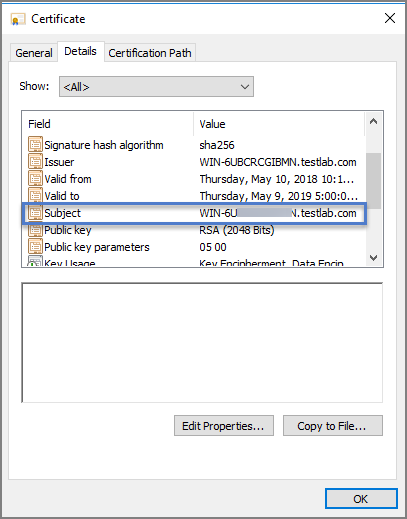
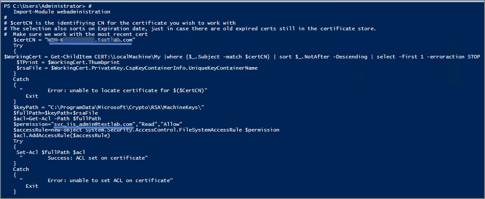

[title]: # (Private Key Certificate)
[tags]: # (access)
[priority]: # (2)
# Setting Read Access to Private Key of your Certificate

1. On your webserver, open Powershell as an Administrator.
1. In the script below, edit the highlighted text in two places.

   * Replace [mycert] with the "subject" name of your certificate (to find this value, open the certificate in mmc, see Subject under the Details tab).

   

   * Replace [MyIISAppPoolServiceAccountName] with the name of your Thycotic Service Account.
1. Copy/paste your edited version of the script below into powershell and press Enter to run it:

```ps
#    
   Import-Module webadministration
#
# $certCN is the identifiying CN for the certificate you wish to work with
# The selection also sorts on Expiration date, just in case there are old expired certs still in the certificate store.
#  Make sure we work with the most recent cert
   $certCN = "mycert"
   Try
   {
$WorkingCert = Get-ChildItem CERT:\LocalMachine\My |where {$_.Subject -match $certCN} | sort $_.NotAfter -Descending | select -first 1 -erroraction STOP
    $TPrint = $WorkingCert.Thumbprint
    $rsaFile = $WorkingCert.PrivateKey.CspKeyContainerInfo.UniqueKeyContainerName
   }
   Catch
   {
     "        Error: unable to locate certificate for $($CertCN)"
       Exit
   }
   $keyPath = "C:\ProgramData\Microsoft\Crypto\RSA\MachineKeys\"
   $fullPath=$keyPath+$rsaFile
   $acl=Get-Acl -Path $fullPath
   $permission="MyIISAppPoolServiceAccountName","Read","Allow"
   $accessRule=new-object System.Security.AccessControl.FileSystemAccessRule $permission
   $acl.AddAccessRule($accessRule)
   Try
   {
    Set-Acl $fullPath $acl
     "        Success: ACL set on certificate"
   }
   Catch
   {
     "        Error: unable to set ACL on certificate"
       Exit
   }
```
   

   * The script should return: "Success: ACL set on certificate"
