[title]: # (IIS App Pool Service Account)
[tags]: # (database object)
[priority]: # (2)
# Using a Service Account to run the IIS App pool

Thycotic recommends setting up a domain service account that can both:

* access the Thycotic product’s SQL database
* run the IIS Application Pool(s) dedicated to your Thycotic product

>**Note**: The service account created in this KB should NOT be the same account that is created during the installation of SQL and used to manage SQL as a whole.

To set up this service account correctly you will need to:

1. Create a service account in Active Directory that will be dedicated to your Thycotic product (Domain).
1. Grant the service account access to the SQL Server database (Database).
1. Assign the service account as Identity of the Application Pool(s) in IIS (Web).
1. Grant folder permissions for the service account on two folders (Web).
1. Configure User Rights Assignment to the service account (Domain AND/OR Web).

## Creating a Domain Service Account

1. Open the __Active Directory Users and Computers__ link from Administrative Tools.  
1. Right-click the directory where you want to assign this account (i.e. testlab.com > Service Accounts).
1. Click __New__ and __User__.
1. Add a name and logon name for the service account.
1. Click __Next__.

   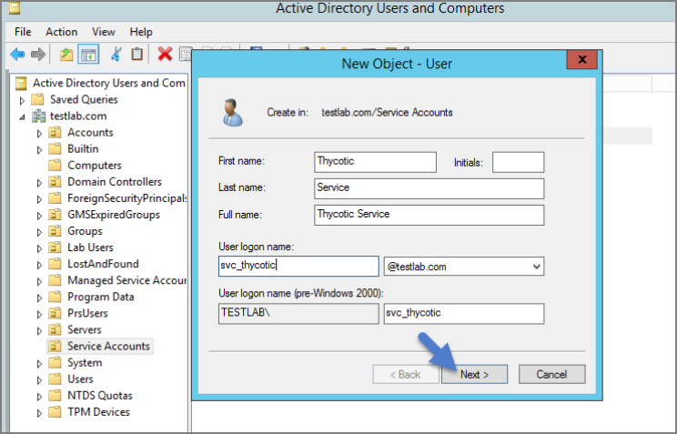
1. Enter a password.

   >**Note**: Uncheck "User must change password at next login if checked.” Check Password never expires or the account could lock you out of Secret Server.

   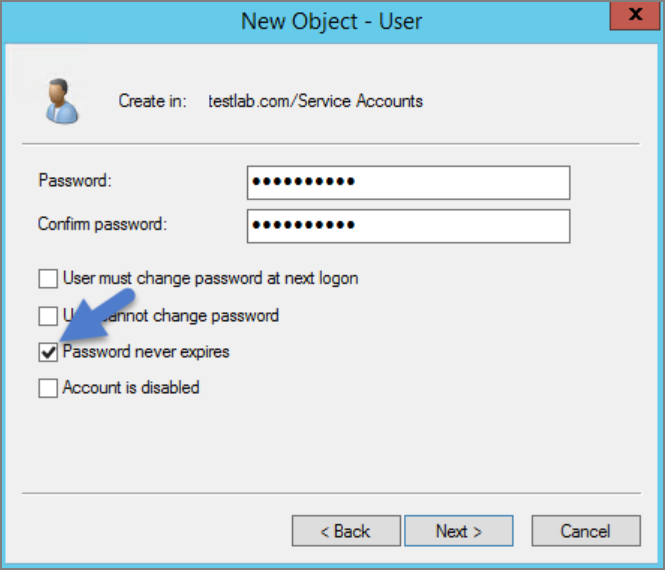
1. Click __Next__.
1. Click __Finish__. This account can now be given access to the database server and the application server.

## Granting Access to SQL Database

You must have SQL installed on your database server before completing these steps:

1. Using SQL Management Studio (on your database server), connect to your Thycotic product’s SQL Database using an Administrator account.
1. Right-click on the Security node (Ensure this is the top most Security node under the instance and not under the database name itself).
1. Click __New__ and __Login__.

   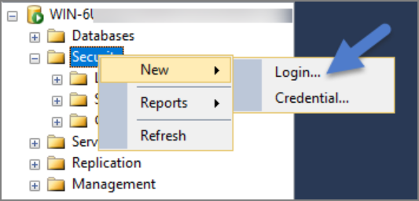
1. Ensure Windows Authentication radio button is selected.
1. On the New Login page click Search…  Ensure that your domain/AD server is selected as the location.

1. In the “Enter the object name to select” box enter the Login name created for your Thycotic service account (e.g., “svc_thycotic”). Click Check Names and select the correct account.

1. Click __OK__.

   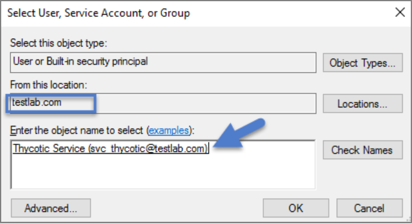
1. If you have already created the database for your Thycotic product, under User Mappings select the database and check the box to grant the db_owner permission (example pictured below).
OR - If you have not yet created the Database, Under Server Roles select db_creator 
1. Click __OK__.

   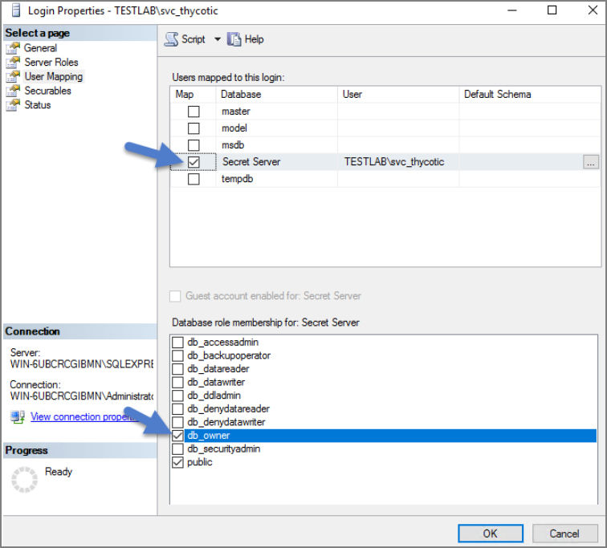

## Assigning Identity of Application Pool(s) in IIS

1. Open IIS on your web server __Search | inetmgr__.
1. Locate the application pool(s) that your Thycotic product is using, right-click  Advanced Settings.
1. The Identity box in the __Process Model__ section, click the three dots on the right of the box.

   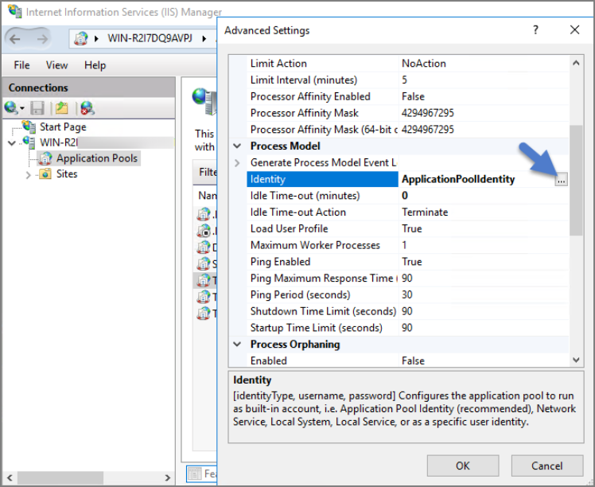
1. Select the Custom Account radio button.
1. Click __Set__ and enter your service account’s name and password.
1. Click __OK__.

   >**Note**: You will need to perform this step for multiple application pools for Privilege Manager.

   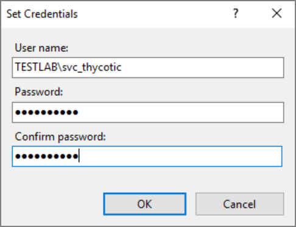

## Granting Folder Permissions

You must have the Thycotic product application files installed (on your web server) before completing this section.

Following the steps below you will need to give the service account __Modify__ access to two folders:

* __C:\Windows\TEMP__
* The folder where your Thycotic product’s application files are located 
(i.e.:__C:\inetpub\wwwroot\SecretServer__)

​You must have the Thycotic Product Application Files installed on your web server before completing these steps.

1. Open __C:\inetpub\wwwroot\TMS__ and right-click the folder you are modifying.
1. Click __Properties__ | __Security__ | __Advanced__.
1. Click __Add__ and then select a principal.
1. Ensure the domain machine is listed as the Location and type the service account under the “Enter the object name to select” box, click Check Names and Enter network credentials for accessing your domain machine. 
1. Click __OK__.

   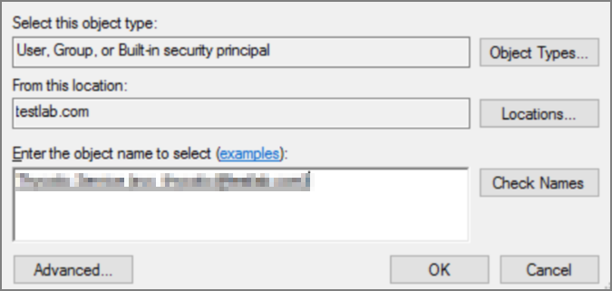
1. Click the __Modify__ checkbox.  

   Your service account should now have Modify, Read & execute, List folder contents, Read, and Write permissions for this folder.
1. Click __OK__, then __Apply__.

   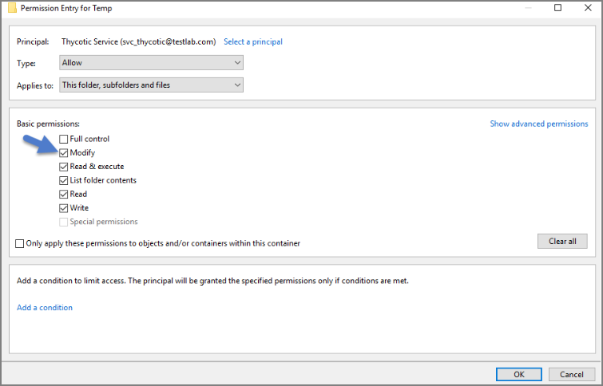

   >**Note**: If a Windows Security pop-up appears, click Yes. The service account will now be able to access this folder.

   >**Note**: The application folder only needs Write and Modify permissions during the installation or during an upgrade. You can remove these once the installation process is complete.

## Configuring User Rights Assignment

The following settings are required for Thycotic Secret Server to function:

* Log on as a batch job

* Impersonate a client after authentication

You can adjust these settings either

* At the Domain level using Group Policy
* Locally on your IIS Web Server using the Local Security Policy Console

## Setting User Rights Assignment on the Domain

1. Open Group Policy Management Console and right-click your preferred GPO container (i.e. Group Policy Objects).

1. Click __New__.

   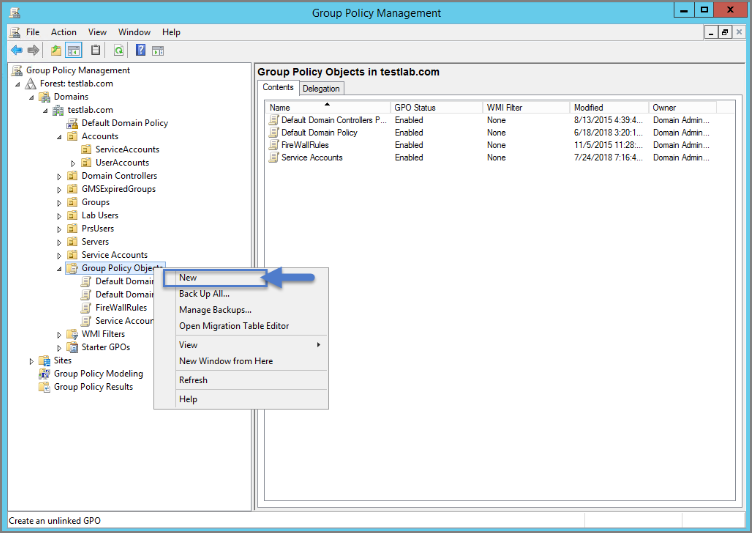
1. Name the new GPO (i.e. Thycotic User Rights Assignment).
1. Click __OK__.
1. Right-click __new GPO__.
1. Click __Edit__.

1. Expand __Computer Configuration__ | __Policies__ | __Windows Settings__ | __Security Settings__ | __Local Policies__.
1. Click __User Rights Assignment__.
1. Right-click __Log on as a batch job__ and click __Properties__.

   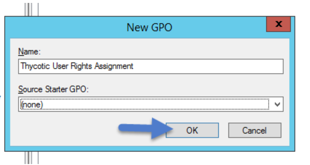
1. Ensure that the __Define these policy settings__ box is checked
1. Click __Add User or Group__. 
1. Add your Thycotic Service Account. 
1. Click __OK__, then __Apply__.

   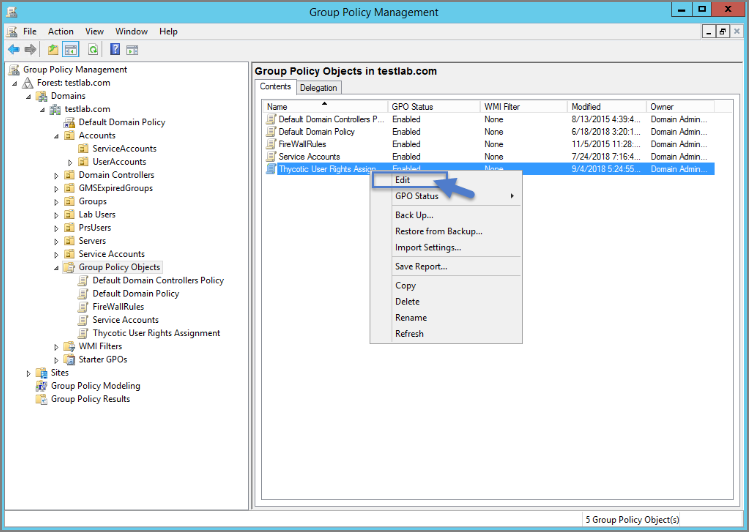
1. Grant __Impersonate a client after authentication__ permission to the service account under "User Rights Assignment" the same way "Log on as a batch job" was assigned above.

1. Link your new GPO to the OU where your Thycotic product machine accounts exist (web + database servers).

   >**Note**: This will overwrite any configuration in the local security policy. Utilizing the local security policy is a safer option if you are not sure about your usage across your domain.

## Setting User Rights Assignment Locally

1. On the web server hosting IIS and your Thycotic Application files.
1. Open __Local Security Policy Console__ (Run as administrator).
1. Expand __Local Policies__ | __User Rights Assignment__.
1. Right-click __Log on as a batch job__ | __Properties__ | __Add User or Group__.
1. Select your Thycotic Service Account and then click __OK__.

1. Do the same to set Impersonate a client after authentication.

   >**Note**: If you get a __Service Unavailable__ after applying "Log on as a batch job" permissions, try updating your group policy settings:
      1. Open the Command Console.
      1. Type in __gpupdate /force__.
      1. Restart the Windows Process Activation Service.
