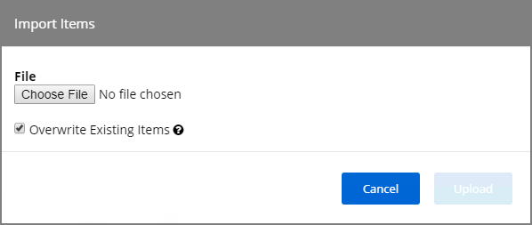

[title]: # (Export and Import Items)
[tags]: # (create,set-up)
[priority]: # (9501)
# Export and Import Items

In Privilege Manager Administrators need the ability to export complete policies, including dependent filters, actions, resource targets and any related items. They also need the ability to then import those policies into another instance.

The export and import feature can be used for production environments with multiple instances and for troubleshooting purposes when assistance is needed.

The feature provides the ability

* to export single policies for specific troubleshooting purposes.
* to bulk export via policies folders at any given folder level depending on specific needs.
* to view all objects after an import grouped by policy, with each policy displaying dependent object types, e.g. filter, action, resource target, etc.
* to view which objects already exist on the destination.
* to choose to overwrite or leave in place what's already there.
* to select specific objects or bulk select

This feature supports the bulk migration and creation of policies, including all of their dependencies.

## Exporting Items

Items at various levels of complexity can be exported. The UI offers several access points for an export operation. 

### Specific Policy Export

To export a specific policy with dependent filters and actions:

1. Navigate to the specific Policy and select it.

   
1. On the __General__ tab in the bottom row of buttons, the second from the right is Export. Click that __Export__ button.
1. A modal opens asking the user to confirm the download of the specific policy.

   

   Click __Download__.
1. A file opening or save dialog opens, select __Save__ file (and optionally check "Do this automatically for files like this from now on.").

   
1. Click __OK__.

The policy details are downloaded in a zip file named after the policy name that was selected for export. The zip file contains one items.xml file with all the exported data. Extract the zip file and open/edit the exported xml.

The export of filters, tasks, or reports is done in a similar way, by navigating to the specific item, locating the Export button and proceeding through the export process steps.

### Folder Exports

Bulk export of items is possible via the Folders page.

1. Navigate to __Admin | More__ and select __Folders__. The export of folders is available on the Policies, Tasks, Reports, and Resources tabs. On the Resources tab, the export is only possible for Resource Filters.
1. From the folders tree select any of the available folders.

   

   Click __Export__.
1. A modal opens asking the user to confirm the download of the specific policy.

   

   Click __Download__.
1. A file opening or save dialog opens, select __Save__ file (and optionally check "Do this automatically for files like this from now on.").

   
1. Click __OK__.

The items are downloaded in a zip file named after the folder that was selected for export. The zip file contains one items.xml file with all the exported data. Extract the zip file and open/edit the exported xml.

## Importing Items

>**Note**:
>Prior to importing any data into your environment, Thycotic recommends to create a backup of the current Privilege Manager Database.

### Using Diagnostics Upload Items File

To import items follow these steps:

1. Navigate to __Admin | Diagnostics__ and select the __Import Items__ button.

   
1. Scroll to the bottom of the page and select the __Upload Items File__ link.

   
1. The __Import Items__ dialog opens, browse to your file location and select the file containing the data to import.

   

   Supported file types for the import are .xslt, .xbl, .xsl, .xml, and .zip.
1. From the __Merge Mode__ drop-down list, select the merge mode for your data.

    <!-- TODO: new screen once drop-down options are corrected -->
1. Click the __Upload__ button.

You can verify the uploaded data by navigating to __Admin | More__ and selecting __Folders__. Depending on your import, the data is listed under Policies, tasks, or Resource Filters.

### Using the Folders Tree

For imports into a specific folder:

1. Navigate to __Admin | More__ and select __Folders__.
1. Select a Folder (Folder level) for the import and click __Import__.
1. The __Import Items__ dialog opens, browse to your file location and select the file containing the data to import.

   

   Supported file types for the import are .xslt, .xbl, .xsl, .xml, and .zip.
1. From the __Merge Mode__ drop-down list, select the merge mode for your data.

    <!-- TODO: new screen once drop-down options are corrected -->
1. Click the __Upload__ button.
