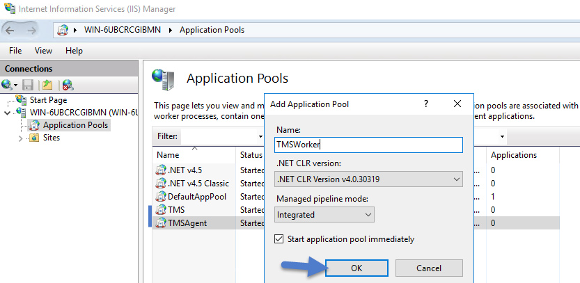
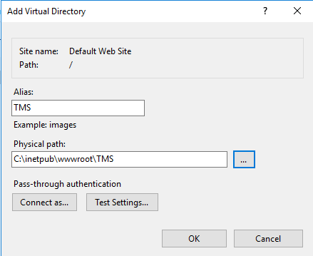
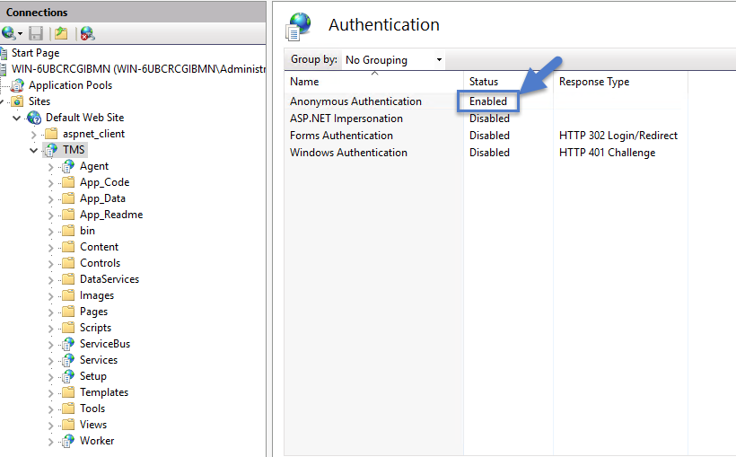
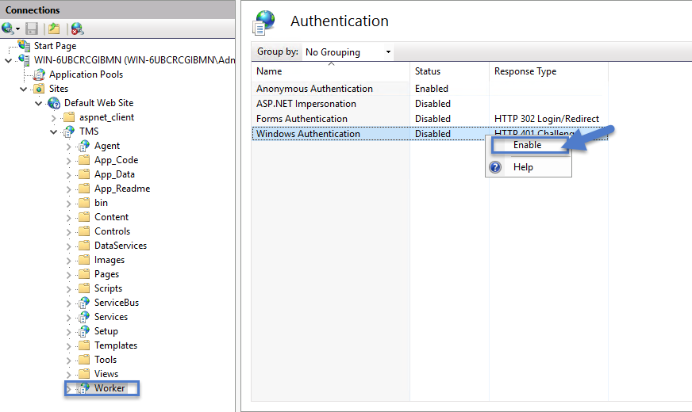
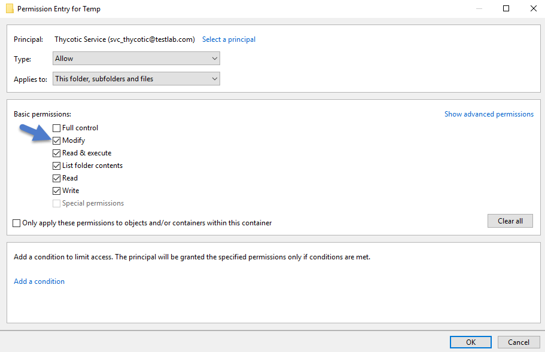

[title]: # (High Availability Setup)
[tags]: # (clustering)
[priority]: # (9600)
# Privilege Manager High Availability Setup

This topic explains the steps involved to set up Thycotic Privilege Manager High
Availability, also known as clustering.

## Pre-Requisites

Make sure that Privilege Manager is installed and working on a primary node with an existing database.

To cluster Privilege Manager a secondary server must be prepared with the proper Privilege Manager pre-requisites. The pre-requisites check can be performed via standard Privilege Manager setup.exe. However, exit that automated installer once all pre-requisites clear.

Except for the Operating System, the following pre-requisites will be installed automatically by our installer. If you already have some of them installed or wish to install them yourself then the installer will skip over them.

### System Requirements Overview

1. **Windows 2008 R2 SP1 or newer** operating system (2012 or newer is recommended)

2. Microsoft **SQL Server 2012 or newer** (Standard edition or higher is recommended)

3. Microsoft **Internet Information Services** (IIS) **7 or newer**

4. Microsoft **.NET Framework 4.6.1 or newer**

>**Note**:
>Windows Server 2016 comes with the .NET Framework already installed.

### Using the Installer to Install/Confirm Pre-Requisites

The latest version of Privilege Manager is available for [download](https://thycotic.force.com/support/s/download-onprem). By clicking the Installer (.exe) link, a setup.exe file will be downloaded to your machine.
It is recommended to run the setup.exe file as an administrator.

>**Note**:
>The setup executable will ONLY be used to install/confirm all pre-requisites are installed on the web server. After confirming the pre-requisites, the installer will be closed and a manual installer will be
completed. The manual installation will allow for separate databases and custom file locations. Do NOT complete the installation with the setup executable.

Running the setup.exe will begin an installation wizard. This wizard will ONLY
be used to install any remaining pre-requisites required on the web server. The
wizard will walk through the initial installation steps, beginning with a
Welcome page.

1. On the Welcome dialog, verify that Privilege Manager is selected and select the checkbox if not already checked.

 
2. Click **Next**.
3. On the License dialog review the End User License Agreement (EULA) and click **Accept License**.
4. On the Database dialog select **Connect to an existing SQL Server**, click **Next**.
5. The Pre-Requisites dialog helps you to ensure everything that is required gets installed for Privilege Manager. Click **Fix Issues** to automatically install the necessary pre-requisites.
6. Close the installer once all pre-requisites are successfully installed.

>**Note**:
>Do NOT continue installing the products with this installer.

## Manual Set-up of Secondary Node

In this procedure you will first copy the web application files from the primary server to the secondary server and then use those copied files to setup and configure the secondary Privilege Manager server.

1. On the primary server, decrypt the **connectionStrings.config** by running the following command:
   ```cmd
   C:\Windows\Microsoft.NET\Framework64\v4.0.30319\aspnet_regiis.exe -pd "connectionStrings" -app "/Tms"
   ```
1. Select and copy all contents of the Privilege Manager web application folder at
   ```cmd
   C:\inetpub\wwwroot\TMS\
   ```
   Including the unencrypted connectionStrings.config file.
1. On the secondary server, create the same folder path.
1. Paste the entire contents of the Privilege Manager web application folder from the primary web server to the similar location on the secondary web server. 

   
1. Open **Internet Information Services Manager** (inetmgr).
1. Under your local server, right-click **Application Pools** and select **Add Application Pool...**
1. **Add** three new application pools.
   1. **TMS**
   1. **TMSAgent**
   1. **TMSWorker**. 

      
1. For each of the 3 app pools (TMS, TMSAgent, and TMSWorker),
   1. right-click on each app pool,
   2. select **Advanced Settings...**
   3. then the **Identity** box in the "Process Model" section,
   4. click the three dots on the right of the box.

      
   5. Select the **Custom Account** radio button,
   6. Click **Set**, enter your service account’s name and password.

      
   7. Click **OK.**
1. Right-click **Default Web Site** in IIS and select **Add Virtual Directory…** 

      

1. Select an alias for your Privilege Manager. The alias is what will be
 appended to the website. For instance, “TMS” in <http://myserver/TMS>.

1. Next, enter the physical directory where you unzipped Privilege Manager (i.e., **C:\\inetpub\\wwwroot\\TMS\\**).

   
1. Click **OK**.
1. In the tree, right-click the new virtual directory and select **Convert to Application**.
   1. Set the **Application Pool** to the one called **TMS**.
   2. Click **OK**. 

      
1. In the virtual directory expand the new **TMS** site,
   1. right click the **Agent** Subfolder and select **Convert to Application**.
   2. Set the **Application Pool** to the one called **TMSAgent**, click **OK**.
1. In the virtual directory navigate to the **ServiceBus** Subfolder.
   1. Right-click and select **Convert to Application**.
   2. Set the **Application Pool** to the one called **TMSWorker** you created earlier, click **OK**. 

      
1. In the virtual directory select the **Services** Subfolder,
   1. Right-click the new virtual directory and select **Convert to Application**.
   2. Ensure that the **Application Pool** is set to the one called **TMS**, click **OK**.
1. In the virtual directory select the **Setup** Subfolder,
   1. Right-click the new virtual directory and select **Convert to Application**.
   2. Ensure that the **Application Pool** is set to the one called **TMS**, click **OK**.
1. In the virtual directory select the **Worker** Subfolder,
   1. Right-click the new virtual directory and select **Convert to Application**.
   2. Set the **Application Pool** to the one called **TMSWorker**, click **OK**.
1. Select your **TMS** virtual directory.
   1. Double-click **Authentication** in the features pane.
   2. Make sure that only **Anonymous Authentication** is set to **Enabled.** Everything else should be set to disabled.

      
1. Select the **Setup** directory.
   1. Double click **Authentication** in the features pane.
   2. Make sure that **Anonymous Authentication** and **Windows Authentication** are both set to **Enabled** and everything else is disabled.  

      
1. Select the **Worker**.
   1. Double-click **Authentication** in the features pane and make sure that **Anonymous Authentication** and **Windows Authentication** are both set to **Enabled** and everything else is disabled.

      

### Folder Permissions to C:\Windows\Temp

1. Navigate to the **C:\Windows\TEMP** folder.
2. Right-click the folder and select Properties \| Security \| Advanced.
3. Click **Add** and **Select a principal**.
4. Ensure the domain machine is listed as the **Location** and type the service account into the **Enter the object name to select** field.
5. Click **Check Names** and **Enter network credentials** for accessing your domain machine.

   
6. Click**OK**.
7. Under Basic permissions, select the **Modify** checkbox**.** 

   
8. Verify your service account has **Modify**, **Read & execute**, **List folder contents**, **Read**, and **Write** permissions for the **C:\Windows\TEMP** folder.
9. Click **OK**, then **Apply**.

### Folder Permissions to the Privilege Manager Application Folder

1. Navigate to the Privilege Manager application folder at **C:\inetpub\wwwroot\TMS**.
2. Right-click the folder and select Properties | Security | Advanced.
3. Select **principal**.
4. Ensure the domain machine is listed as the **Location** and type the service account into the **Enter the object name to select** field.
5. Click **Check Names** and **Enter network credentials** for accessing your domain machine.

   
6. Click **OK**.
7. Under Basic permissions, select the **Modifycheckbox**.

   
8. Verify your service account has **Modify**, **Read & execute**, **List folder contents**, **Read**, and **Write** permissions for the **C:\Windows\TEMP** folder.
9. Click **OK**, then **Apply**.

>**Note:** 
>The application folder only needs **Write** and **Modify** permissions during the installation or during an upgrade. You can remove these once the installation process is complete.

### Permission to Certificate Private Key (prior to 10.6 only)

>**Note**:
>This is only required for Privilege Manager prior to release 10.6.

TMS requires **Read** access to the private key of the certificate being used for the HTTPS binding. To set this:

1. Open **mmc.exe** as an administrator.
1. Add the certificate manager snap-in choosing to manage certificates for the computer account (**File | Add/Remove Snap-in…**)
1. Click **Certificates**,
1. then **Add | Computer account | Next | Local computer | Finish | OK**.
1. Find the certificate that the HTTPS binding for your site is using.
1. Right-click on the certificate and select **All Tasks | Manage Private Keys**.
1. Grant **Read** access to the identity account for your application pools.

If the “Manage Private Keys” option is not available, you can set this permission in PowerShell.
[This article ](https://thycotic.force.com/support/s/article/PM-Adv-Setting-Read-Access-to-the-Private-Key-of-your-Certificate-in-Powershell)
has the script.

### Verify Login on Secondary Node

1. Navigate to Privilege Manager, ex: **http://localhost/TMS**. You should be able to authenticate to Privilege Manager.
2. After logging in, all policies and all data accessible on the primary node should be accessible on the secondary node.

## Re-encrypt ConnectionStrings.config

1. On the **primary node**, run the following command to re-encrypt the connectionStrings.config file:

   ```cmd
   C:\Windows\Microsoft.NET\Framework64\v4.0.30319\aspnet_regiis.exe -pe "connectionStrings" -app "/Tms"
   ```

2. On the **secondary node**, run the same command to re-encrypt the connectionStrings.config file:

   ```cmd
   C:\Windows\Microsoft.NET\Framework64\v4.0.30319\aspnet_regiis.exe -pe "connectionStrings" -app "/Tms"
   ```

Privilege Manager has now successfully been clustered. A load balancer, GTM, VIP, etc. can be used to manage the traffic. The settings to configure this will be handled on the side of this infrastructure piece and is beyond the scope of this document. Contact Thycotic’s Professional Services team if additional consultation is required.

Thycotic requires that **sticky sessions** are enabled on the load balancer to prevent a user from bouncing between servers on each request of a single session.
