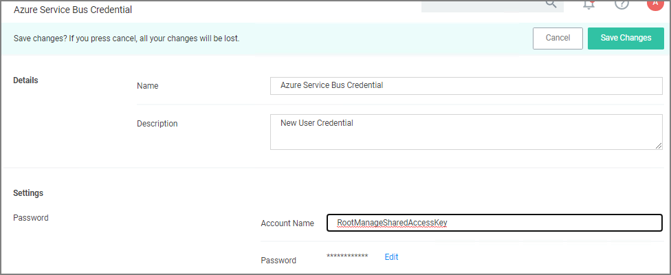

[title]: # (Internet Connected Clients)
[tags]: # (on-prem,configuration)
[priority]: # (2)
# Setting up Internet Connected Clients

On-premises Privilege Manager instances need to use an Azure Service Bus for internet connected clients. The Azure Service Bus is a subscription service that external agents can connect to and use to communicate with an internal Privilege Manager Server (TMS) instance.

>**Note**: Cloud customers don't need to use the Internet Connected Clients set-up, because their clients can already connect to the internet-based cloud instance.

With Privilege Manager 10.7 and up TLS 1.2 is supported.

This page is broken up into three sections:

* Azure Service Bus Queue Configuration
* Setting up the Service Bus as a Foreign System in Privilege Manager
* Configuring the Agents to use the Service Bus (if this is a new agent installation, the Agents can be pointed directly at the Service Bus namespace URL)

## Azure Service Bus Queue Configuration

Thycotic requires a Service Bus relay for remote communication. For this a Service Bus Queue needs to be created, follow the procedure as outlined by Microsoft [here in Quickstart: Use Azure portal to create a Service Bus queue](https://docs.microsoft.com/en-us/azure/service-bus-messaging/service-bus-quickstart-portal).

1. In the Azure Service Bus portal go to the __Shared access policies__ page.
1. Find the policy called __RootManageSharedAccessKey__. If you don't have one yet, create one by that name and select the __Manage__ option and save it.
1. On the __RootManageSharedAccessKey__ policy you can see the __Primary Key__ field. Make note of where this is. We have use it in a step down below.
1. Next, navigate to the __Queues__ page and create a new queue.
1. Do not check any of the options, using the defaults is fine. Take note of the queue name you gave it.

Next you will need to follow the instructions below to create a credential for the Service Bus and add the Service Bus as a foreign system in Privilege Manager.

## Setting up the Service Bus Foreign System

The Azure Service Bus requires a Foreign Systems configuration in Privilege Manager. To configure a Service Bus instance with a custom URL and credentials follow these steps:

1. In the Thycotic Privilege Manager Console, click __Admin | Configuration__.
1. Click the __User Credentials__ tab.
1. Click __Add New__.
   1. Enter a __Name__, for example _Azure Service Bus Credential_.

      .
   1. Set the Account name to __RootManageSharedAccessKey__.
   1. Set the Password to the value of the __Primary Key__ obtained during the Azure Service Bus configuration procedure __step 3__ under "Azure Service Bus Queue Configuration" above.
   1. Click __Save__.
1. Navigate to __Admin | Configuration__ and select the __Foreign Systems__ tab.
1. Click the __Azure Service Bus__ option.
1. Click __Add New__.
   1. Enter a __Name__, for example _Privilege Manager Azure Service Bus_.
   1. Set the __ServiceBus Name__ to the namespace of the Service Bus from the Azure Portal. To find this value, open the Azure Portal, locate the Service Bus that is being used for this integration (refer to the intro above). Go to the __Properties__ page and locate the Name property (generally, this is the same name as the instance you just located in the list of Service Bus instances).
   1. Deselect the __Enabled__ box for now.
   1. Click __Create__.
1. Click __Edit__ to provide more Settings details.
   1. Set the credential to the credential created in step 3 of this procedure (_Azure Service Bus Credential_).
   1. Enable the Service Bus.
   1. Leave the URL field as is (and ignore the fact that it's called URL – it's just the Service Bus name).
   1. Make sure the URI matches the first part of the namespace created in Azure.
   1. Set the QueueName to the same queue name created above in __step 4__ under "Azure Service Bus Queue Configuration".
   1. Set the Queue Policy Name to __RootManageSharedAccessKey__.
   1. Set the Queue Policy Secret to the __Primary Key__ as obtained in __step 3__ under "Azure Service Bus Queue Configuration" above.
   1. Click __Save__.
1. Recycle the App Pools on the Privilege Manager Instance following any changes for this integration. Without the recycle, the new settings won't be applied.
1. To verify everything is working correctly, open your browser and point it to the ServiceBus worker service:

   * __On-Premises__: `https://yourinstance.privilegemanager.com/Tms/ServiceBus/WorkerService.svc`

   Wait for the page to respond.

## Configuring Agents to Use the Service Bus

When setting the URL for Agent communication, Internet connected clients need to use the Service Bus URL created above.

>**Note**:
>For new installations, the agents can be set up to communicate with the service bus during the initial installation process when the __TMSURL__ and installation codes are provided, refer to [Bundled Install](../install/agent-inst-win-bundle.md).

### Using regedit

1. Open the Registry Editor (__regedit__).
1. Navigate to __HKEY_LOCAL_MACHINE | SOFTWARE | Policies | Arellia | AMS__.
1. Right click __BaseUrl__ and select __Modify__.
1. In the __Edit String__ dialog box, change the __BaseURL__ to your Privilege Manager (TMS) Address based on the __Azure Service Bus Queue__ configuration, for example `https://[your company].servicebus.windows.net/`, which in our example is `https://testing.servicebus.windows.net/`
1. Close the Registry Editor.
1. Restart the Agent service.

### Using PowerShell

To modify the TMS address via PowerShell, run this command as Administrator:

```ps1
C:\Program Files\Thycotic\Powershell\Arellia.Agent\SetAmsServer.ps1
```

The script will then ask you to type in the fully qualified domain name of the server, enter the __Azure Service Bus Queue URL__, for example `https://[your company].servicebus.windows.net/`, which in our example is `https://testing.servicebus.windows.net/`.
