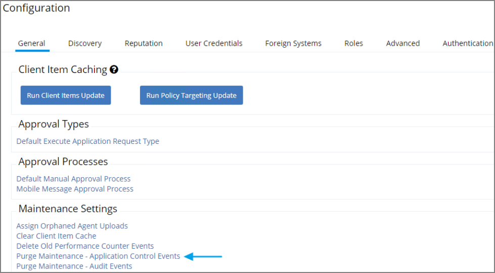
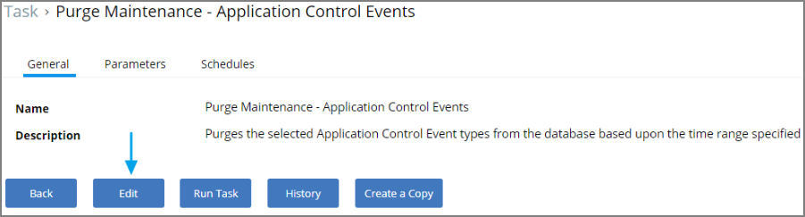
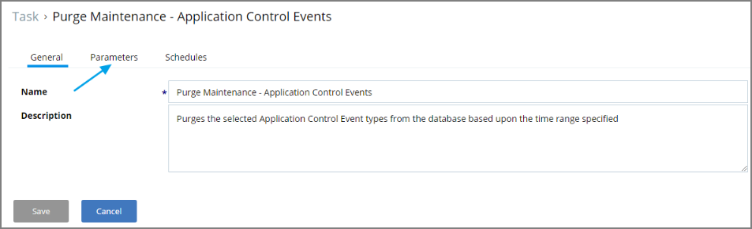
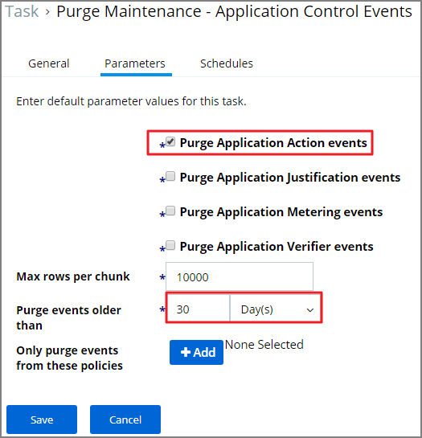
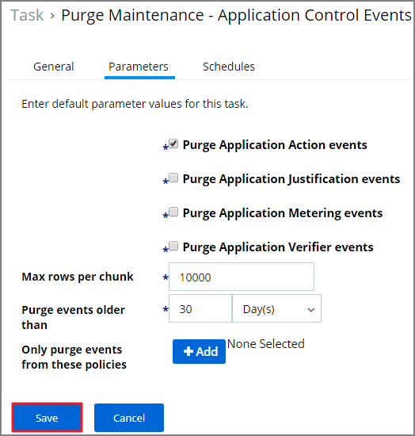
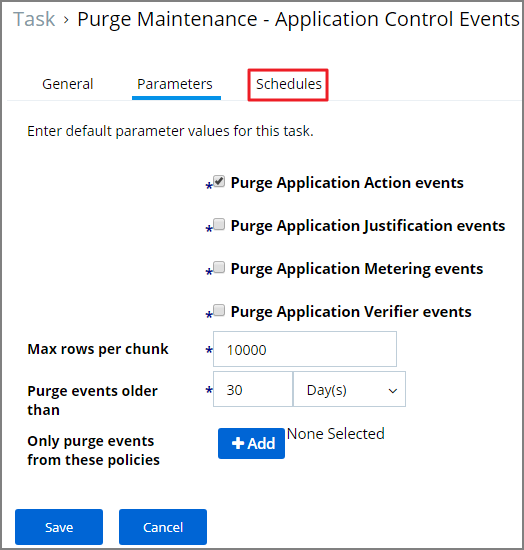
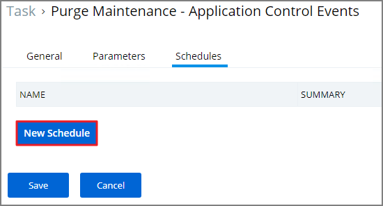
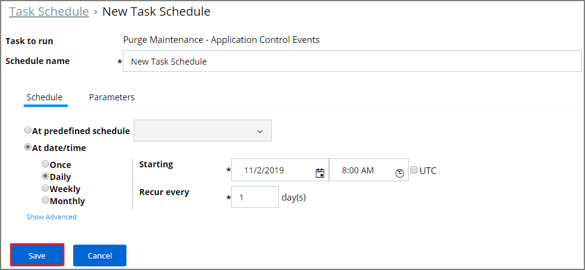

# Purging Action Items Table

If the application action table frequently grows too large you can use the steps
below to create a scheduled event to purge old application action events.

Resolve
-------

1.  Launch **Privilege Manager**.

2.  Click **ADMIN** \| **Configuration**.

    

3.  Click **Purge Maintenance – Application Control Events**.

    

4.  Click **Edit**.

    

5.  Click **Parameters**.

    

6.  Select **Purge Application Action events** and the number of days.

    **Note:** You can also select the other events to purge as well.

    

7.  Click **Save**.

    

8.  Click **Schedules**.

    

9.  Click **New Schedule**.

    

10. Enter in a **Schedule name** and the frequency you want the task to run.

    

11. Click **Save**.

    
