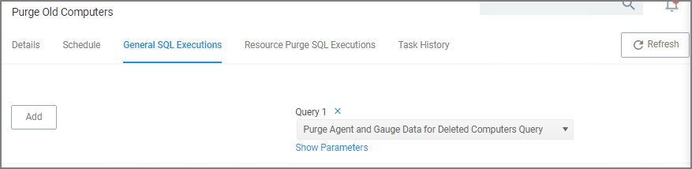
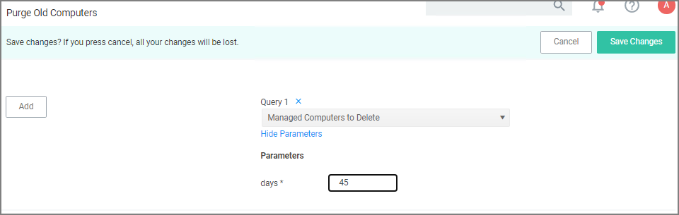

[title]: # (Purge Computers)
[tags]: # (maintenance)
[priority]: # (2)
# How to Purge Computers

After using Privilege Manager for a certain amount of time, you may have computers that haven't communicated with the Privilege Manager server for an extended period of time. This can be done via the Purge Computers task, which can be found under Configuration on the General tab.

1. Navigate to __Admin | Configuration__ and select the __General__ tab.
1. Under the Maintenance Settings section click __Purge Old Computers__.

   
1. On the __Maintenance Task > Purge Old Computers__ page select the __General SQL Executions__ tab.
1. Verify that __Query 1__ is set to __Purge Agent Gauge Data for Deleted Computers Query__.

   

   If that specific query is not listed,

   1. Click __Edit__ to either replace the query currently listed or add this query.
   1. Start typing the query name _Purge Agent Gauge Data for Deleted Computers Query_ and select the query from the results list.
1. Select the Resource Purge SQL Executions tab.
1. Verify that __Query 1__ is set to __Managed Computers to Delete__.

   

   If that specific query is not listed,

   1. Click __Edit__ to either replace the query currently listed or add this query.
   1. Start typing the query name _Managed Computers to Delete_ and select the query from the results list.
1. Click __Show Parameters__. The Days field indicates after how many days a system is considered to be an old computer and thus should be purged. The default value is 90 days. If you want a different value,

   1. Click __Edit__ and change the number of days.

   
   1. Click __Save__.
1. Click __Run Task__.
1. You can view the status of the running task by clicking the View Status here link.

   
