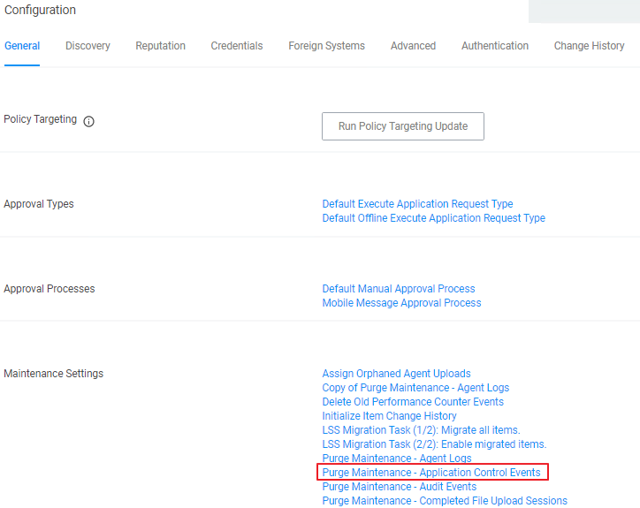
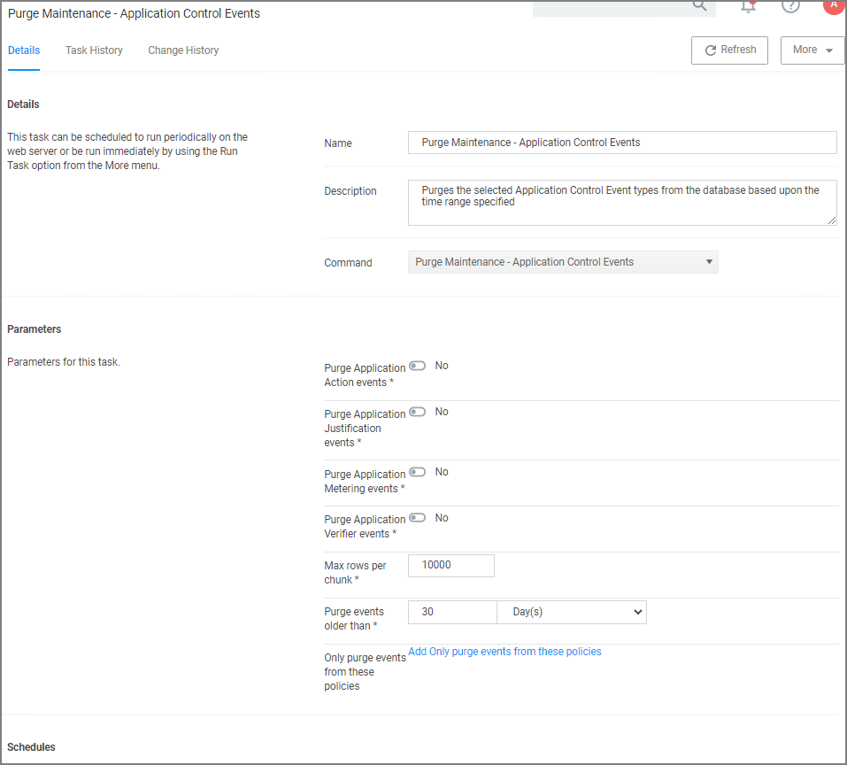
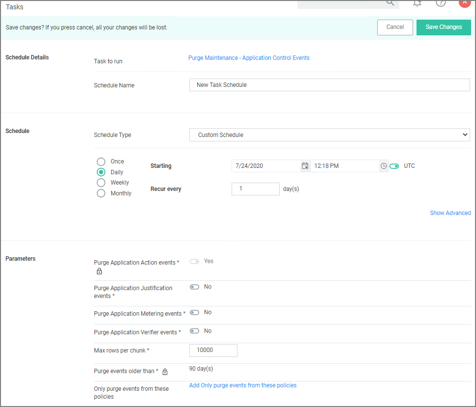

[title]: # (Purging Action Items Table)
[tags]: # (maintenance)
[priority]: # (2)
# Purging Action Items Table

If the application action table frequently grows too large, you can use the steps below to create a scheduled event to purge old application action events.

## Creating a Scheduled Event for Purging

1. Launch __Privilege Manager__.
1. Click __Admin |  Configuration__.

   
1. Click __Purge Maintenance – Application Control Events__.

   
1. Under __Parameters__,
   1. Set the __Purge Application Action events__ switch to __Yes__.
   1. Under __Purge events older than__ you may change the default of 30 days to another value.

      >**Note**: You can also select the other events to purge as well.
1. Click __Save Changes__.
1. Under __Schedules__ click __New Schedule__.

    
1. Enter in a __Schedule name__ and the frequency you want the task to run. You can add other parameters here too. Parameters that were previously selected are locked at this point.
1. Click __Save Changes__.
