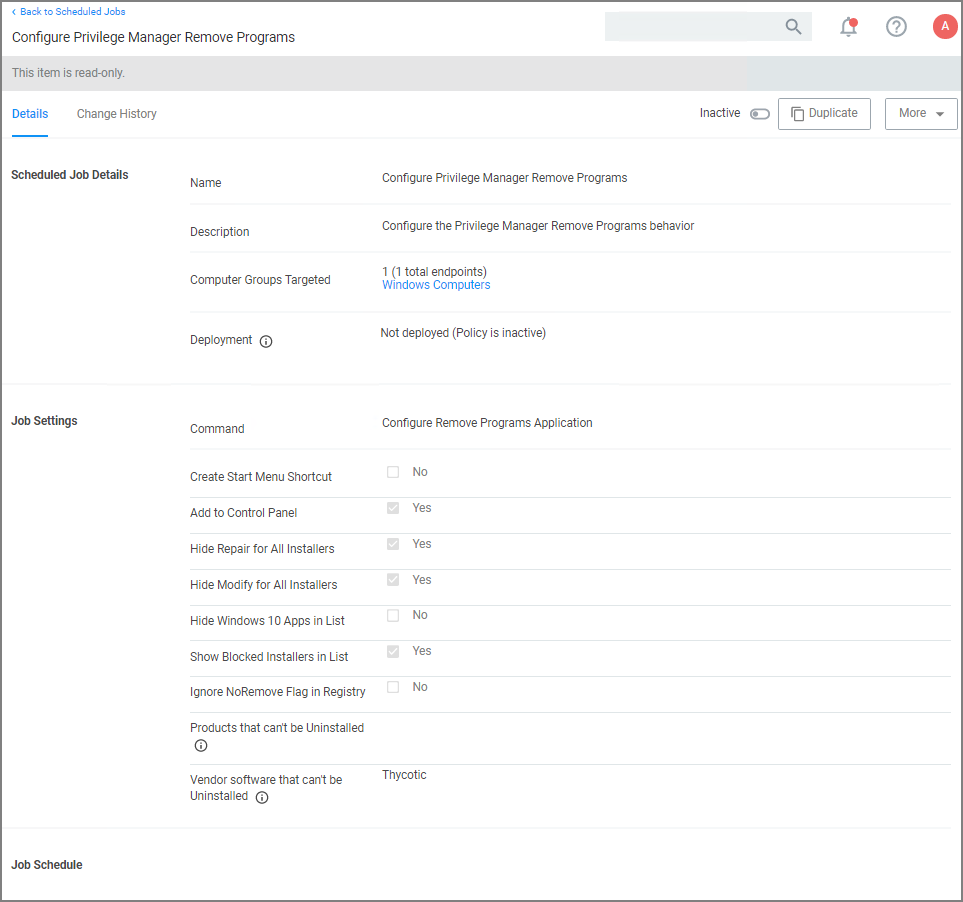
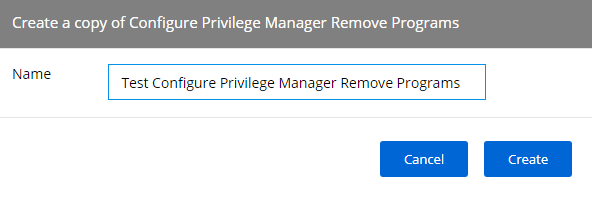
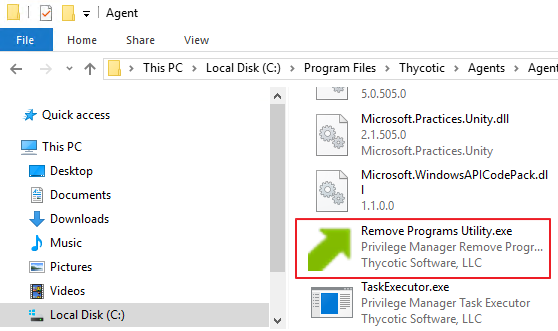
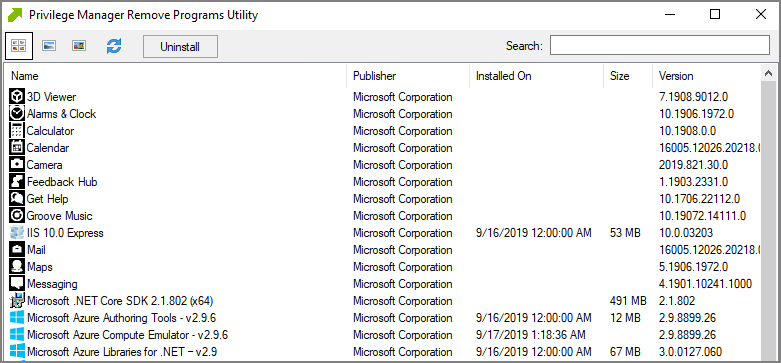

[title]: # (Remove Program Utility)
[tags]: # (create,set-up)
[priority]: # (2)
# Using the Remove Programs Utility

The Remove Programs Utility provides a solution to the following problem that Windows standard users are not able to remove applications from the control panel because of Windows checking for admin rights. This utility is available for deployment via Privilege Manager.

Customers can use this utility in any of the following ways:

* Allow users to uninstall any and all applications by using the utility.
* Make the utility show an approval request for each uninstaller that is launched.
* Make the utility show an approval prompt when it launches.

The utility will list all the same applications as the Remove Programs in the Control Panel, but it can also hide software that end users should not be able to uninstall (such as the Thycotic agents).

With Privilege Manager version 10.7 Thycotic is introducing support for Windows 10 __Apps & Features__ and the management of Windows Store apps via the __Remove Programs Helper__. Certain apps designed as a Windows 10 package are registered in __Apps & Features__ but do not appear in the operating systems Add Remove Programs options. Privilege Manager locates those applications and provides management via the enhanced __Remove Programs Utility__.

## Using the Configure Privilege Manager Remove Programs Policy

With the Privilege Manager 10.7 release the Remove Programs Utility has moved from being delivered via configuration feed to being fully integrated and delivered via the Server and Agent installation packages.

To allow standard users to use the utility refer to the [Elevating the Privilege Manager Remove Programs Utility Policy](../../computer-groups/app-control/examples/elevate/pm-remove-prog.md) set-up instructions. Thycotic recommends to also create a policy that blocks non installers from running via the Remove Programs Utility, which is documented under the same topic as the utility elevation.

## Configuring the Remove Programs Utility

1. Under your __Computer Group__ select __Scheduled Jobs__.
1. Search for __Configure Privilege Manager Remove Programs__.
1. Click on the policy link __Configure Privilege Manager Remove Programs__.

   

   If you need to customize the default policy, Thycotic recommends to create a copy.
1. Click __Duplicate__ and name your policy.
1. Click __Create__.
1. Under __Job Settings__, customize the access and functions of the utility. For example:
   * Choose whether a shortcut on the start menu or on the control panel should be created.
   * List products that you want to prevent being uninstalled. There are two options for this:
     * If the "Show Blocked Installers in List" option is unchecked, the products will be hidden.
     * If the "Show Blocked Installers in List" option is checked, the products will just be disabled from being uninstalled.

     If you selected "Create Start Menu Shortcut", the users will see Privilege Manager Remove Programs on the Start Menu. If you selected "Add to Control Panel", the users will see Privilege Manager Remove Programs in the Control Panel.
1. Under __Job Schedule__, customize the triggers, such as when to run the utility for inventory purposes. This determines how often you want the policy from the Task Scheduler on the endpoint to check to ensure the settings match.

   
1. Under __Job Conditions__, customize additional conditions that impact running the task, e.g. allowing the utility to be used on demand.
1. Set the __Inactive__ switch to __Active__.
1. Click __Save Changes__.
1. Next to __Deployment__, click the __i__ icon and select the __Resource and Collection Targeting Update__ task. 

   

## Use the Utility

The utility is straightforward to use. It's installed on endpoints as part of the Agents installation.
Users can select the row containing the program that they want to uninstall and then select the uninstall button.

