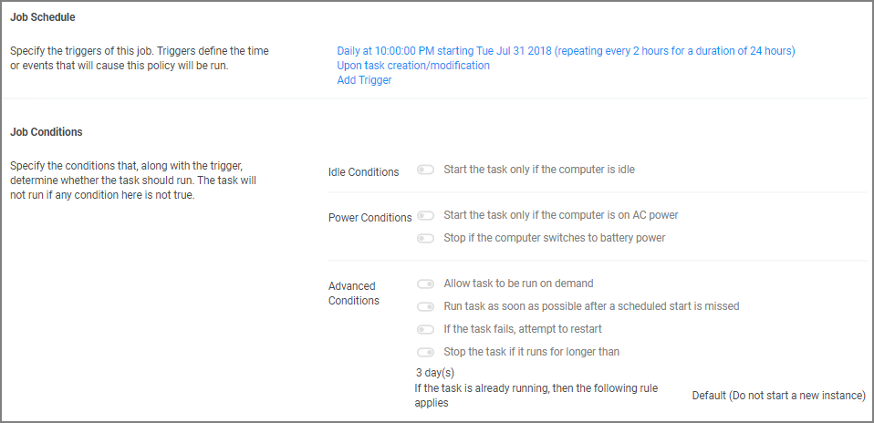

[title]: # (Using the Remove Program Utility)
[tags]: # (create,set-up)
[priority]: # (2)
# Using the Remove Programs Utility

The Remove Programs Utility provides a solution to the following problem that Windows standard users are not able to remove applications from the control panel because of Windows checking for admin rights. This utility is available for deployment via Privilege Manager.

Customers can use this utility in any of the following ways:

* Allow users to uninstall any and all applications by using the utility.
* Make the utility show an approval request for each uninstaller that is launched.
* Make the utility show an approval prompt when it launches.

The utility will list all the same applications as the Remove Programs in the Control Panel, but it can also hide software that end users should not be able to uninstall (such as the Thycotic agents).

With Privilege Manager version 10.7 Thycotic is introducing support for Windows 10 __Apps & Features__ and the management of Windows Store apps via the __Remove Programs Helper__. Certain apps designed as a Windows 10 package are registered in __Apps & Features__ but do not appear in the operating systems Add Remove Programs options. Privilege Manager locates those applications and provides management via the enhanced __Remove Programs Utility__.

## Using the Configure Privilege Manager Remove Programs Policy

With the Privilege Manager 10.7 release the Remove Programs Utility has moved from being delivered via configuration feed to being fully integrated and delivered via the Server and Agent installation packages.

### Setting up the Policy

1. Navigate to __Admin | Policies__ and select to the __General__ tab.
1. Search for __Configure Privilege Manager Remove Programs__.

   
1. Click on the policy link __Configure Privilege Manager Remove Programs__.

   

   The policy is enabled by default. If you need to customize the default policy, Thycotic recommends to create a copy.
1. Click __Create a Copy__ and name your policy.

   
1. Click __Edit__ to customize any of the defaults for the policy. Several parameters and attributes are available for customization in the various tabs on the page. On the

   * __General__ tab, enable your policy and verify the command is set to __Configure Remove Programs Application__.

     
   * __Parameters__ tab, customize the access and functions of the utility. For example, choose whether a shortcut on the start menu or on the control panel should be created. 

     

     List products that you want to prevent being uninstalled. There are two options for this:

     * If the "Show Blocked Installers in List" option is unchecked, the products will be hidden.
     * If the "Show Blocked Installers in List" option is checked, the products will just be disabled from being uninstalled.

     If you selected "Create Start Menu Shortcut", the users will see Thycotic Remove Programs on the Start Menu. If you selected "Add to Control Panel", the users will see an addition on the Control Panel such as shown below:

     
   * __Triggers__ tab, customize when to run the utility for inventory purposes. This determines how often you want the policy from the Task Scheduler on the endpoint to check to ensure the settings match.

     
   * __Targets__ tab, customize the resource targets (list of managed computers).

     
   * __Conditions__ tab, customize the conditions under which to run tasks.

     
   * __Advanced__ tab, customize additional conditions that impact running the task, e.g. allowing the utility to be used on demand.

     
   * __Deployment__ tab, users can see information about the policy status, when modified and total resources targeted. The tab also offers a Refresh Status option.

     
1. Click __Save__ to save all changes you made.

## Use the Utility

The utility is straightforward to use. It's installed on endpoints as part of the Agents installation.
Users can select the row containing the program that they want to uninstall and then select the uninstall button.

## 10.6 and earlier: Download and Install via Config Feed

These steps are only required for customers on Privilege Manager versions 10.6 or earlier.

1. Navigate to __Admin | More... | Config Feeds__.
1. In the row for "Privilege Manager Product Configuration Feeds", click __Select Items__.

   
1. In the row for "Application Control Solution", click __Select Items__.

   
1. In the row for "Application Control – Remove Programs Helper", click on __Download__. This downloads and installs the deployment policy and an elevation policy to the server. The elevation policy is included in the Config Feed because the utility needs to run elevated.

   
1. After the download/installation is complete a "Installed" indicator shows.

   

### Add and Customize the Policy

After the config feed has been downloaded and installed, add and customize the policy with the following steps in 10.6 and earlier versions of Privilege Manager:

1. Navigate to __Admin | Policies__, which defaults to the General tab.

   
1. Click on the row listing the __Add Thycotic Remove Programs__ policy.

   
1. On the Parameters tab customize the function of the utility. Several parameters and attributes are available for customization in the various tabs on the page. Click __Edit__ to customize.
1. __Enable__ the policy.
1. Click __Save__ to save all changes you made.
