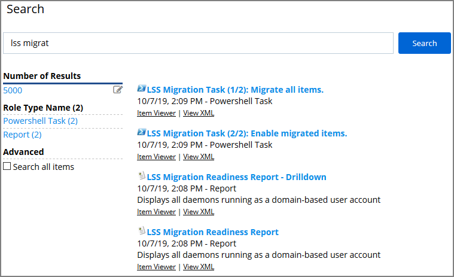
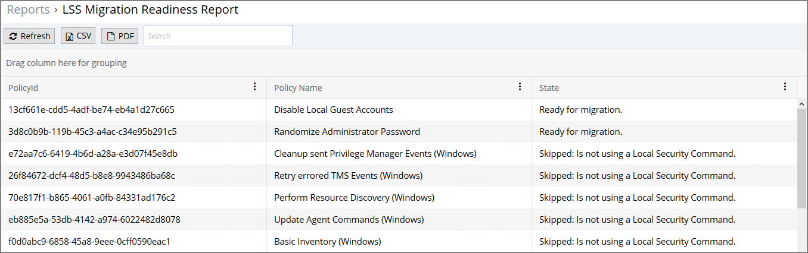
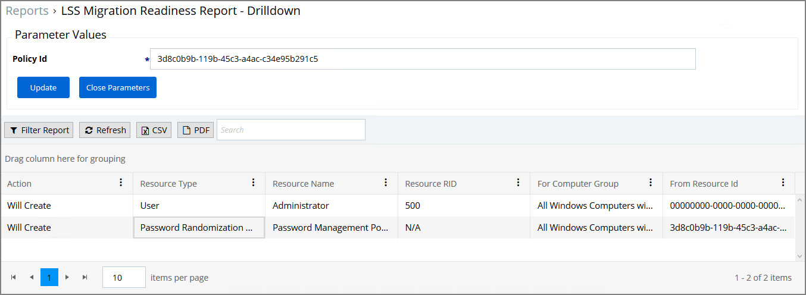
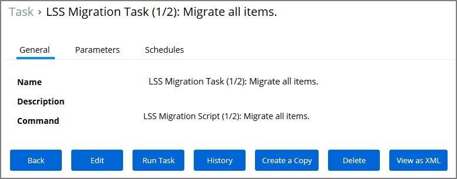
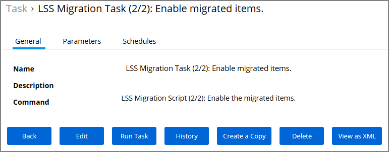

[title]: # (Migrate LSS Policies)
[tags]: # (silverlight end-of-life)
[priority]: # (9501)
# Migrate Local Security Policies

In support of the Silverlight End-of-Life product cycle, Privilege Manager provides a migration path for Local Security implementations that previously utilized Silverlight.

>**Note**:
>Thycotic recommends to use a Professional Services engagement when migrating local security to Privilege Manager 10.7 or newer.

Before any migration is performed, make sure to backup your Privilege Manager database.

## Migration Steps

Starting with Privilege Manager 10.7 the LLS Migration Readiness Report is available. The report is generated after an upgrade to 10.7 or higher from any previous Privilege Manager version.

To access the LSS Migration Readiness Report, follow these steps:

1. From anywhere in the Privilege Manager console search for LSS Migration.

   

   The search does show all LSS Migration labeled results found in Privilege Manager. As the image shows, there are two related reports and tasks.
1. Select __LSS Migration Readiness Report__.
1. The report shows a table containing Policy IDs, their Name, and the current migration status.

   

   

   The migration state can be:

   * Ready for migration.
   * Skipped: Is not using a Local Security Command.
   * Skipped: Task has already been migrated.

1. Any item with a state listed as _Ready for migration_ can be selected and the __LSS Migration Readiness Report - Drilldown__ report opens for that specific item.

   

   The drilldown report shows the Action to be performed for the item during migration. The drilldown report shows information about the Resource Type, Name, Resource ID (RID), For Computer Group, and From ResourceID.

   <!-- need details on those columns and what it means: for CG, from RID, etc. What should be done to items that are not ready for migration? What needs to be done if the drilldown shows something the customer doesn't like? -->
1. If there aren't any conflicts and all items found can be migrated, use the LSS Migration tasks to migrate and then enable to items pertaining to Local Security. This is a two step process, first migrate then enable.

   1. Search for LSS Migration Task (1/2): Migrate all items.

      

   1. After all items are migrated, run the LSS Migration Task (2/2): Enable migrated items.

      

   Either of these tasks can be edited, and have parameters or schedules defined.
