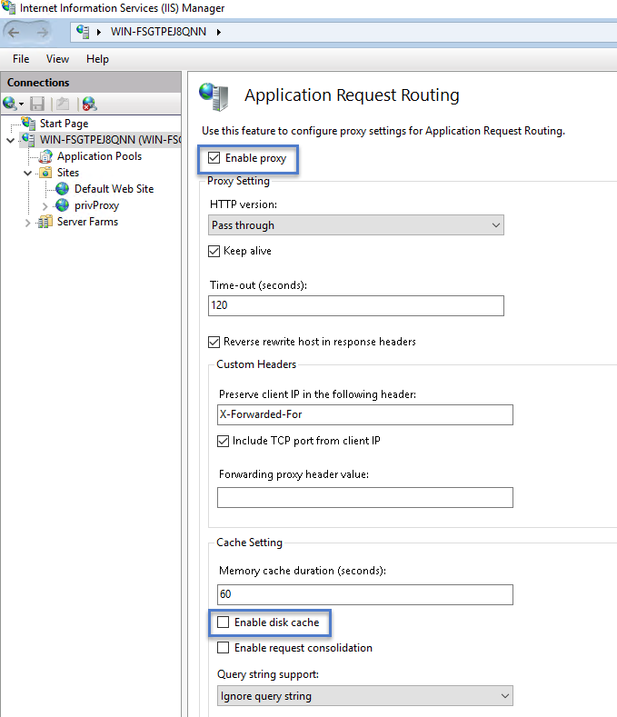

[title]: # (Proxy Setup)
[tags]: # (reverse)
[priority]: # (9510)
# Setting up a PM Proxy

>**Note**:
>Thycotic Management Server, or “TMS”, is an umbrella term for our base application layer that Privilege Manager runs on top of.  For this guide you only need to recognize that "Tms" is programmed into your Privilege Manager URL string for configuration purposes.

Many organizations choose to protect their Privilege Manager web server by restricting it from direct outbound internet access. To secure your environment according to best practices, it is not enough to simply set your server offline because Privilege Manager still will communicate directly to agents across your network that DO have direct internet access, therefore attackers can potentially use the connection between your endpoint Agent and Privilege Manager to breach your web server.

To prevent this direct connection between agent endpoints and your Privilege Manager web server you can set up a Reverse Proxy machine with limited permissions. A properly configured Reverse Proxy will act as a buffer between Privilege Manager agents and the Privilege Manager server to limit server exposure.

You can use nginx, F5, or Windows Application Request Routing 3.0 and URL Rewrite in IIS on a DMZ Server. The steps below walk through a reverse proxy using IIS and Windows Application Request Routing.

In this setup, only the endpoint agent needs to be accessible via HTTPS. It is important to note that the certificate being used for HTTPS communication should be the same certificate that is installed on your Privilege Manager web server.

## Server Configuration

1. Setup a new server or modify an existing server to be in the DMZ.
1. Download [Web Platform Installer](http://www.microsoft.com/web/downloads/platform.aspx) on your new Reverse Proxy server. This allows you to add updated IIS extensions from Microsoft.
1. In the search bar of the Web Platform Installer, enter __Application Request Routing #.0__. Click __Add__ and then __Install__. You will need to accept the license terms.

   
1. Create an empty folder under C:\\inetpub\\ named __privProxy__.
1. Open IIS Manager and right-click __Sites__ and select __Add Web Site__.
1. Name the site __privProxy__ and set the __Physical Path__to the folder under C:\\inetpub\\ named __privProxy__.
1. Change the binding to __HTTPS__.
1. Use the default port of 443. 
   >**Note**:
   >If there are other applications using port 443 on this server, such as Symantec CEM, then set the privProxy to use a different port, such as __45593__. If you use a port other than 443, make sure to add the appropriate firewall rule.
1. Select a certificate for the binding to use and Click __OK__. The certificate being used for HTTPS communication should be the same certificate that is installed on your Privilege Manager web server. Follow [these instructions](https://thycotic.force.com/support/s/article/Trusting-an-SSL-Certificate-on-a-Client-Machine) to install a certificate on your Reverse Proxy server. 

   
1. Select the server node in the left hand navigation pane in IIS Manager.
1. Open __Application Request Routing__ from the middle pane.
1. Select __Server Proxy Settings__ in the right hand actions pane
1. In the __Application Request Routing__ pane, select __Enable Proxy__ and deselect __Enable disk cache__. 

   
1. Select __Apply__ under the actions pane and then select __URL Rewrite__.
1. Select __Add Rule(s)__ on the actions pane and then under __Inbound rules__ select __Blank rule__.
1. Name the rule __privProxy__.
1. In the Edit Inbound Rule window, do the following steps:

   1. Under __Match URL__ from the __Requested URL__ menu, choose __Matches the Pattern__.
   1. From the__ Using__ menu, choose __Wildcards__.
   1. From the __Pattern__ menu, choose __Tms/Agent/*__.
   1. Select __Ignore case__.

      
1. Under __Conditions__, from the __Logical Grouping__ menu, choose __Match All__.
1. Add a condition for __{HTTPS}: Matches the pattern: on__.
1. (optional) You can also add a __{SERVER_PORT}__ condition and set it to the port number configured above.  

   
1. Under __Action__, from the __Action Type__ menu, choose __Rewrite__.
1. Under __Action Properties__, in the __Rewrite URL__ field, type the URL https://server.example.com/Tms/Agent/{R:1}
1. Select __Append query string__.
1. Select__ Stop processing of subsequent rules__.

   
1. In the __Actions__ pane, click __Apply__.

   

Now your internet-connected agents will be able to communicate with the Privilege Manager server
through [https://external-name.domain.com:45593/Tms/](https://external-name.domain.com:45593/Ams/) or [https://external-name.server.com/Tms/](https://external-name.server.com/Ams/), depending on the port you chose.

>**Info**:
>Make sure that the server acting as the reverse proxy trusts and matches the certificate that the Privilege Manager web server is using for its HTTPS binding. If the certificate is not trusted, the proxy will return a 500.21 Gateway error.

## Agent Configuration

When you set up the Agent, make sure that the BaseURL has been set to the DMZ Server Address by following the steps in [Setting the Privilege Manager Server Address](https://thycotic.force.com/support/s/article/Setting-the-Privilege-Manager-Server-Address).

>**Important**:
>The Privilege Manager server is __not__ able to push tasks to agents when the agents are not connected to the same network. However, the internet connected clients will automatically pull tasks from the server on a scheduled interval.
