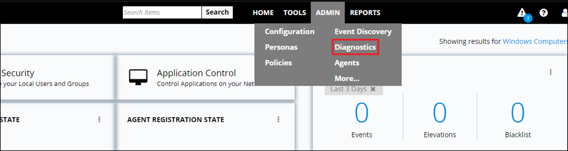
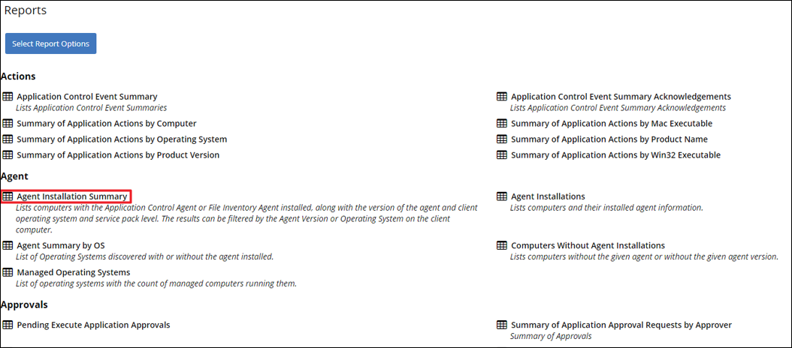

[title]: # (- Bundled Install)
[tags]: # (agent,endpoint,installation)
[priority]: # (601)
# Bundled Install

>**Important**:
>To ensure you have installed all prerequisite software on your managed computers __before__ you install the Thycotic agents, please see our [System Requirements for Privilege Manager](https://thycotic.force.com/support/s/article/System-Requirements-Privilege-Manager)

To install Thycotic agents __on a single testing machine__, follow these steps:

1. Go to [Agent Downloads](http://thycotic.force.com/support/s/article/Software-Download) and download the __Bundled Agent Installer (Windows)__.
1. Run the Thycotic Bundled Installer on the computer you want to manage.
1. During the setup process, enter the base URL and the [Install Code](https://thycotic.force.com/support/s/article/PM-Agent-Install-Codes) when prompted. *Note: The Install Code field can be left blank when using versions lower than 10.5 *  

   
   To install Thycotic agents __on multiple machines__, we recommend the following:
1. Go to [Agent Downloads](http://thycotic.force.com/support/s/article/Software-Download) and download the standalone MSI files.
1. Push them out through any software delivery system tool (e.g.: SCCM) using the recommended command lines.

Once your agents are installed, verify that they have registered in Privilege Manager. Navigate to the __ADMIN \| Diagnostics__ page from the Dashboard, or __ADMIN | Agents__ to view your agent details.

>**Note**:
>It may take 15-30 minutes for new agents to receive policies and register machine details.  

Optional: To speed up this process you can go to __Admin | Configuration | General__ and click the __Run Policy Targeting Update__ button. Then, restart the Thycotic Agent Service on that computer.  
  
After the initial policies are received, future updates will be based on the task schedules set in Update Applicable Policies and Scheduled Registration policies. Ensure to select the correct policies based on Windows or Mac operating systems. To edit these schedules, navigate to __Admin | Policies | General__ tab, click the desired task, click the __Triggers__ tab, and then __Edit**.  
  

On the Diagnostics page you will see the quantity of agents registered and what operating system is running on registered endpoints. Registered endpoints can also be viewed in the report (run from the __REPORTS__ menu selection) __Agent Installation Summary__ or by navigating to the __Admin | Agents | Agent Reports__ tab.  
  

From the __Agent Installation Summary__ report you can click into any of the __target machines__ listed that have a Thycotic agent installed. Pictured above is a view from one of these resource pages where you can check the machine's System Health and configured policies.
