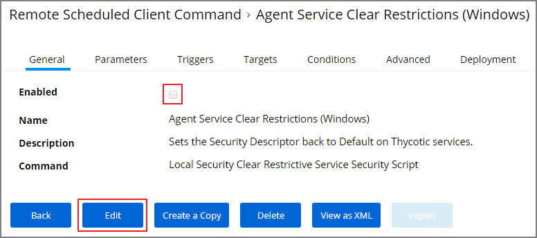

[title]: # (Hardening Rollback)
[tags]: # (endpoint,hardening)
[priority]: # (1621)
# Restore Default Agent Permissions

If you need to rollback agent hardening on your endpoints, follow these steps to restore the default agent permissions:

1. Navigate to __ADMIN | More...__ and select __Config Feeds__.
1. Next to __Privilege Manager Product Configuration Feeds__ click __Select Items__.
1. Next to __Thycotic Management Server Core__ click __Select Items__.
1. Download the __Reset Agent Service Permissions__ config feed.

   
1. Once the config feed is installed, navigate to __ADMIN | Policies__ and select the General tab.
1. Search for the agent service policies and select to edit.

   
1. Disable the __Agent Service Start / Stop Control (Windows)__ policy.
   1. Click __Edit__.
   1. Deselect __Enabled__.

   
   1. Click __Save__.
1. Enable the __Agent Service Clear Restrictions (Windows)__ policy.
   1. Click __Edit__.
   1. Select __Enabled__.

   
   1. On the Targets tab specify the computers that need to be targeted by this policy.
   1. On the Triggers tab specify when to run and/or what events will trigger the policy to run.
1. Click __Save__.

<!-- no go
1. Navigate to __ADMIN | More...__ and select __Folders__.
1. In the Policies folder tree open __General | Windows__.

   
1. Click __Add New__.
1. From the __Template__ drop-down select __Local Security Scheduled Client Task__.
1. Name your policy _Restore Agent Security Permissions_.
1. As a command enter __Local Security Set Service Security Script__.
1. Click __Create__.

   
1. Click __Edit__.
1. Select the __Parameters__ tab.
1. For __Service__ add the __ArelliaAgent__ service.
1. For __Security Descriptor__ add the __Standard Service Security Descriptor__.
1. Click __Save__.

   
1. Click __Create a Copy__.
1. Name the copy _Restore ACSAgent Security Permissions_.
1. Click __Create__.
1. Click __Edit__.
1. Select the __Parameters__ tab.
1. For __Service__ add the __ArelliaACScv__ service.

   
1. Click __Save__.

Add the Remote Scheduled Client Commands to a policy to have the agents pick up the rollback.
-->