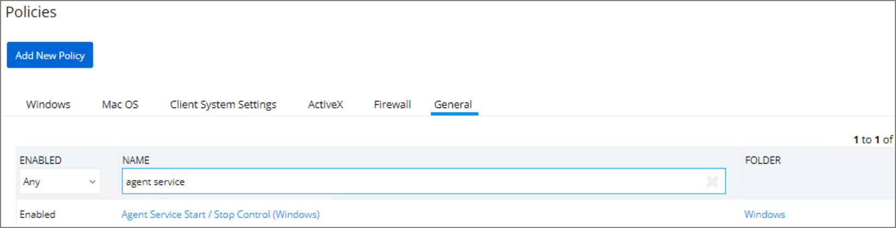
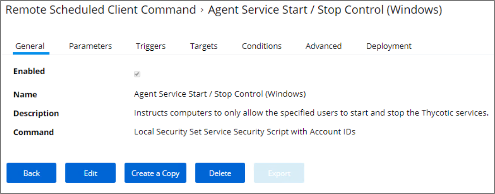
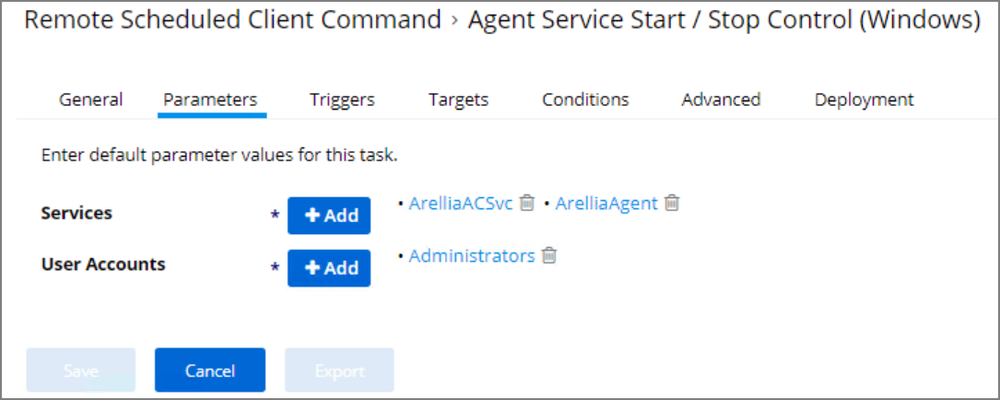

[title]: # (Agent Hardening)
[tags]: # (endpoint,installation,registration)
[priority]: # (1620)
# Agent Hardening

Agent installations on endpoints can be secured, only allowing a specified user access to start or stop an agent service and denying any agent control access to a local Administrator or basic user account.

To make sure that local Administrators do not tamper with Thycotic agents running on their system, Privilege Manager Administrators can define users that can start and stop the Privilege Manager services running on endpoints, such as the Thycotic Agent or Thycotic Application Control.

A user or group needs to be available in Privilege Manager to be selected while setting up the task. This user or group will have rights to start and stop agent services running on endpoints.

## Editing the Agent Service Start / Stop Control (Windows) Policy

1. Navigate to __ADMIN | Policies__.
1. Click on the __General__ Tab.
1. In the Name field enter __Agent Service Start / Stop Control__.

   
1. Click on the __Agent Service Start / Stop Control (Windows)__ policy.

   
1. To customize the Agent Hardening policy navigate to the __Parameters tab__.
1. Click __Edit__.

   
1. Under __User Services__ click the __+__ button and use the search field to select the Services to be targeted by the task
1. Under __User Accounts__ click the __+__ button and use the search field to find the specific user account that has permissions to make changes to the Agent services.
1. Click __Save__.

>**Note**: If you require a rollback of the agent hardening due to upgrade issues, use the manual [Restore Default Agent Permissions](agent-hardening-rollback.md) procedure.
