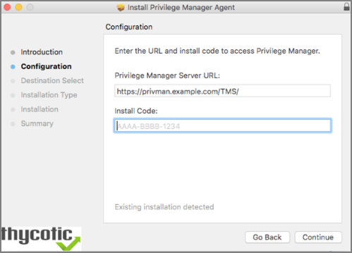

[title]: # (macOS Agents)
[tags]: # (endpoint,installation,registration)
[priority]: # (1604)
# macOS Agents

Use the links below to download the agents installation software for macOS based endpoints.

## Mac OS X Installer (10.11 or Newer)

The Bundled Mac Agent DMG + PKG installer is available for macOS systems. You can use this installer directly on individual endpoints for testing or for production environments.

### Agents Installation Download Link

https://tmsnuget.thycotic.com/software/Agents/ThycoticManagementAgent-10.6.20.dmg

### Installing macOS Agents

>**Note**:
>If you enter the wrong install code or you need to update an install code for whatever reason, rerun the package installer to provide the correct/new install code.
>The Install Code field can be left blank when using versions lower than 10.5.

#### Directly

The Bundled macOS Agent is a DMG + PKG file. You can use this Mac agent installer directly on individual endpoints for testing or production environments.

To install the agent software on a single testing machine, follow these steps:

1. Go to [Agent Downloads](https://tmsnuget.thycotic.com/software/Agents/ThycoticManagementAgent-10.6.20.dmg) and download the Privilege Manager Mac Agent.
1. Run the Bundled Mac Agent DMG + PKG Installer on the computer you want to manage.
1. During the setup process,
   1. enter the base URL and
   1. the Install Code when prompted.​

   

>**Note**: The bundled installer does require a restart in order to ensure the agent is ready to use.

#### Using an Unattended Install Method

Begin by downloading the DMG + PKG package (See link for Privilege Manager Mac Agent listed above) on one of your Mac endpoints. Run the installer by double clicking the PKG file.  

After installing this first agent, navigate to _/Library/Application Support/Thycotic/Agent/agentconfig.json_. The agentconfig.json file stores information such as your organization’s URL and a few other custom settings like ‘Task Polling Interval,’ etc.

Open the file and add the "installCode" parameter after the "tmsBaseUrl" to that file as shown in the following code sample:

```json
{
                "tmsBaseUrl": "https://servername/Tms/",
                "installCode": "VALUEHERE"
}
```

There are two methods for deploying your remaining Mac agents in an unattended fashion:

* Network File Share
* Distribution Tool  

##### Network File Share

If you want administrators to deploy agents onto individual macOS endpoints, save the PKG installer from the DMG side-by-side with the __agentconfig.json__ file in a network share folder.

Due to new macOS security enhancements, users cannot run a PKG installer from a network share anymore. The administrator must then run the installer command-line tool from __Terminal.app__ after mounting and cd'ing to the directory containing the PKG installer and __agentconfig.json__ file:

```cmd
cd /Volumes/<network share>/<path to PKG installer>
sudo installer -pkg ThycoticManagementAgent-10.6.20.pkg -target /
```

The PKG will first look for an __agentconfig.json__ file located in the same folder. When it finds this file, it will copy __agentconfig.json__ into the _/Library/Application Support/Thycotic/Agent_ folder during the unattended install on the Mac endpoint where the installer is running.

##### Distribution Tool

Using a Deployment Tool like Jamf or SCCM, include both the PKG installer and the __agentconfig.json__ files in the distribution package together, then deploy the package onto your endpoint Macs by running a script using a tool or remotely by using ssh to install the PKG, for example:

```shell
sudo installer -pkg ThycoticManagementAgent.10.6.20.pkg -target /
```  

As in the example using a Network Share, the PKG will first look for an __agentconfig.json__ file located in the same folder. When it finds this file, it will copy __agentconfig.json__ into the _/Library/Application Support/Thycotic/Agent_ folder during the unattended install on the endpoint Mac where the installer is running.

For more instructions on how to deploy in bulk using Microsoft Software System Center Configuration Manager (SCCM), Microsoft instructions for Macs are described [here](https://technet.microsoft.com/en-us/library/jj687950.aspx).

## After Initial Deployment

If the Mac already has an existing __agentconfig.json__ file, it will NOT be overwritten because creating a file only occurs if the computer didn’t already have an __agentconfig.json__ installed. This means you can use the same distribution package for upgrades and new installs.

>**Note**:
>It will take 15-30 minutes for newly installed agents to register in Privilege Manager. See the agent registration information in the [Terminal Commands](agent-inst-mac.md#terminal_commands) topic to speed the process up.

Agents receive new policies on a schedule which can be modified. To check the schedule, 

1. Go to __Admin | Resources__.
1. Select for this macOS machine name the __Update Agent Commands (Mac OS) Policy__.
1. Edit the schedule on the __Triggers__ tab.

## Register New Agents and Finding Logs for Troubleshooting

For troubleshooting your Mac agent, logs are found in the Console application. There are two places to check for logs in Console:

* First, you can filter your machine's logs by clicking your machine's name under Devices and typing "Thycotic" into the top search bar.
* Second, Thycotic-specific logs are recorded in a Console folder that is titled thycotic (found in the left side bar: Reports | /var/log | thycotic).

## Terminal Commands

In the Mac Terminal application you can perform the following commands directly to your Thycotic macOS agent.

>**Note**: The `sudo` command may prompt for admin account password verification.

Find this list by entering the following into Terminal:

```shell
sudo /usr/local/thycotic/agent/agentUtil.sh
```

These are the commands returned for the utility:

```shell
runschedule -scheduleId {id}
updateclientitems
clientitemsummary
register
settmsserver -serverUri {https://servername.com/Tms/}
settmsserver -serverName {servername}
stop
start
restart
enableverboselogging
disableverboselogging
```

### Command Usage

To perform a command, insert the name of the above command that you need to perform into this command string:  

```shell
sudo /usr/local/thycotic/agent/agentUtil.sh [InsertCommandHere]
```

As one example, if you entered an incorrect server name path in the agent installer and Privilege Manager therefore cannot find and register your Mac agent, you can run the command:
  
```shell
sudo /usr/local/thycotic/agent/agentUtil.sh settmsserver -serverUri {https://servername.com/Tms/}
```

Which is using the correct server name URI to redirect your agent toward the correct server location.

Or, to register an agent immediately after updating the Privilege Manager server location, type:

```shell
sudo /usr/local/thycotic/agent/agentUtil.sh register
```

The complete command shell exchange looks like this:

```shell
macadmin-MacBook-Pro:~ madadmin$ sudo /usr/local/thycotic/agent/agentUtil.sh register
Password:
Initiated registration.
macadmin-MacBook-Pro:~ madadmin$
```

## Uninstalling an Agent

When you need to uninstall the macOS Agent, use the __Uninstall.sh__ shell command:

```shell
sudo /Volumes/ThycoticManagementAgent-10.6.20/Uninstall.sh
```
