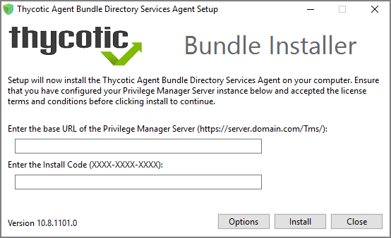

[title]: # (Bundled Core and DSA Install)
[tags]: # (agent,endpoint)
[priority]: # (1605)
# Bundled Core and Directory Services Agents

The __Thycotic Directory Services Installer__ bundle delivers the Thycotic Agent (Core Agent) and the Thycotic Directory Services Agent in one package for installation on x64-bit systems. To learn more about the Directory Services Agents refer to [Directory Services Agent (AD)](agent-inst-win-dsa.md). Also refer to [Agent System Requirements](agent-sysreq.md).

## Installing the Thycotic Directory Services Installer Bundle

To install this Thycotic agents bundle __on a single machine__, follow these steps:

1. Download the [Bundled Privilege Manager Core and Directory Services Agent - Windows](../sw-downloads.md).
1. Run the __ThycoticDirectoryServicesInstaller__ on the computer you want to use for the active directory synchronization tasks.
1. During the setup process, enter the Privilege Manager Server URL (or AZ Service Bus Queue URL) and the [Install Code](installcode.md) when prompted.

   >**Note**: The Install Code field can be left blank when using versions lower than 10.5.

   
1. Click __Close__ after the installation completes.

>**Note**:
>It may take 15-30 minutes for agents to receive new policies, to speed this up navigate to __Admin | Configuration | General__ and click __Run Policy Targeting Update__, then open the Agent Utility on the endpoint and click the __Register__ button.
