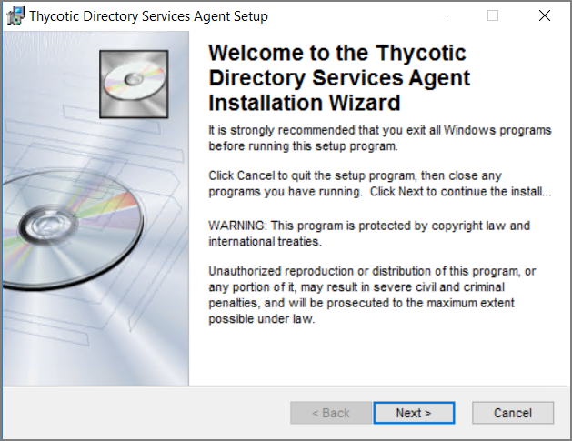
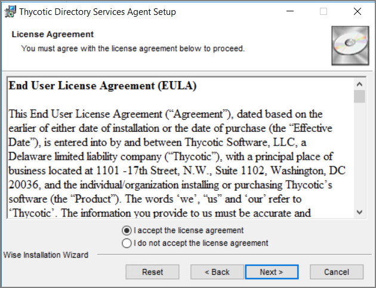
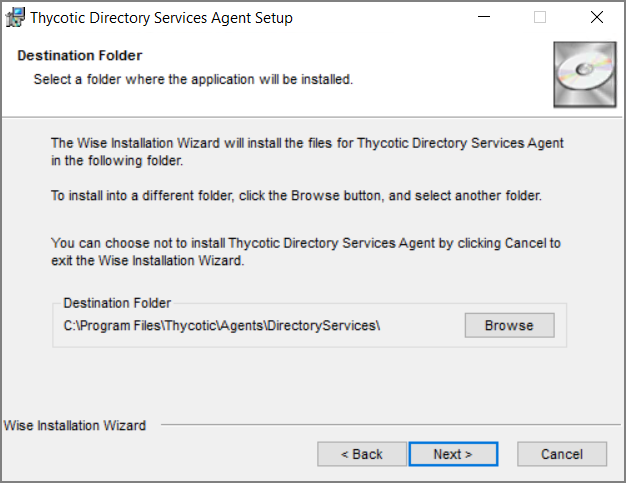
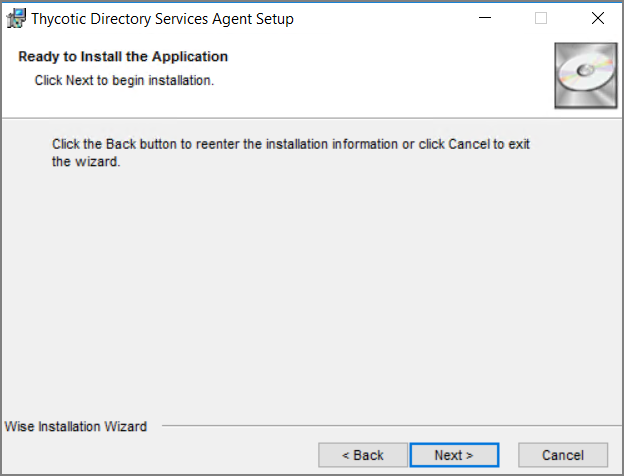
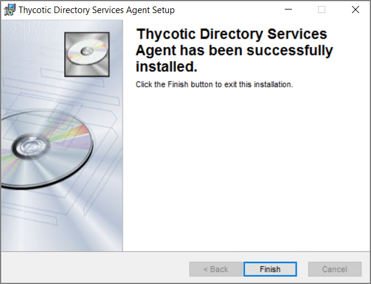

[title]: # (Directory Services Agent)
[tags]: # (endpoint,installation)
[priority]: # (1604)
# Directory Services Agent (AD)

This agent supports the Active Directory synchronization between Privilege Manager Cloud instances and local directory services. This agent only needs to be installed on one system to perform the synchronization task. The local agent can be deployed into an AD environment instead of requiring direct connectivity from the server to the domain controllers. You will be able to configure the product in either method (direct or agent-based).

The agent method requires that the Directory Services Agent is installed on one computer connected to a domain controller. Once installed, the agent receives the Active Directory Sync (Agent) scheduled task along with other parameters such as the credential used, which AD objects, etc. to perform a synchronization between a Cloud instance and local AD.

>**Note**: If the Directory Services Agent is installed on a system with an Application Control or a Local Security Agent, a license will be consumed. If a system has the Thycotic Agent (Core Agent) and Directory Services Agent installed ONLY, no license is consumed.
>
>The Directory Services Agent for local AD synchronization with Privilege Manager Cloud instances is available for x64-bit systems only.

Refer to [Agent System Requirements](agent-sysreq.md).

## Prerequisites

The __Core Thycotic Agent__ needs to be installed on the system that receives the __Directory Services Agent__ installation. The other agents aren't required, but can be installed on the same system without issues.

## Directory Services Agent Installation

Download the latest version of the __Directory Services Agent__ via the [Software Downloads](../sw-downloads.md) page.

1. Double-click the .msi file to start the installation wizard:

   

   Close all other applications running on the system and click __Next__.
1. On the __EULA Agreement__ screen, select __I accept the license agreement__.

   

   Click __Next__.
1. On the __Destination Folder__ screen, keep the default installation destination or use __Browse__ to select a different folder.

   

   Click __Next__.
1. On the __Ready to install__ screen, you have an option to go back to change your previous selection, otherwise click __Next__ to proceed with the installation.

   

   If you have any other Thycotic Agents already installed on the system, the installer my prompt you to stop the services before you can proceed.
1. After a successful installation of the Directory Services Agent, you will see the following screen:

   

   Click __Close__.
1. Restart any previously stopped agent services.
