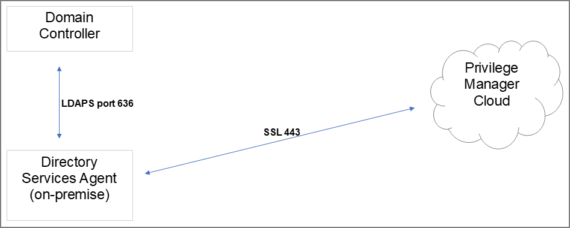

[title]: # (System Requirements)
[tags]: # (agents)
[priority]: # (1601)
# Agent System Requirements

For agents in an environment with a moderate policy configuration, the requirements for memory and disk space are as follows:

* Memory usage: 50Mb
* Disk usage:
  * Thycotic base agent: 10MB
  * Application Control Solution: 9MB
  * Local Security Solution: 3MB
  * Security Analysis Solution: 13 MB
* Average CPU over a week: 3%
* Impact to boot time: Negligible

## Supported Windows Operating Systems (both 32- and 64-bit):

* Desktops: Windows 7, Windows 8, Windows 8.1, Windows 10
* Servers: Windows Server 2012 R2 and newer
* __Disable__ the GPO security option "System cryptography: Use __FIPS__ compliant algorithms for encryption, hashing, and signing."

## MacOS Agent

* MacOS 10.11 (El Capitan) or newer

>**Note**: Endpoints with Apple Silicon processor are not supported at this point.

## Directory Services Agent

The Directory Services Agent needs to be installed on a well resourced system running either

* Windows 10 or above or
* Windows Server 2016 or above.
* Port requirements:
  * The agent needs to be able to communicate to the server on 443
  * AD Sync agent and Domain Controller over LDAPS

>**Note**: The Directory Services Agent is available for x64-bit systems only.

## Windows Management Framework download locations

### Windows Management Framework 2.0 or newer

* Installed on Windows 7 and Windows Server 2012 R2 by default
* PowerShell 3.0 is installed on Windows 8 and Windows Server 2012 R2 by default
* Older operating systems require installation

| Operating System | Download Location |
| ----- | ----- |
| Windows XP | http://download.microsoft.com/download/E/C/E/ECE99583-2003-455D-B681-68DB610B44A4/WindowsXP-KB968930-x86-ENG.exe |
| Windows Server 2008 (x86) | http://download.microsoft.com/download/F/9/E/F9EF6ACB-2BA8-4845-9C10-85FC4A69B207/Windows6.0-KB968930-x86.msu |
Windows Server 2008 (x64) | http://download.microsoft.com/download/2/8/6/28686477-3242-4E96-9009-30B16BED89AF/Windows6.0-KB968930-x64.msu |

### .NET 4.0 Framework or newer

Windows 8 and newer and Windows Server 2012 and newer have 4.5 installed by default.

To download it, go to http://www.microsoft.com/en-us/download/details.aspx?id=24872.

### .NET 2.0 Framework SP1

The .Net 2.0 SP1 update is required only for Windows XP. To download, go to http://download.microsoft.com/download/c/6/e/c6e88215-0178-4c6c-b5f3-158ff77b1f38/NetFx20SP2_x86.exe.

## Ports/Agent Access Information

* __Outbound (port 443 - HTTPS)__: This is the default access port through which the agent connects to the server. You may specify a different port based on your environment.
* __Inbound (port 5593)__: The is the default and only port that the agent listens on. This port is not required and you can block port 5593. If you block the port, the agents pull updates from the server based on a set schedule.
* __SQL (port 1433)__: This is the default SQL DB port. The SQL port can be customized.
